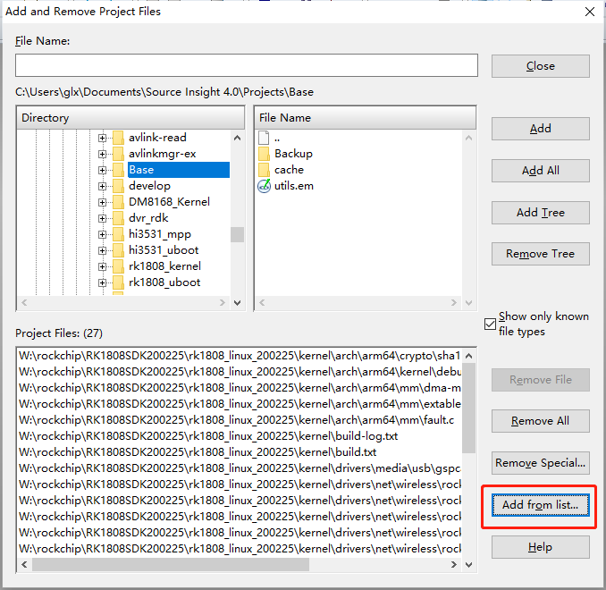

# 前言

现在linux内核文件越来越多，在source inside添加工程的时候，如果不加区别，全部添进去，会导致工程很大，耗时很长，而且搜索时也特别不方便，查找函数的时候，也会出现N个同名函数，让人不知道到底哪个才是最终被编译的

为了解决这个问题，只需要添加编译内核的log中提到的文件即可

关于这个的做法，网上有写c++程序取做替换的，有用脚本替换的，还有的写的不知道什么东西放到github让人下载的，但是都没用说明白具体的原理，实际去操作，发现并不能成功

因此这篇文章将以最简单的方法，一步步教你如何去做

# 内核编译及log生成

如果内核以及编译过了，那么使用make distclean先清除掉

然后make，加上你自己的编译参数，最后重定向到一个日志文件，我举个例子

```shell
sudo make rk1808-evb-v10.img > build-log.txt
```

这个build-log.txt文件，打开来看大概是这个样子，有各种CC之类开头的命令， 有时还有一些其它信息打印输出，有个这个文件，下一步就是利用sublime去将它改为source inside需要的list文件

```shell
  CC      init/main.o
  CHK     include/generated/compile.h
  CC      init/do_mounts.o
  CC      init/do_mounts_initrd.o
  CC      arch/arm64/mm/dma-mapping.o
  CC      init/noinitramfs.o
  CC      arch/arm64/mm/extable.o
  CC      init/initramfs.o
  CC      init/init_task.o
  CC      arch/arm64/mm/fault.o
  CC      arch/arm64/crypto/sha1-ce-glue.o
  CC      arch/arm64/kernel/debug-monitors.o
  
  CC [M]  drivers/net/wireless/rockchip_wlan/rkwifi/bcmdhd/dhd_gpio.o
  CC [M]  drivers/net/wireless/rockchip_wlan/rkwifi/bcmdhd/wl_iw.o
  CC [M]  drivers/net/wireless/rockchip_wlan/rkwifi/bcmdhd/wl_escan.o
  CC [M]  drivers/net/wireless/rockchip_wlan/rkwifi/bcmdhd/wl_cfg80211.o
  CC [M]  drivers/net/wireless/rockchip_wlan/rkwifi/bcmdhd/wl_cfgp2p.o
  CC [M]  drivers/net/wireless/rockchip_wlan/rkwifi/bcmdhd/wl_linux_mon.o
  CC [M]  drivers/net/wireless/rockchip_wlan/rkwifi/bcmdhd/wl_cfg_btcoex.o
  CC [M]  drivers/net/wireless/rockchip_wlan/rkwifi/bcmdhd/wl_cfgvendor.o
  CC [M]  drivers/net/wireless/rockchip_wlan/rkwifi/bcmdhd/dhd_cfg80211.o
  LD [M]  drivers/net/wireless/rockchip_wlan/rkwifi/bcmdhd/bcmdhd.o
  Building modules, stage 2.
  MODPOST 3 modules
  CC      drivers/media/usb/gspca/gspca_main.mod.o
  CC      drivers/net/wireless/rockchip_wlan/rkwifi/bcmdhd/bcmdhd.mod.o
  CC      fs/nfs/flexfilelayout/nfs_layout_flexfiles.mod.o
  LD [M]  fs/nfs/flexfilelayout/nfs_layout_flexfiles.ko
  LD [M]  drivers/net/wireless/rockchip_wlan/rkwifi/bcmdhd/bcmdhd.ko
  LD [M]  drivers/media/usb/gspca/gspca_main.ko
  Image:  resource.img (with rk1808-evb-v10.dtb logo.bmp logo_kernel.bmp) is ready
  Image:  boot.img (with Image  resource.img) is ready
  Image:  zboot.img (with Image.lz4  resource.img) is ready
```

# 修改log

首先是不需要的log删掉，例如以下这些，因为它们不是源文件

```shell
Building modules, stage 2.
MODPOST 3 modules
LD [M]  fs/nfs/flexfilelayout/nfs_layout_flexfiles.ko
LD [M]  drivers/net/wireless/rockchip_wlan/rkwifi/bcmdhd/bcmdhd.ko
LD [M]  drivers/media/usb/gspca/gspca_main.ko
Image:  resource.img (with rk1808-evb-v10.dtb logo.bmp logo_kernel.bmp) is ready
Image:  boot.img (with Image  resource.img) is ready
Image:  zboot.img (with Image.lz4  resource.img) is ready
```


然后斜杠`/`改为反斜杠`\`，首先任意选中一个斜线`/`，然后点击菜单的查找->快速查找全部，即可选中


然后键盘输入`\`即可


这个文档中还有很多.o结尾的，都需要改为.c结尾，在sublime中随便选中一个`.o`

然后点击菜单的查找->快速查找全部，就可以选中所有的`.o`，可以发现文件名中的o并没用被选中


键盘输入`.c`，即可完成全部替换


然后把Windows下内核目录的路径复制出来，我还是举个例子，复制这个路径

```shell
W:\rockchip\RK1808SDK200225\rk1808_linux_200225\kernel
```

在sublime中按住鼠标的中键拖动，按行选中需要删除的部分，注意行数可能有点多，需要一点耐心才能全部选中，这一步推荐先看完后续所有的步骤，再操作，因为选中一次实在太难了


然后ctrl+v粘贴进去


最后别忘记了输入反斜杠


sublime的这个多线操作还是很精髓的

# source inside添加

这个文本文件放在哪里其实不重要，因为里面装的都是绝对路径，选择添加add from list，即可大功告成，我这里为了演示，这个文档只写个这么点文件进去，正常情况下，内核应该会有三四千个文件



# 关于notepadd++

关于最后一步，在文件的头部统一添加文字，其实也可以用notepad++的正则表达式做，ctrl+h打开替换窗口，替换目标就是`^`，表示文件开头，替换为填你想添加的内容，查找模式选择正则表达式，然后全部替换即可


