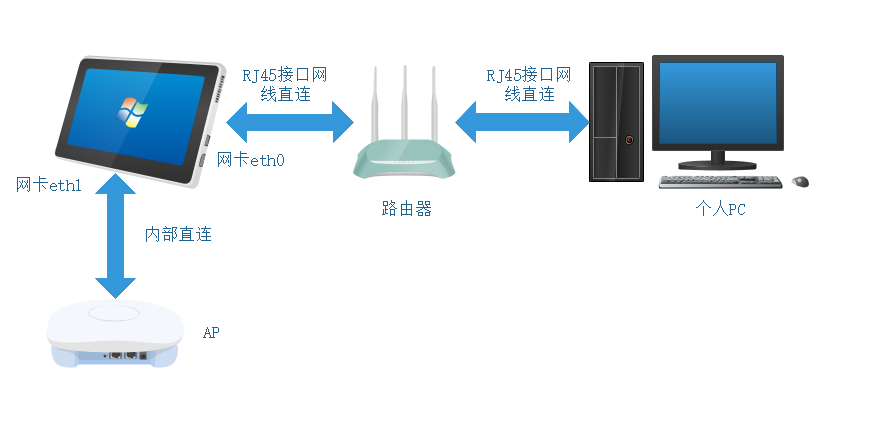
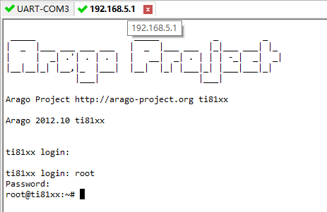

[TOC]
------
<div STYLE="page-break-after: always;"></div>

# 问题的提出

平板这款产品上，只留下了一个RJ45网口，而内部有3张网卡

其中eth0是与外界相连的，可以直接访问到，eth1是外界无法直接访问的

另外一张网卡，实际上可以认为是另一个linux系统，是第三方的产品，作为ap来使用，不妨简称为ap

现在的需求是，pc通过eth0所在的RJ45接口，能访问到ap的web界面，并进行修改

可以画一个简单的结构图帮助理解



按照之前的情况，pc和eth0处于同一网段，eth1和ap处于同一网段，因此无法通过pc访问到ap

如果把4个设备的ip都设置为同一网段，又会导致新的问题，那就是pc访问eth1的数据，将不会到达eth1，而直接由eth0处理，这是linux内部的一种路由机制

最后提出的解决方案，就是在平板内部，设置一个网桥，将eth0的数据转发到eth1

# 简单的使用

对于非开发人员来讲，只需要知道如何操作即可，目前还没有针对平板做正式的升级包，这里做了一个临时的，位于

> https://192.168.1.244:3244/svn/configuratiolibrary/泛教育平台/05编码/交互式录播系统/录播系统/8003/bin/bridge/portable_recSysBin_20200604_for_pad.tar.gz

使用此安装包升级，并按照svn上同样位置的文档**平板如何访问AP模块**进行升级和设置，此文档的后续部分可以不看


# 调试记录

## 内核的修改

<p id="kernel">目前的内核配置，并未打开桥接模式，因此需要先修改内核</p>

目前公司所使用的配置文件为`ti8168_pcie_v2.0_rc_config`

在其基础上进行修改

```cpp
./buildmenu.sh 

[*] Networking support  --->
	Networking options  --->
	<*> 802.1d Ethernet Bridging	//打开bridge
	[*] Network packet filtering framework (Netfilter)  --->	
    	//这一项只有打开了bridge才显示
		<*>   Ethernet Bridge tables (ebtables) support  --->
    		<*>   ebt: broute table support
            ... //全部选中
            <*>   ebt: nflog support
```

目前在svn上已经将配置文件升级为`ti8168_pcie_v2.1_rc_config`了

`ti8168_pcie_v2.1_rc_config`相较于2.0版本还增加一项设置，但是跟本次调试网桥没什么关系

``` cpp
File systems  --->
    DOS/FAT/NT Filesystems  --->
    < > NTFS file system support	//将这一项不选中
```

## mtd block的设置

由于平板设备使用的mtd block与众不同，因此要对`board-ti8168etv.c`文件进行修改

找到`static struct mtd_partition ti816x_nand_partitions[] = {`

修改如下，将uboot logo的大小变为`48 * NAND_BLOCK_SIZE`，其它产品是24

``` cpp
.name           = "U-Boot Logo",
.offset	        = MTDPART_OFS_APPEND,	/* Offset = 0x280000 */
.size  	        = 48 * NAND_BLOCK_SIZE,	//24 * NAND_BLOCK_SIZE,
```

## 编译内核

```shell
./build.sh 
```

生成了目标内核 `Image arch/arm/boot/uImage is ready`

## 烧录内核

将内核文件`uImage`通过挂载或者tftp方式复制到平板文件目录下,在`uImage`所在目录执行以下指令

``` shell
flash_eraseall /dev/mtd3
nandwrite /dev/mtd3 -p uImage
```

## brctl 的编译

<p id="brctl">在网上下载源码`bridge-utils-1.6.tar.xz`进行编译</p>

* 解压

```shell
tar xvf bridge-utils-1.6.tar.xz
```

* 进入源码根目录

```shell
cd bridge-utils-1.6/
```

* 执行autoconf生成自动配置文件

```shell
autoconf
```

* 自动配置,生成makefile,这里可以加参数,但是我比较懒

```shell
./configure
```

* 修改makefile

```shell
vi Makefile
//找一个位置,指定自己的编译工具链
CC=arm-none-linux-gnueabi-gcc
```

* 编译

```shell
make
```

* 将生成的可执行文件拷贝到机器上

注意不要执行`make install`,如果想要执行这条命令,需要在`./configure` 的时候加上参数`--prefix=xxx`,具体可以百度查

## 网桥的设置

* 允许网口进行转发

```shell
echo "1" >/proc/sys/net/ipv4/ip_forward
```

* 创建网桥

``` shell
brctl addbr br0
```

* 绑定网卡

```shell
brctl addif br0 eth0 eth1
```

* 启动网桥

```shell
ifconfig br0 192.168.5.1 up
```

## PC添加目标网段ip

如果此时希望pc能访问平板，需要在pc上新增对应网段的ip

打开以太网设置，按如下步骤操作，添加的目标网段，要和AP的网段保持一致


## 访问平板

输入`ifconfig -a`,可以看到当前网卡的状态

``` shell
root@ti81xx:~# ifconfig -a
br0       Link encap:Ethernet  HWaddr 10:CE:A9:A3:5E:E0  
          inet addr:192.168.5.1  Bcast:192.168.5.255  Mask:255.255.255.0
          UP BROADCAST RUNNING MULTICAST  MTU:1500  Metric:1
          RX packets:16191 errors:0 dropped:3132 overruns:0 frame:0
          TX packets:1969 errors:0 dropped:0 overruns:0 carrier:0
          collisions:0 txqueuelen:0 
          RX bytes:1338806 (1.2 MiB)  TX bytes:2626409 (2.5 MiB)

eth0      Link encap:Ethernet  HWaddr 10:CE:A9:A3:5E:E0  
          inet addr:192.168.10.105  Bcast:192.168.10.255  Mask:255.255.255.0
          UP BROADCAST RUNNING MULTICAST  MTU:1500  Metric:1
          RX packets:32468 errors:0 dropped:175 overruns:0 frame:0
          TX packets:3982 errors:0 dropped:0 overruns:0 carrier:0
          collisions:0 txqueuelen:1000 
          RX bytes:3395809 (3.2 MiB)  TX bytes:3320568 (3.1 MiB)
          Interrupt:40 

eth1      Link encap:Ethernet  HWaddr 10:CE:A9:A3:5E:E1  
          inet addr:192.168.103.202  Bcast:192.168.103.255  Mask:255.255.255.0
          UP BROADCAST RUNNING MULTICAST  MTU:1500  Metric:1
          RX packets:2098 errors:0 dropped:0 overruns:0 frame:0
          TX packets:15866 errors:0 dropped:0 overruns:0 carrier:0
          collisions:0 txqueuelen:1000 
          RX bytes:711348 (694.6 KiB)  TX bytes:1594999 (1.5 MiB)
          Interrupt:44 Base address:0x8000 

lo        Link encap:Local Loopback  
          inet addr:127.0.0.1  Mask:255.0.0.0
          UP LOOPBACK RUNNING  MTU:16436  Metric:1
          RX packets:24 errors:0 dropped:0 overruns:0 frame:0
          TX packets:24 errors:0 dropped:0 overruns:0 carrier:0
          collisions:0 txqueuelen:0 
          RX bytes:2232 (2.1 KiB)  TX bytes:2232 (2.1 KiB)
```

如果成功设置网桥，此时可以通过两个ip，利用telnet访问它

一是设置网桥之前eth0的ip：192.168.10.105

二是设置的网桥的ip：192.168.5.1

通过第二种方法访问时，同样需要先在pc上添加对应的网段，否则pc上没有对应网段的ip，是无法正常访问的



## 设置AP

此时可以通过浏览器访问ap，进行设置，本例中ap的ip为192.168.5.105


## 关闭网桥

与网桥打开的操作相反即可

```shell
ifconfig br0 down
brctl delif br0 eth0 eth1
brctl delbr br0
```

## ap的ip地址搜索

上述调试记录是在已知ap模块ip情况下，该厂家还提供了一个工具，用来搜索模块的ip

在svn的以下目录，提供了Windows pc的工具，用来寻找ap的网段

```shell
https://192.168.1.244:3244/svn/configuratiolibrary/泛教育平台/05编码/交互式录播系统/录播系统/8003/bin/bridge【设备发现】CDDP_1.0.4.7_201804012.zip
```

解压后，进入子目录，找到exe文件，执行即可，注意，执行前，需要先启动网桥，启动网桥的过程目前已经写成脚本，按照脚本执行即可，具体操作可以参考**平板如何访问AP模块**， 网桥的ip给多少并不重要，只要不和其它ip冲突就行


## 网桥设置的脚本

```shell
#!/bin/sh

usage(){
        echo "usage : ./bridge.sh net_bridge_IP/off"
        echo "net_bridge_IP ：can't conflict with other ip"
        echo "example of open the bridge: ./bridge.sh 192.168.88.66"
        echo "example of close the bridge: ./bridge.sh off"
}

set_bridge()
{
        echo "1" >/proc/sys/net/ipv4/ip_forward
        brctl addbr br0
        brctl addif br0 eth0 eth1
        ifconfig br0 $1 up
        echo "net bridge is working, ip : $1"
        echo "you can visit the OS by bridge ip now, and the old ip is still inuse"
        echo "execute ./bridge.sh off to close the net bridge"
}

if [ -z $1 ] || [ $1 = "-h" ] || [ $1 = "-help" ];then
    	usage
elif [ "$1" = "off" ];then
        ifconfig br0 down
        brctl delif br0 eth0 eth1
        brctl delbr br0
else
        set_bridge $1
fi
```

