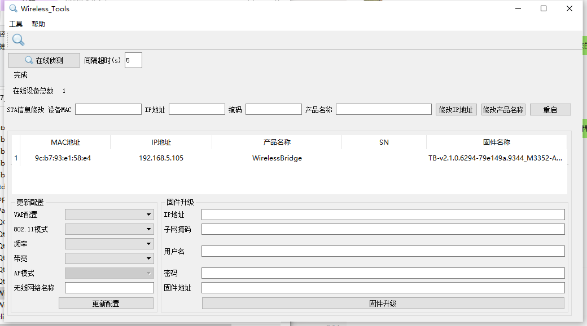
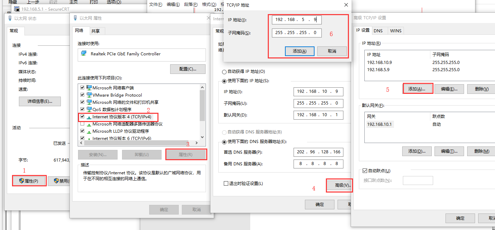
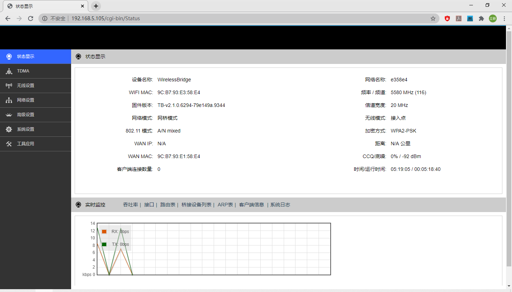

# 安装包的升级
1. 在linux下解压临时升级包

```shell
tar xvf portable_recSysBin_20200604_for_pad.tar.gz
```

2. 按照便携的要求进行升级

```shell
# 先mount挂载目录到机器上，然后进行升级
./envinit.sh initPortable
./envinit.sh disk
rm /sbin/sysdev
cp /zigsun/html/serviceMgr.db /zigsun/db/
```
3. 升级完之后，打开网卡的配置文件

```shell
vi /etc/network/interfaces
```
4. 修改eth0默认的ip，以下ip仅作示范

```shell
iface eth0 inet static
address 192.168.10.105
netmask 255.255.255.0
gateway 192.168.10.1
```

5. 保存重启

```shell
sync
reboot
```

# 打开网桥

执行脚本配置网桥，此脚本有help帮助信息，在执行脚本时，不带参数，或者参数设为`-h`或`-help`可以查看，如下

```shell
root@ti81xx:~# ./bridge.sh 
usage : ./bridge.sh net_bridge_IP/off
net_bridge_IP ：can't conflict with other ip
example of open the bridge: ./bridge.sh 192.168.88.66
example of close the bridge: ./bridge.sh off
```

配置网桥时，需要给网桥的ip参数，这个参数随便设置一个ip即可，但是要是正常的ip，不能是乱七八糟的数或者字符串，而且也不能和其它ip或者网关冲突，网桥的启动需要几秒钟时间，请耐心等待

```shell
cd & ./bridge.sh 192.168.88.66
```

执行成功后提示信息如下

```shell
root@ti81xx:~# cd & ./bridge.sh 192.168.88.66
[1] 13401
device eth0 entered promiscuous mode
device eth1 entered promiscuous mode
br0: port 2(eth1) entering learning state
br0: port 2(eth1) entering learning state
br0: port 1(eth0) entering learning state
br0: port 1(eth0) entering learning state
net bridge is working, ip : 192.168.88.66
you can visit the OS by bridge ip now, and the old ip is still inuse
execute ./bridge.sh off to close the net bridge
[1]+  Done                    cd
```

# 找出ap的网段

在svn的以下目录，提供了Windows pc的工具，用来寻找ap的网段

```shell
https://192.168.1.244:3244/svn/configuratiolibrary/泛教育平台/05编码/交互式录播系统/录播系统/8003/bin/bridge【设备发现】CDDP_1.0.4.7_201804012.zip
```

解压后，进入子目录，找到exe文件，执行即可，如果不知道ap的网段，pc就无法访问它



# pc添加目标网段

为了在配置网桥后，要使pc能正常访问ap，还需要在pc上新增对应网段的ip

打开以太网设置，按如下步骤操作，添加的目标网段



# AP模块的访问

此时可以通过浏览器访问ap，进行设置，本例中ap的ip为192.168.5.105



# 平板的访问

如果成功设置网桥，此时可以通过两个ip，利用telnet访问它

一是设置网桥之前eth0的ip：192.168.10.105

二是设置的网桥的ip：192.168.88.66

通过第二种方法访问时，同样需要先在pc上添加对应的网段，否则pc上没有88网段的ip，是无法正常访问的

# 关闭网桥

```shell
cd & ./bridge.sh off
```
