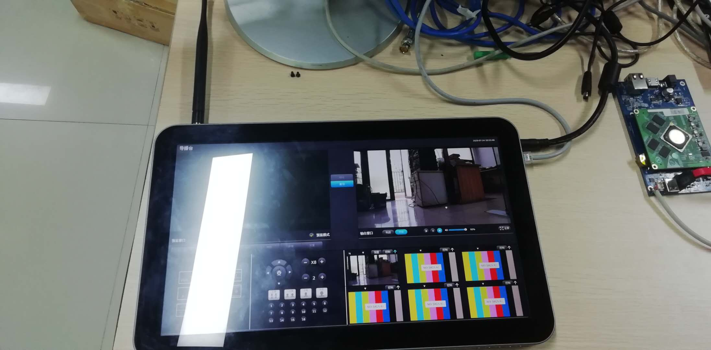

[TOC]

# 连接示意图




# 平板触摸屏不能用的问题

因为在windows下解压，导致tslib的符号链接失效

正常情况下，共享库应该是链接的形式

```shell
lrwxrwxrwx 1 root root    18  6月 30 13:53 libts-1.4.so.0 -> libts-1.4.so.0.2.4
-rwxrwxrwx 1 root root 13208  6月 30 13:53 libts-1.4.so.0.2.4
-rwxrwxrwx 1 root root   938  6月 30 13:53 libts.la
lrwxrwxrwx 1 root root    18  6月 30 13:53 libts.so -> libts-1.4.so.0.2.4
drwxrwxrwx 2 root root  4096  6月 30 13:53 pkgconfig
drwxrwxrwx 2 work work  4096  6月 30 13:53 ts
```

这个问题后面升级包里用脚本加上链接即可解决

对于平板这个临时升级包，先暂时在linux下解压升级


# 平板IP的设置

## eth0的设置

eth0是唯一接出来的网口，用来连网线的，这个一般设成和当前电脑一样的网段，比如我这里电脑ip用的是192.168.10.9，为了方便访问，我把eth0的ip设为192.168.10.161，反正不要跟网段内的其它设备冲突即可，检验ip是否已经有人使用，用电脑ping一下看能不能ping通

### 默认的设置的修改

打开网卡的配置文件

> vi /etc/network/interfaces

上下左右键进行移动，找到如下关于eth0的描述

```shell
iface eth0 inet static
        address 192.168.10.161
        netmask 255.255.255.0
        gateway 192.168.10.1
```

这几句是设置静态ip、网络掩码、网关的，也就是说开机时会将按照这个设置网络

之前已经用vi打开了配置文件，在vi编辑器中，输入i，即可在光标处进行输入，修改好ip后，按下`ESC`，再输入`:wq`，即可保存退出，如果输错了，可以按下`ESC`，再输入`:q`，即可不保存强制退出

### 临时生效的修改

如果不希望更改默认的ip设置，也可以修改一个临时的ip，不过重启后就失效了

> ifconfig eth0 192.168.10.160

## eth1的设置

eth1的设置，**要和无线摄像机的ip网段保持一致**，设置方式，与eth0基本一致，就是修改的是eth1

输入ifconfig，可以查看当前网卡的信息

```shell
root@ti81xx:~# ifconfig 
eth0      Link encap:Ethernet  HWaddr 10:CE:A9:A3:92:2A  
          inet addr:192.168.10.161  Bcast:192.168.10.255  Mask:255.255.255.0
          UP BROADCAST RUNNING MULTICAST  MTU:1500  Metric:1
          RX packets:222089 errors:0 dropped:70 overruns:23871 frame:23871
          TX packets:355616 errors:0 dropped:0 overruns:0 carrier:0
          collisions:0 txqueuelen:1000 
          RX bytes:15515135 (14.7 MiB)  TX bytes:445491529 (424.8 MiB)
          Interrupt:40 Base address:0x8000 

eth1      Link encap:Ethernet  HWaddr 10:CE:A9:A3:92:2B  
          inet addr:192.168.100.101  Bcast:192.168.100.255  Mask:255.255.255.0
          UP BROADCAST RUNNING MULTICAST  MTU:1500  Metric:1
          RX packets:1159037 errors:0 dropped:34 overruns:0 frame:0
          TX packets:22181 errors:0 dropped:0 overruns:0 carrier:0
          collisions:0 txqueuelen:1000 
          RX bytes:1472363462 (1.3 GiB)  TX bytes:2501496 (2.3 MiB)
          Interrupt:44 Base address:0x8000 

lo        Link encap:Local Loopback  
          inet addr:127.0.0.1  Mask:255.0.0.0
          UP LOOPBACK RUNNING  MTU:16436  Metric:1
          RX packets:640 errors:0 dropped:0 overruns:0 frame:0
          TX packets:640 errors:0 dropped:0 overruns:0 carrier:0
          collisions:0 txqueuelen:0 
          RX bytes:60449 (59.0 KiB)  TX bytes:60449 (59.0 KiB)
```

# 网桥的设置

网桥唯一的作用，是让pc能访问到板子上的ap模块、摄像机的sta模块以及摄像机本身，并对其进行修改，如果不打开网桥，pc是无法访问到这些的

网桥如何使用，可以参考之前的文档《平板如何访问AP模块》

这里要额外说明几点

* 网桥的ip可以随意设置
* 网桥的ip不要跟ap、sta、无线摄像机、机器eth0的网段相冲突
* 开启网桥后，可以通过网桥访问机器

目前我所在的测试环境，无线摄像机ip是192.168.5.116，这个ip我待会演示如何修改到192.168.100.116

无线摄像机的sta模块，Ip是192.168.5.106

机器的ap模块，ip是192.168.5.105

机器的eth1的ip，192.168.100.101

机器的eth0的ip，192.168.10.161


打开网桥，随意给一个ip

> ./bridge.sh 192.168.88.66

网桥的打开可能比较慢，打开成功后，会有提示

```shell
root@ti81xx:~# ./bridge.sh 192.168.88.66
net bridge is working, ip : 192.168.88.66
you can visit the OS by bridge ip now, and the old ip is still inuse
execute ./bridge.sh off to close the net bridge
root@ti81xx:~# 
```

一般情况下，仍然可以通过原来的ip地址，用telnet去访问机器，也可以通过新设置的网桥ip去访问机器，不过电脑上要添加对应的网段ip，例如此处网桥的ip是192.168.88.66，电脑可以添加一个192.168.88.9的ip，添加的方法参考《平板如何访问AP模块》中的对应章节

设置网桥后，机器上会多一张虚拟网卡br0

```shell
root@ti81xx:~# ifconfig
br0       Link encap:Ethernet  HWaddr 10:CE:A9:A3:92:2A  
          inet addr:192.168.88.66  Bcast:192.168.88.255  Mask:255.255.255.0
          UP BROADCAST RUNNING MULTICAST  MTU:1500  Metric:1
          RX packets:101099 errors:0 dropped:424 overruns:0 frame:0
          TX packets:16 errors:0 dropped:0 overruns:0 carrier:0
          collisions:0 txqueuelen:0 
          RX bytes:4977099 (4.7 MiB)  TX bytes:672 (672.0 B)

eth0      Link encap:Ethernet  HWaddr 10:CE:A9:A3:92:2A  
          inet addr:192.168.10.161  Bcast:192.168.10.255  Mask:255.255.255.0
          UP BROADCAST RUNNING MULTICAST  MTU:1500  Metric:1
          RX packets:432738 errors:0 dropped:73 overruns:59741 frame:59741
          TX packets:442940 errors:0 dropped:0 overruns:0 carrier:0
          collisions:0 txqueuelen:1000 
          RX bytes:29508049 (28.1 MiB)  TX bytes:545363521 (520.0 MiB)
          Interrupt:40 Base address:0x8000 

eth1      Link encap:Ethernet  HWaddr 10:CE:A9:A3:92:2B  
          inet addr:192.168.100.101  Bcast:192.168.100.255  Mask:255.255.255.0
          UP BROADCAST RUNNING MULTICAST  MTU:1500  Metric:1
          RX packets:1256618 errors:0 dropped:34 overruns:0 frame:0
          TX packets:133614 errors:0 dropped:294 overruns:0 carrier:0
          collisions:0 txqueuelen:1000 
          RX bytes:1586079027 (1.4 GiB)  TX bytes:10123191 (9.6 MiB)
          Interrupt:44 Base address:0x8000 

lo        Link encap:Local Loopback  
          inet addr:127.0.0.1  Mask:255.0.0.0
          UP LOOPBACK RUNNING  MTU:16436  Metric:1
          RX packets:648 errors:0 dropped:0 overruns:0 frame:0
          TX packets:648 errors:0 dropped:0 overruns:0 carrier:0
          collisions:0 txqueuelen:0 
          RX bytes:61081 (59.6 KiB)  TX bytes:61081 (59.6 KiB)
```

打开网桥后，电脑增加对应网段，可以访问机器


# ap和sta模块

打开网桥后，可以利用ap和sta模块提供的工具，搜索他们的ip


目前找到是5.105和5.106，这两个Ip，如果局域网内没人用，那就最好，因为这两个ip不需要修改，如果有人用，那就冲突了，需要把电脑、机器、摄像机连成一个局域网，与外网脱离，然后进行ip的修改，确保不发生冲突

注意ap和sta的ip，一般情况下保持默认，不需要跟无线摄像机以及eth1的网段相同，但是无线摄像机和eth1的网段一定要相同才有画面出来

ap和sta的ip修改，就是打开网桥的情况下，访问它们的web界面进行修改即可，一般情况下，不需要修改


# 无线摄像机

打开网桥后，就能通过电脑访问无线摄像机了，无线摄像机的ip，必须事前知道，这个不知道有没有对应的搜索工具，反正我这是没有

无线摄像机目前ip是192.168.5.116，


进去把ip修改为一个不冲突的，而且要和机器的eth1网段保持一致，目前eth1已经设置为192.168.100.101了，所以摄像机ip可以设置为192.168.100.116，改完无线摄像机要重启


```shell
root@ti81xx:~# ifconfig eth1
eth1      Link encap:Ethernet  HWaddr 10:CE:A9:A3:92:2B  
          inet addr:192.168.100.101  Bcast:192.168.100.255  Mask:255.255.255.0
          UP BROADCAST RUNNING MULTICAST  MTU:1500  Metric:1
          RX packets:1220788 errors:0 dropped:34 overruns:0 frame:0
          TX packets:123781 errors:0 dropped:294 overruns:0 carrier:0
          collisions:0 txqueuelen:1000 
          RX bytes:1542398080 (1.4 GiB)  TX bytes:9308507 (8.8 MiB)
          Interrupt:44 Base address:0x8000 
```

ip的设置已经修改好了


在输入源添加网络摄像机


# 最后的设置

所有的配置都ok之后，关闭网桥

```
./bridge.sh off
```

通过eth0的ip访问机器，即可看到图像


注意，不关闭网桥的情况下，机器是访问不了无线摄像机的，无线摄像机的数据包会被机器直接转发到pc端这边，所以想要出图像，设置完毕后，一定要关闭网桥