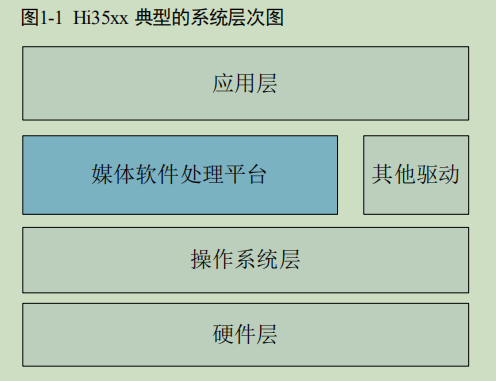
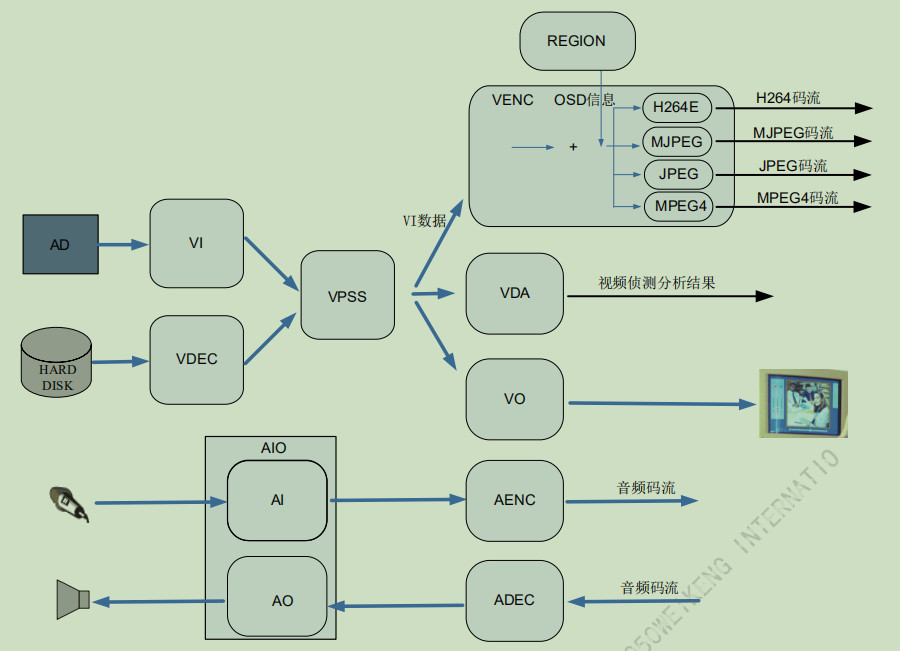
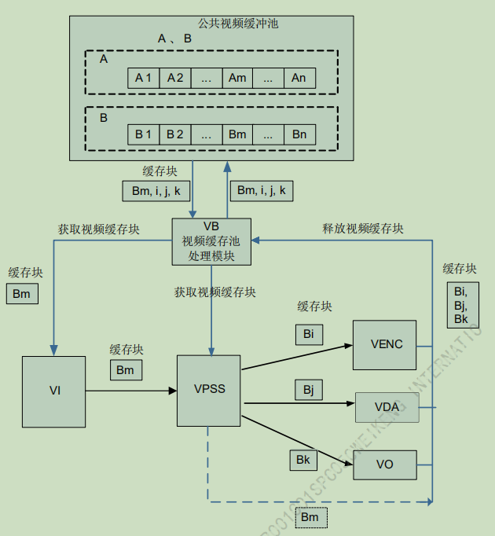

[TOC]
------
<div STYLE="page-break-after: always;"></div>
# 系统架构及缓存池
首先要看一下《HiMPP 媒体处理软件开发参考.pdf》的第一章和第二章，对于基本的框架要有概念

## 概述

海思提供的媒体处理软件平台(Media Process Platform,简称 MPP)，可支持应用软件快速开发。该平台对应用软件屏蔽了芯片相关的复杂的底层处理，并对应用软件直接提供
MPI（MPP Programe Interface）接口完成相应功能。该平台支持应用软件快速开发以下功能：

* 输入视频捕获
* H.264/MJPEG/JPEG/MPEG4 编码
* H264/H.265/VC1/MPEG4/MPEG2/AVS 解码
* 视频输出显示
* 视频图像前处理（包括去噪、增强、锐化、Deinterlace）
* 编码码流叠加 OSD
* 视频侦测分析
* 智能分析、音频捕获及输出
* 音频编解码

## 系统架构


* 硬件层：硬件层由 Hi35xx 芯片加上必要的外围器件构成。外围器件包括 Flash、DDR（Double Data-Rate）、视频 Sensor 或 AD、音频 AD 等。
* 操作系统层：基于 linux OS 系统
* 媒体处理平台：基于操作系统层，控制芯片完成相应的媒体处理功能。它对应用层屏蔽了硬件处理细节，并为应用层提供 API 接口完成相应功能
* 其他驱动：除媒体处理平台外,海思为 Hi35xx 芯片的其他相关硬件处理单元提供了相应的驱动, 包括 GMAC、SDIO、I2C、USB、SSP 等驱动
* 应用层：基于海思媒体处理平台及其他驱动，由用户开发的应用软件系统

## MPP架构


* VI 模块：捕获视频图像，可对其做剪切、缩放、镜像等处理，并输出多路不同分辨率的图像数据。
* VDEC解码模块：对编码后的视频码流进行解码，并将解析后的图像数据送 VPSS 进行图像处理或直接送 VO 显示。可对 H.264/H.265/VC1/MPEG4/MPEG2/AVS 格式的视频码流进行解码。
* VPSS 模块：接收 VI 和解码模块发送过来的图像，可对图像进行去噪、图像增强、锐化等处理，并实现同源输出多路不同分辨率的图像数据用于编码、预览或抓拍。
* VENC编码模块：接收 VI 捕获并经 VPSS 处理后输出的图像数据，可叠加用户通过 Region模块设置的 OSD 图像，然后按不同协议进行编码并输出相应码流。
* VDA 模块：接收 VI 的输出图像，并进行移动侦测和遮挡侦测，最后输出侦测分析结果。
* VO 模块：接收 VPSS 处理后的输出图像，可进行播放控制等处理，最后按用户配置的输出协议输出给外围视频设备。
* AI 模块：捕获音频数据，然后 AENC 模块支持按多种音频协议对其进行编码，最后输出音频码流。

用户从网络或外围存储设备获取的音频码流可直接送给 ADEC 模块，ADEC 支持解码多种不同的音频格式码流，解码后数据送给 AO 模块即可播放声音。

应用程序启动 MPP 业务前，必须完成 MPP 系统初始化工作。同理，应用程序退出MPP 业务后，也要完成 MPP 系统去初始化工作，释放资源


## 视频缓存池
视频缓存池主要向媒体业务提供大块物理内存管理功能，负责内存的分配和回收，充分发挥内存缓存池的作用，让物理内存资源在各个媒体处理模块中合理使用。
一组大小相同、物理地址连续的缓存块组成一个视频缓存池。必须在系统初始化之前配置公共视频缓存池。根据业务的不同，公共缓存池的数量、缓存块的大小和数量不同


所有的视频输入通道都可以从公共视频缓存池中获取视频缓存块用于保存采集的图像，如图中所示从公共视频缓存池 B 中获取视频缓存块 Bm。缓存块 Bm 经 VI 发送给 VPSS，输入缓存块 Bm 经过 VPSS 处理之后被释放回公共视频缓存池。假设VPSS 通道的工作模式是 USER，则 VPSS 通道 0 从公共视频缓存池 B 中获取缓存块 Bi 作为输出图像缓存 buffer 发送给 VENC，VPSS 通道 1 从公共视频缓存池 B 中获取缓存块 Bk 作为输出图像缓存 buffer 发送给 VO，Bi 经 VENC 编码完之后释放回公共视频缓存池，Bk 经 VO 显示完之后释放回公共视频缓存池


# 系统的去初始化

## 参考代码及makfile

这一部分需要用的库和头文件，在每个API中均有说明，hi_comm_sys.h、hi_comm_vb.h、mpi_sys.h、mpi_vb.h、libmpi.a，需要在代码中引入头文件，在makefile中引入库文件libmpi.a，并指定头文件的位置

除此之外，我提供的马克file中的其它静态库和其它链接库也是编译所必须的，当然你可以去找sample的makefile改一下拿过来用

### glx_hdmi.c

```cpp
#include <hi_comm_sys.h>
#include <hi_comm_vb.h>

#include <mpi_sys.h>
#include <mpi_vb.h>

HI_VOID hi_mpp_sys_deinit(HI_VOID)
{
	HI_U32 i = 0;
	HI_MPI_SYS_Exit();
	for(i=0; i<VB_MAX_USER; i++)
	{
		HI_MPI_VB_ExitModCommPool(i);
	}
	for (i=0; i<VB_MAX_POOLS; i++)
    {
         HI_MPI_VB_DestroyPool(i);
    }
	HI_MPI_VB_Exit();
}

int main(int argc, char * argv [ ])
{
	hi_mpp_sys_deinit();
	return 0;
}

```

### makefile

```shell
CC := arm-hisiv500-linux-gcc
SRC  := glx_hdmi.c
OBJ  := glx_hdmi.bin
CFLAGS := -Wall -g
INC_FLAGS := -I../include
LIBA := ../lib/libmpi.a ../lib/libjpeg.a ../lib/libVoiceEngine.a ../lib/libupvqe.a ../lib/libdnvqe.a ../lib/libhdmi.a
LIBS :=
LIB := -lpthread -ldl -lm

all:
	 $(CC) $(SRC) -o $(OBJ) 	\
	 $(CFLAGS)					\
	 $(INC_FLAGS)				\
	 $(LIBA)					\
	 $(LIBS)					\
	 $(LIB)
	
clean:
	rm -f *.bin *.o
```

第一步对系统去初始化，以防止因上一次错误退出，部分模块没有还原到初始状态而出现问题，可以理解为将整个mpp重置

## step1
去初始化 MPP 系统。除了音频的编解码通道外，所有的音频输入输出、视频输入输出、视频编码、视频叠加区域、视频侦测分析通道等都会被销毁或者禁用。

```cpp
HI_S32 HI_MPI_SYS_Exit(HI_VOID);
```
## step2
退出模块公共视频缓存池

```cpp
//注意参数是一个枚举变量，所以此处应该对枚举的每一个值，都执行此函数，也就是需要一个for循环
HI_S32 HI_MPI_VB_ExitModCommPool(VB_UID_E enVbUid);
```

## step3
销毁视频缓存池

```cpp
//注意参数是一个枚举变量，所以此处应该对枚举的每一个值，都执行此函数，也就是需要一个for循环
HI_S32 HI_MPI_VB_DestroyPool(VB_POOL Pool);
```

## step4
去初始化 MPP 视频缓存池

```cpp
HI_S32 HI_MPI_VB_Exit (HI_VOID);
```

# 系统的初始化

进行工作之前，得对内存池和mpp做一个基本的初始化，具体步骤可以参考sample中的sample_vio.c
## 参考代码

```cpp
HI_VOID hi_mpp_sys_init(HI_VOID)
{
	VB_CONF_S stVbConf = {0};
	MPP_SYS_CONF_S stSysConf = {0};

	stVbConf.u32MaxPoolCnt = 64;
    stVbConf.astCommPool[0].u32BlkSize = 1920*1080*2;
    stVbConf.astCommPool[0].u32BlkCnt  = 20;
		
	HI_MPI_VB_SetConf(&stVbConf);
	HI_MPI_VB_Init();
	stSysConf.u32AlignWidth = 64;
	HI_MPI_SYS_SetConf(&stSysConf);
	HI_MPI_SYS_Init();
}
```

## step1

设置 MPP 视频缓存池属性

```cpp
HI_S32 HI_MPI_VB_SetConf (const VB_CONF_S *pstVbConf);
```

注意到传进来的是结构体指针，所以需要提前声明一个结构体变量，并往里面填充初始值
```cpp
//定义视频缓存池属性结构体
typedef struct hiVB_CONF_S
{
    HI_U32 u32MaxPoolCnt; /* max count of pools, (0,VB_MAX_POOLS] */
    Struct hiVB_CPOOL_S
    {
        HI_U32 u32BlkSize;
        HI_U32 u32BlkCnt;
        HI_CHAR acMmzName[MAX_MMZ_NAME_LEN];
    }astCommPool[VB_MAX_COMM_POOLS];
} VB_CONF_S;
```

* 结构体成员u32MaxPoolCnt，是整个系统中可容纳的缓存池个数，一般按sample取值16、64或128，最大值可以取到256，但是目前没见别人用过
* Struct hiVB_CPOOL_S是缓存池的属性，具体又分为三项
    * u32BlkSize ：一个缓存块（bulk）的大小，以byte为单位，根据视频帧大小计算得到，这个给的太小了会导致视频数据装不下
    * u32BlkCnt ：缓存块的数量
    * acMmzName：在mmz中的名字

name应该是用处不大，所以一般不写，以下参数仅供参考

```cpp
stVbConf.u32MaxPoolCnt = 64;
stVbConf.astCommPool[0].u32BlkSize = 1920*1080*2;
stVbConf.astCommPool[0].u32BlkCnt  = 20;
```

## step2

初始化 MPP 视频缓存池
```cpp
HI_S32 HI_MPI_VB_Init (HI_VOID);
```

## step3
配置系统控制参数

```cpp
HI_S32 HI_MPI_SYS_SetConf(const MPP_SYS_CONF_S *pstSysConf);
```

这里同样也需要先声明一个结构体并初始化
```cpp
typedef struct hiMPP_SYS_CONF_S
{
    HI_U32 u32AlignWidth;
}MPP_SYS_CONF_S;
```
这个结构体很简单，就一个变量 u32AlignWidth，是整个系统中使用图像的 stride 字节对齐数。
该变量要求是16的倍数，取值区间是[1, 1024]

stride是说的图像的一行，在内存中所占的字节数，比如现在u32AlignWidth=64，也就是说每一行图像在内存中占64个字节，按这种方式对齐，但是这64个字节中，并不是所有字节都保存了有效数据，除了图像数据外，可能还有扩展的内容和空白的部分，比较常见的取值就是64和16

## step4
初始化 MPP 系统。除了音频的编解码通道外，所有的音频输入输出、视频输入输出、视频编码、视频叠加区域、视频侦测分析等都会被初始化

```cpp
HI_S32 HI_MPI_SYS_Init(HI_VOID);
```

# VDEC的初始化

VDEC 模块提供驱动视频解码硬件工作的 MPI 接口，实现视频解码功能

## VDEC基础知识

### 码流发送方式

数据到达解码器的方式有两种

* 流式发送：VIDEO_MODE_STREAM

发送的码流长度可以任意，但是解码器要收到下一帧码流才会认为上一帧的结束，所以发送到解码器后，可能不会立即解码

* 按帧发送：VIDEO_MODE_FRAME

每次发送一个完整帧，解码器接收到就认为该帧已经结束，立即开始解码

### 解码协议切换

通过模块参数 u32ProtocolSwitch 控制解码是否支持解码视频协议（H.264/H.265/MPEG4）之间的切换，一般情况下用不上这个功能

### 图像输出方式

根据 H.264/H265 协议，解码图像可能不会在解码后立即输出。VDEC 解码器可以通过设置不同的图像输出方式达到尽快输出的目的。图像输出方式包括以下两种

* 解码序：解码图像按照解码的先后顺序输出
* 显示序：解码图像按照 H.264/H265 协议输出

一般情况下设置为显示序：s32DecOrderOutput=0

### 时间戳（PTS）处理

以VIDEO_MODE_FRAME模式发送码流时，需要设置时间戳参数PTS

* PTS=0：用户不进行帧率控制，而是由视频输出模块（VO）进行帧率控制
* PTS=-1：此图像不会被视频输出模块（VO）显示
* other：视频输出模块（VO）根据用户设置的 PTS 值进行帧率控制

这个值我设置过-1和其它，没啥变化，以后知道是怎么回事再来补充

### 解码图像旋转

VDEC 支持解码图像按 0 度、90 度、180 度、270 度旋转后输出，旋转后输出的图像都是非压缩的，图像旋转角度可在接口 HI_MPI_VDEC_SetRotate 中设置

```cpp
HI_MPI_VDEC_SetRotate(u32ChnId, ROTATE_180);	//旋转180度显示，仅供娱乐
```

### 亮度统计信息

**这个功能可能有点鸡肋**

VDEC 支持获取一帧解码图像的亮度像素统计和、亮度像素平均值。亮度统计信息可通过接口 HI_MPI_VDEC_GetChnLuma 来获取。亮度统计信息里记录了码流PTS 值，如果想要知道当前获取到的亮度统计信息是具体哪一帧的亮度信息，可通过按帧模式发送码流，送入不同的 PTS 值来对应到具体某一帧

### 用户图片

当网络异常断开，前端没有码流送来时，用户可通过设置插入用户图片显示在 VO上，以提示当前网络异常或没有码流可解码。VDEC 提供两种插入用户图片方式

* 立刻插入用户图片：VDEC 会先清空解码器内部的码流和图像，然后插入用户图片
* 延迟插入用户图片：VDEC 会先把解码器内部的码流全部解完，待解码图像全部输出之后再插入用户图片

这个下次做图片解码的实验再细说

### 解码帧存分配方式

**一般情况下，这里默认是第一种ModuleVB池**

* 解码 ModuleVB 池：创建解码通道时不分配图像 Buffer，而是由用户调用相应的 MPI 接口创建专属于解码模块的 ModuleVB 池，该 VB 池只允许 VDEC 获取VB 块，其它模块只能使用不能获取。支持协议切换时，用户需要预先分配PMV VB 内存

* 解码 PrivateVB 池：创建解码通道时由 VDEC 创建私有 VB 池作为该通道的图像 Buffer，用户可以在创建通道前调用接口 HI_MPI_VDEC_SetChnVBCnt 来设置通道私有 VB 池的 VB 个数，默认个数为 5。支持协议切换时，系统默认分配 PMV VB 内存

* 解码 UserVB 池：创建解码通道时不分配图像 Buffer，而是由用户调用接口HI_MPI_VB_CreatePool 创建一个视频缓存 VB 池，再通过调用接口HI_MPI_VDEC_AttachVbPool 把某个解码通道绑定到固定的视频缓存 VB 池中。支持协议切换时，用户需要预先分配 PMV VB 内存


三种解码帧存分配方式可通过 ko 加载时设置模块参数 VBSource 来选择。VBSource=0 表示使用解码 ModuleVB 池方式；VBSource =1 表示使用解码PrivateVB 池方式；VBSource=2 表示使用解码 UserVB 池方式。当解码帧存使用ModuleVB 池或者 UserVB 池方式时，可以不用销毁解码通道直接销毁 VB 池，但是销毁解码 VB 池前用户必须保证没有任何模块正在使用这个 VB 池里的任何一块 VB（可通过复位解码通道，以及复位解码直接或间接绑定的后级模块实现，如VDEC 绑定 VPSS，VPSS 绑定 VO，则就要同时复位 VDEC、VPSS 和 VO）。如果用户是从 VDEC 里获取图像上去，无论哪种帧存分配方式，必须保证全部图像释放回 VDEC，否则会出现程序异常的情况

### 码流 Buffer 配置模式

**一般情况下，这里默认是一般模式**

解码码流 buffer 配置支持两种模式：一般模式和省内存模式

* 一般模式：码流 Buffer 总大小为用户配置的 u32BufSize+通道宽 x 通道高/2，u32BufSize 可配置的最小值为通道宽 x 通道高 x3/4，此模式下码流 Buffer 能容纳每一帧码流，包括超大帧
* 省内存模式：码流 Buffer 的总大小为用户创建解码通道时配置的 u32BufSize 的大小，u32BufSize 可配置的最小值为 32KB，但是用户必须保证送入码流每帧大小不能超过 u32BufSize - 4KB。此模式下码流的发送方式必须按帧发送

### 通道解码能力

通道解码能力是指当前解码通道所能解码的总分辨率。例如，用户创建了一个宽为1920，高为 1080 的解码通道，那么当前解码通道的通道解码能力就为1920x1080，在内存足够的前提下，当前通道能解码任何 WxH <= 1920x1080 分辨率的码流

这里要注意的是，即使码流 WxH 的总分辨率一样，但是不同的宽高组合解码所需要的内存大小还是不一样的。比如用户希望一个解码通道能同时解码 1920x1080 和1080x1920 两种分辨率的码流，用户可以用宏 VB_PIC_BLK_SIZE(Width, Height,Type, size)分别计算这两种码流所需内存的大小，然后取大值分配 VB，创建解码通道


## step1 解码缓存池的初始化

由于要做h264的视频文件解码，所以先得将文件打开，然后将二进制数据发送给VDEC模块，因此需要初始化VDEC

在这之前，VDEC需要将解码后的数据，放入缓存池，然后缓存池的数据最终被VPSS获取，因此需要先初始化VDEC的缓存池

库文件需要增加 mpi_vdec.h、hi_comm_vdec.h

### 参考代码：

```cpp
#include <hi_comm_vdec.h>
#include <mpi_vdec.h>

HI_VOID hi_mpp_vdec_vb_init(HI_VOID)
{
	VB_CONF_S stVbConf = {0};
	HI_S32 s32PicSize;
	
	stVbConf.u32MaxPoolCnt = 2;
	VB_PIC_BLK_SIZE(1920, 1080, PT_H264, s32PicSize);
	stVbConf.astCommPool[0].u32BlkSize   = s32PicSize;
	stVbConf.astCommPool[0].u32BlkCnt    = 5;
	
	HI_MPI_VB_SetModPoolConf(VB_UID_VDEC, &stVbConf);
    HI_MPI_VB_InitModCommPool(VB_UID_VDEC);
}
```

### 设置模块公共视频缓冲池属性

模块公共视频缓冲区的配置根据实际需要配置，否则会造成内存浪费。

```cpp
stVbConf.u32MaxPoolCnt = 2;
VB_PIC_BLK_SIZE(1920, 1080, PT_H264, s32PicSize);
stVbConf.astCommPool[0].u32BlkSize   = s32PicSize;
stVbConf.astCommPool[0].u32BlkCnt    = 5;
```

### 创建公共视频缓存池

```cpp
HI_MPI_VB_SetModPoolConf(VB_UID_VDEC, &stVbConf);
HI_MPI_VB_InitModCommPool(VB_UID_VDEC);
```

## step2 创建通道

### 参考代码

```cpp
HI_VOID hi_mpp_vdec_ch_init(HI_VOID)
{
	HI_U32 u32ChnId = 0;
	VDEC_CHN_ATTR_S stVdecAttr = {0};

	stVdecAttr.enType       = PT_H264;
    stVdecAttr.u32BufSize   = 3 * 1920 * 1080;
    stVdecAttr.u32Priority  = 5;
    stVdecAttr.u32PicWidth  = 1920;
    stVdecAttr.u32PicHeight = 1080;
    stVdecAttr.stVdecVideoAttr.enMode=VIDEO_MODE_FRAME;
    stVdecAttr.stVdecVideoAttr.u32RefFrameNum = 2;
    stVdecAttr.stVdecVideoAttr.bTemporalMvpEnable = 0;
	
	HI_MPI_VDEC_CreateChn(u32ChnId, &stVdecAttr);
}
```


### 创建通道

```cpp
HI_S32 HI_MPI_VDEC_CreateChn(VDEC_CHN VdChn, const VDEC_CHN_ATTR_S *pstAttr)
```

创建通道前，需要先构建通道参数

```cpp
typedef struct hiVDEC_CHN_ATTR_S
{
    PAYLOAD_TYPE_E enType; 		/* 解码协议类型 */
    HI_U32 u32BufSize; 			/* 码流Buffer大小 */
    HI_U32 u32Priority; 		/* 通道优先级 */
    HI_U32 u32PicWidth; 		/* 通道宽 */ 
    HI_U32 u32PicHeight; 		/* 通道高 */
    union
    {
        VDEC_ATTR_JPEG_S stVdecJpegAttr;
        VDEC_ATTR_VIDEO_S stVdecVideoAttr;
    };
}VDEC_CHN_ATTR_S;

typedef struct hiVDEC_ATTR_VIDEO_S 
{ 
 HI_U32 u32RefFrameNum ; 		/* 参考帧个数 */
 VIDEO_MODE_E enMode; 			/* 发送码流方式 */
 HI_BOOL bTemporalMvpEnable; 	/* 是否支持时域运动矢量预测*/
}VDEC_ATTR_VIDEO_S, *PTR_VDEC_ATTR_VIDEO_S;
```

* 解码协议类型在枚举PAYLOAD_TYPE_E中定义了很多，这里用到H264解码就是PT_H264

* 码流Buffer大小一般情况下，大于等于解码通道大小（宽 x 高）的 3/4 倍，sample给的参数是3倍

* 通道优先级，取值范围为 1 ~ 255，值越大优先级越高。注意：0 表明此通道不被调度，JPEGD 解码优先级无效但必须设

置为非 0 才能解码

* 通道宽、通道高，一般都是1920*1080，单位是像素

* stVdecJpegAttr是JPEG 通道的相关属性

* stVdecVideoAttr是除 JPEG 以外其它所支持类型的通道的相关属性

* 参考帧个数取值范围：[0, 16]，参考帧的数目决定解码时需要的参考帧个数，会较大的影响内存 VB 块占用，根据实际情况设置合适的值。海思自编码流：推荐设为 2。 

* 发送码流方式，一般为按帧发送

* 是否支持时域运动矢量预测，如果 H.264/MPEG4 解码不需要解码 B 帧，或者 H.265 解码不需要解码支持时域运动矢量预测，则配置bTemporalMvpEnable 为 0，否则配置为 1，在H264协议里定义了三种帧，I、P、B，肯定是需要B帧的，所以这里设置为1

## step3 启动解码线程

### 参考代码

```cpp
HI_VOID hi_mpp_vdec_init(HI_VOID)
{
	hi_mpp_vdec_vb_init();
	hi_mpp_vdec_ch_init();
	HI_MPI_VDEC_StartRecvStream(u32ChnId);
	pthread_create(&vdec_info.decThread, 0, hi_video_send_to_vdec_thread, NULL);
}
```

依次调用vdec的缓存池和通道初始化，然后调用HI_MPI_VDEC_StartRecvStream后，vdev就开始接收码流了，这时候需要创建一个线程，从文件中读出数据，并发送给vdec

线程中需要使用到一些通道的参数，因此创建一个全局的结构体，来保存视频解码的部分信息

```cpp
struct VDEC_INFO{
	HI_U32 u32ChnId;		//解码通道号
	HI_U32 u32BufSize;		//通道buf大小
	pthread_t decThread;	//线程结构体
	HI_BOOL threadState;	//线程状态，置false时，停止并回收线程
}vdec_info;
```

在`hi_mpp_vdec_ch_init`中，对结构体vdec_info做初始化

```cpp
HI_VOID hi_mpp_vdec_ch_init(HI_VOID)
{
	...
	vdec_info.u32ChnId = u32ChnId;
	vdec_info.u32BufSize = 1920*1080;
	vdec_info.threadState = HI_TRUE;
	...
}
```

发送码流的线程如下

```cpp
HI_VOID * hi_video_send_to_vdec_thread(HI_VOID *args)
{
	FILE *fp=NULL;
	HI_U8 *pBuf = NULL;
	HI_S32 s32UsedBytes = 0, s32ReadLen, s32Ret;
	VDEC_STREAM_S stStream = {0};

	//二进制方式打开h264视频文件
	fp = fopen("1080P.h264", "rb");
	pBuf = malloc(vdec_info.u32BufSize);

	while (1)
	{
		if(vdec_info.threadState == HI_FALSE)
			break;
		s32ReadLen = fread(pBuf, 1, vdec_info.u32BufSize, fp);
		if (s32ReadLen == 0)				//文件已经读完，又重头开始读取，实现循环播放的效果
		{
			s32UsedBytes = 0;
			fseek(fp, 0, SEEK_SET); 		//文件指针的位置归零
			s32ReadLen = fread(pBuf, 1, vdec_info.u32BufSize, fp);  
		}		
		stStream.u64PTS  = 0;
		stStream.pu8Addr = pBuf;
		stStream.u32Len  = s32ReadLen;
		stStream.bEndOfFrame = HI_FALSE;
		stStream.bEndOfStream = HI_FALSE;
SEND:		
		s32Ret = HI_MPI_VDEC_SendStream(vdec_info.u32ChnId, &stStream, 0);
		if (HI_SUCCESS != s32Ret)
        {
        	printf("not success ret=0x%X\n", s32Ret);
			sleep(1);
			goto SEND;
        }
        else
        {
        	printf("success ret=0x%X\n", s32Ret);
            s32UsedBytes += s32ReadLen;
        }
		usleep(20000);
	};
	free(pBuf);
	fclose(fp);
	printf("video thread exit 0\n");
	return NULL;
}
```

### 线程分析

该线程中用到了诸如 sleep、usleep、malloc、free等函数是需要加标准库文件的

```
#include <unistd.h>
#include <stdlib.h>
```

* 需要注意的是，调用`HI_MPI_VDEC_SendStream`发送数据并不一定能成功，正常情况下返回0和HI_ERR_VDEC_BUF_FULL ，因此可以sleep一段时间再尝试发送

* 码流肯定是二进制的数据，如果不加b的话，无法识别

* 关于buf分配的大小，因为之前设置的按帧发送，所以每次读取一帧的大小，比如视频是`1920*1080`，那这u32BufSize就应该设为`1920*1080`

* 关于vdec_info.threadState，在程序退出时，线程需要一个标志位知道程序要完蛋了，自己也赶紧跑路，否则主线程会卡在线程回收上

* SEND的存在，主要是因为不是每一次发送都能成功，如果之前没有成功，就不能继续读，而是直接把之前读的数据，再次尝试发送。如果不用跳转语句，也可以反复去读，不过要修改文件指针的定位

### 发送函数分析

```cpp
HI_S32 HI_MPI_VDEC_SendStream(VDEC_CHN VdChn, const VDEC_STREAM_S *pstStream, HI_S32 s32MilliSec);
```

这个函数就是用来向向视频解码通道发送码流数据

* VdChn是解码通道号，取值范围：[0, VDEC_MAX_CHN_NUM)，跟之前的设置保持一致

* pstStream是解码码流数据指针，要发送的数据，及相关信息，都放在所指向的结构体中

* MilliSec是送码流方式标志，取值范围：

  * -1：阻塞
  * 0：非阻塞
  * 正值：超时时间，没有上限值，以 ms 为单位动态属性

  这个取值比较随意，一般不采用阻塞，否则出错了线程就卡死了

```cpp
typedef struct hiVDEC_STREAM_S
{
 HI_U8* pu8Addr; 		/* 码流地址 */
 HI_U32 u32Len; 		/* 码流长度 */
 HI_U64 u64PTS; 		/* 时间戳 */
 HI_BOOL bEndOfFrame; 	/* 当前帧是否结束 */
 HI_BOOL bEndOfStream; 	/* 是否发完所有码流 */
}VDEC_STREAM_S;
```

* pu8Addr是码流包的地址，也就是要发送的数据buffer，的指针
* u32Len是码流包的长度，以 byte 为单位，要发送数据的长度
* u64PTS是码流包的时间戳，以 μs 为单位。
* bEndOfFrame是当前帧是否结束，此值目前暂无效，直接给0
* bEndOfStream是否发完所有码流，如果是读文件，一个文件播完了想停下，最后一次发送这里置1


# 当前源代码

打字有点多，markdown解析器已经开始卡顿了，就先到这，最后贴一下进行到目前的代码

```cpp
#include <stdio.h>
#include <unistd.h>
#include <stdlib.h>

#include <hi_comm_sys.h>
#include <hi_comm_vb.h>
#include <hi_comm_vdec.h>

#include <mpi_sys.h>
#include <mpi_vb.h>
#include <mpi_vdec.h>

struct VDEC_INFO{
	HI_U32 u32ChnId;		//解码通道号
	HI_U32 u32BufSize;		//通道buf大小
	pthread_t decThread;	//线程结构体
	HI_BOOL threadState;	//线程状态，置0时，停止并回收线程
}vdec_info;


HI_VOID * hi_video_send_to_vdec_thread(HI_VOID *args)
{
	FILE *fp=NULL;
	HI_U8 *pBuf = NULL;
	HI_S32 s32UsedBytes = 0, s32ReadLen, s32Ret;
	VDEC_STREAM_S stStream = {0};

	//二进制方式打开h264视频文件
	fp = fopen("1080P.h264", "rb");
	pBuf = malloc(vdec_info.u32BufSize);

	while (1)
	{
		if(vdec_info.threadState == HI_FALSE)
			break;
		s32ReadLen = fread(pBuf, 1, vdec_info.u32BufSize, fp);
		if (s32ReadLen == 0)				//文件已经读完，又重头开始读取，实现循环播放的效果
		{
			s32UsedBytes = 0;
			fseek(fp, 0, SEEK_SET); 		//文件指针的位置归零
			s32ReadLen = fread(pBuf, 1, vdec_info.u32BufSize, fp);  
		}		
		stStream.u64PTS  = 0;
		stStream.pu8Addr = pBuf;
		stStream.u32Len  = s32ReadLen;
		stStream.bEndOfFrame = HI_FALSE;
		stStream.bEndOfStream = HI_FALSE;
SEND:		
		s32Ret = HI_MPI_VDEC_SendStream(vdec_info.u32ChnId, &stStream, 0);
		if (HI_SUCCESS != s32Ret)
        {
        	printf("not success ret=0x%X\n", s32Ret);
			sleep(1);
			goto SEND;
        }
        else
        {
        	printf("success ret=0x%X\n", s32Ret);
            s32UsedBytes += s32ReadLen;
        }
		usleep(20000);
	};
	free(pBuf);
	fclose(fp);
	printf("video thread exit 0\n");
	return NULL;
}

HI_VOID hi_mpp_sys_deinit(HI_VOID)
{
	HI_U32 i = 0;
	HI_MPI_SYS_Exit();
	for(i=0; i<VB_MAX_USER; i++)
	{
		HI_MPI_VB_ExitModCommPool(i);
	}
	for (i=0; i<VB_MAX_POOLS; i++)
    {
         HI_MPI_VB_DestroyPool(i);
    }
	HI_MPI_VB_Exit();
}

HI_VOID hi_mpp_sys_init(HI_VOID)
{
	VB_CONF_S stVbConf = {0};
	MPP_SYS_CONF_S stSysConf = {0};

	stVbConf.u32MaxPoolCnt = 64;
    stVbConf.astCommPool[0].u32BlkSize = 1920*1080*2;
    stVbConf.astCommPool[0].u32BlkCnt  = 20;
		
	HI_MPI_VB_SetConf(&stVbConf);
	HI_MPI_VB_Init();
	stSysConf.u32AlignWidth = 64;
	HI_MPI_SYS_SetConf(&stSysConf);
	HI_MPI_SYS_Init();
}

HI_VOID hi_mpp_vdec_vb_init(HI_VOID)
{
	VB_CONF_S stVbConf = {0};
	HI_S32 s32PicSize;
	
	stVbConf.u32MaxPoolCnt = 2;
	VB_PIC_BLK_SIZE(1920, 1080, PT_H264, s32PicSize);
	stVbConf.astCommPool[0].u32BlkSize   = s32PicSize;
	stVbConf.astCommPool[0].u32BlkCnt    = 5;
	
	HI_MPI_VB_SetModPoolConf(VB_UID_VDEC, &stVbConf);
    HI_MPI_VB_InitModCommPool(VB_UID_VDEC);
}

HI_VOID hi_mpp_vdec_ch_init(HI_VOID)
{
	HI_U32 u32ChnId = 0;
	VDEC_CHN_ATTR_S stVdecAttr = {0};

	stVdecAttr.enType       = PT_H264;
    stVdecAttr.u32BufSize   = 3 * 1920 * 1080;
    stVdecAttr.u32Priority  = 5;
    stVdecAttr.u32PicWidth  = 1920;
    stVdecAttr.u32PicHeight = 1080;
    stVdecAttr.stVdecVideoAttr.enMode=VIDEO_MODE_FRAME;
    stVdecAttr.stVdecVideoAttr.u32RefFrameNum = 2;
    stVdecAttr.stVdecVideoAttr.bTemporalMvpEnable = 1;

	vdec_info.u32ChnId = u32ChnId;
	vdec_info.u32BufSize = 1920 * 1080;
	vdec_info.threadState = HI_TRUE;
	HI_MPI_VDEC_CreateChn(u32ChnId, &stVdecAttr);
	
}

HI_VOID hi_mpp_vdec_init(HI_VOID)
{
	hi_mpp_vdec_vb_init();
	hi_mpp_vdec_ch_init();
	HI_MPI_VDEC_StartRecvStream(vdec_info.u32ChnId);
	pthread_create(&vdec_info.decThread, 0, hi_video_send_to_vdec_thread, NULL);
}


int main(int argc, char * argv [ ])
{
	hi_mpp_sys_deinit();
	hi_mpp_sys_init();
	hi_mpp_vdec_init();
	
	return 0;
}

```

