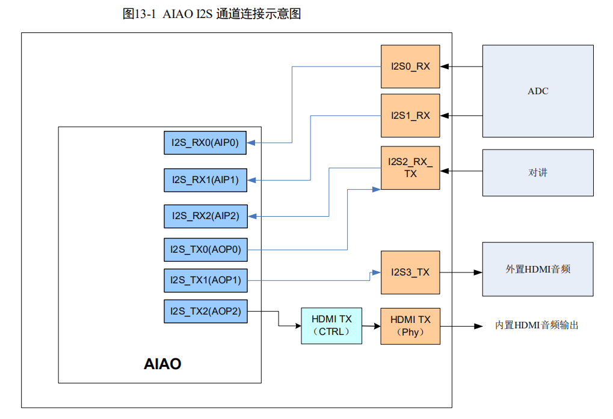
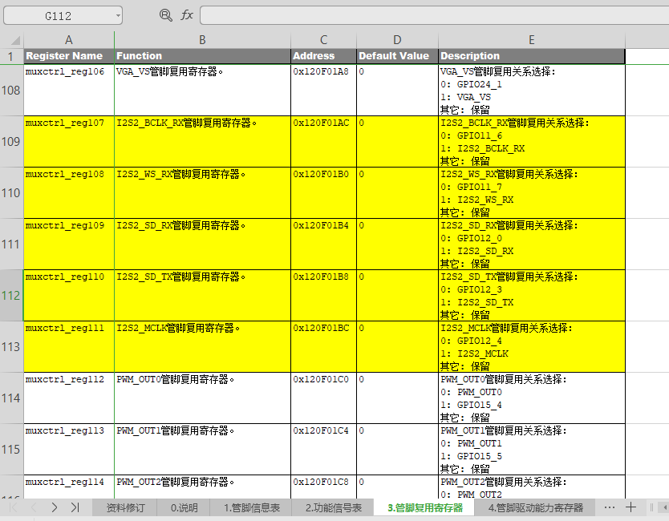
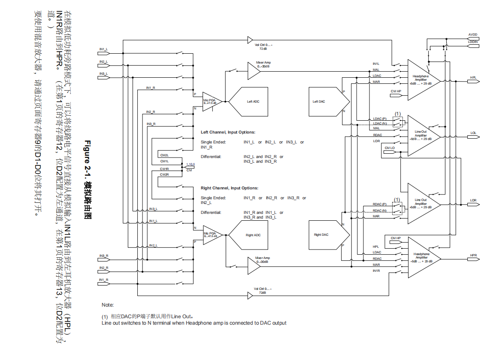

# 前言

为了在海思平台上使用tlv320aic3254，花了大概2个星期研究海思音频部分的手册、3254的用户手册，最终参考tlv320aic31的代码，实现了3254的驱动，同时在mpp的sample中，增加了3254对应的宏，以及相应的初始化代码，这篇文章主要是做一个阶段性的梳理

# 参考资料

| 资料                                                         | 说明             |
| ------------------------------------------------------------ | ---------------- |
| ReleaseDoc\zh\00.hardware\chip\Hi3531DV100 H.265编解码处理器用户指南.pdf | 寄存器说明中文版 |
| ReleaseDoc\en\00.hardware\chip\Hi3531D V100 H.265 CODEC Processor Data Sheet.pdf | 寄存器说明英文版 |
| ReleaseDoc\zh\00.hardware\chip\Hi3531DV100_PINOUT_CN.xlsx    | 引脚说明         |
| ReleaseDoc\zh\01.software\board\HiMPP V3.0 媒体处理软件开发参考.pdf | mpp API说明      |
| TLV320AIC3254 Application Reference Guide (Rev. A).pdf       | codec用户手册    |

# 海思音频相关知识

海思的mpp（Media Process Platform）媒体处理平台针对音频提供了4种类型的API子模块，分别是AI（音频输入）、AO（音频输出）、ADEC（音频编码）、AENC（音频编码），本文的重点是AI和AO，编解码不做介绍

## 音频接口和 AI、AO 设备

* 音频输入输出接口简称为 AIO（Audio Input/Output）接口，用于和 Audio Codec 对接，完成声音的录制和播放。AIO 接口分为两种类型：当为输入类型时，称为 AIP，当为输出类型时，称为 AOP

* Hi3531DV100 内部集成 1 个 AIAO，包含 3 个 AIP（Audio Input Port）和 3 个 AOP（Audio Output Port）

* AIAO 接口支持 I2S 和 PCM 两种模式，采用 DMA 方式存取数据，本文只针对I2S讲解

* 软件中负责抽象音频接口输入功能的单元，称之为 AI 设备；负责抽象音频接口输出功能的单元，称之为 AO 设备

## 录音和播放原理

原始音频信号以模拟信号的形式给出后，通过 Audio Codec，按一定采样率和采样精度转换为数字信号。Audio Codec 以 I2S 时序或 PCM 时序的方式，将数字信号传输给 AI设备。芯片利用 DMA 将 AI 设备中的音频数据搬移到内存中，完成录音操作。

播放和录音是基于同样的原理。芯片利用 DMA 将内存中的数据传输到 AO 设备。AO设备通过 I2S 时序或 PCM 时序向 Audio Codec 发送数据。Audio Codec 完成数字信号到模拟信号的转换过程，并输出模拟信号

## AIAO I2S连接示意图



从这张图可以得到一个信息，内部的AIP和AOP和外部的I2S引脚有一个映射关系，tlv320aic32x4作为一个即能录制，又能播放的codec，应该选用上面的I2S2，内部对应的是AIP2和AOP0

打开《Hi3531DV100_PINOUT_CN.xlsx》，在**3.管脚复用寄存器**中搜I2S2，如图



* MCLK：主时钟，hi3531d会根据采样率的不同，生成一个主时钟，频率8M~15M不等
* BLCK：位时钟，每发送一个位的数据，都需要靠位时钟实现同步，计算公式为**采样率 x 采样精度 x 声道数**

* WS：声道选择，0和1表示传输不同的声道，频率等于采样频率

* SD_TX：海思发送引脚
* SD_RX：海思接收引脚

上面的5个引脚，默认功能就是I2S，可以用[himm工具](https://blog.csdn.net/whitefish520/article/details/107709573)确认一下I2S引脚的复用情况

## I2S主从模式

海思和3254均支持主模式或者从模式，当海思作为master时，将向外提供BCLK和WS，海思作为slave时，BLCK和WS由外部输入，codec也是一样。

两者的区别在于，海思不管是做master还是slave，一定会向外提供主时钟MCLK，因此codec不再需要单独的外部晶振，也不需要向外输出MCLK

## 硬件连接

| 海思         | codec |
| ------------ | ----- |
| I2S2_BCLK_RX | BCLK  |
| I2S2_WS_RX   | WCLK  |
| I2S2_SD_RX   | DOUT  |
| I2S2_SD_TX   | DIN   |
| I2S2_MCLK    | MCLK  |

# tlv320aic3254驱动

驱动就三个文件：tlv320aic32x4.c、tlv320aic32x4.h、Makefile，[下载链接](https://download.csdn.net/download/whitefish520/12733595)

框架部分参考了tlv320aic31，内容部分做了比较大的改动

## 准备工作

在mpp/extdrv目录下，创建tlv320aic32x4目录，并将三个文件拷贝到其中，然后退回上层，在**extdrv**目录下，执行make，这时会生成对应的驱动程序

## 驱动代码的说明

为了防止文档较长，代码仅作节选

### c文件

init函数主要是注册了一个misc设备，并进行了codec设备的初始化

```cpp
static int __init tlv320aic32x4_init(void)
{
    misc_register(&tlv320aic32x4_dev);
    i2c_client_init();
    tlv320aic32x4_device_init();
    return 0;
}

static void __exit tlv320aic32x4_exit(void)
{
    tlv320aic32x4_device_exit();
    misc_deregister(&tlv320aic32x4_dev);
    i2c_client_exit();
}
```

在注册misc设备的时候，给了一个结构体，这个驱动的主要内容，都在ioctl函数里面，open和close是什么都不做的

```cpp
static struct file_operations tlv320aic32x4_fops =
{
    .owner		    = THIS_MODULE,
    .unlocked_ioctl	= tlv320aic32x4_ioctl,
    .open		    = tlv320aic32x4_open,
    .release	    = tlv320aic32x4_close
};
static struct miscdevice tlv320aic32x4_dev =
{
    MISC_DYNAMIC_MINOR,
    I2C_DEV_NAME,
    &tlv320aic32x4_fops,
};
```

在ioctl内部，将应用层传下来的参数copy_from_user到内核空间，然后根据cmd的类型，分别进行不同的操作


在文件的开头，也定义了一部分内容

```cpp
/* define MICRO */
#define I2C_DEV         (1)                 // tlv_aic32x4 use i2c-1
#define I2C_DEV_NAME    "tlv320aic32x4"     // I2C dev info
#define I2C_DEV_ADDR    (0x30)              // i2c dev address
```

hi3531d只有i2c-0和i2c-1，因此使用的是哪个，I2C_DEV就定义哪个

I2C_DEV_NAME是指定insmod驱动后，在dev目录下生成的节点名字

I2C_DEV_ADDR指定了codec的设备地址，7位地址原本是0x18，0x30是经过移位的，在海思平台下，无论是应用层还是驱动层，调用i2c都必须用移位后的地址，读写不区分，都是这个地址


```cpp
#define DEBUG_LEVEL 3
#define DPRINTK(level,fmt,args...) do{ if(level < DEBUG_LEVEL)\
            printk(KERN_INFO "%s [%s, line-%d]: " fmt "\n",I2C_DEV_NAME,__FUNCTION__,__LINE__,##args);\
    }while(0)
```

这个宏定义主要是方便信息的打印，比如此处等级设成3，那么等级为0，1，2的，就一定会打印出来，如果不希望打印过多的调试信息，level最好改为1，只打印严重错误的信息


```cpp
/* global variable */
static struct i2c_board_info hi_info =
{
    I2C_BOARD_INFO(I2C_DEV_NAME, I2C_DEV_ADDR),
};
static struct i2c_client* tlv_client;
static unsigned int cur_page = 0;

static const struct aic32x4_rate_divs aic32x4_divs[] = {

    /* hi3531d as master, aic32x4 as slave, it will be more easy to set parameters*/
    /* channels less than 20 */
    //mclk     rate                     nadc madc aosr ndac mdac dosr 
	{12288000, AIC32x4_SAMPLE_RATE_48K, 1,   2,   128, 1,   2,   128 },
	{12288000, AIC32x4_SAMPLE_RATE_24K, 1,   4,   128, 1,   2,   256 },
	{12288000, AIC32x4_SAMPLE_RATE_12K, 1,   8,   128, 1,   2,   512 },

    {8192000,  AIC32x4_SAMPLE_RATE_32K, 1,   2,   128, 1,   2,   128 },
	{8192000,  AIC32x4_SAMPLE_RATE_16K, 1,   4,   128, 1,   2,   256 },
	{8192000,   AIC32x4_SAMPLE_RATE_8K, 1,   8,   128, 1,   2,   512 },

    {11289600, AIC32x4_SAMPLE_RATE_44K, 1,   2,   128, 1,   2,   128 },
	{11289600, AIC32x4_SAMPLE_RATE_22K, 1,   4,   128, 1,   2,   256 },
	{11289600, AIC32x4_SAMPLE_RATE_11K, 1,   8,   128, 1,   2,   512 },
    //mclk     rate                     0x12 0x13 0x14 0x0b 0x0c 0x0d-0x0e 
    /* channels equal 20 */
    //mclk                  rate   nadc madc aosr ndac mdac dosr 
    // {15360000, 48000, 1,   2,   128, 1,   2,   128 },
	// {15360000, 24000, 1,   4,   128, 1,   2,   256 },
	// {15360000, 12000, 1,   8,   128, 1,   2,   512 },

    // {10240000, 32000, 1,   2,   128, 1,   2,   128 },
	// {10240000, 16000, 1,   4,   128, 1,   2,   256 },
	// {10240000,  8000, 1,   8,   128, 1,   2,   512 },

    // {14112000, 44100, 1,   2,   128, 1,   2,   128 },
	// {14112000, 22050, 1,   4,   128, 1,   2,   256 },
	// {14112000, 11025, 1,   8,   128, 1,   2,   512 },

};
```

`i2c_client* tlv_client`实际上就是一个句柄，每次i2c读或写都要用到它。

cur_page主要是用来标记当前的读写的寄存器是多少页的，因为3254这个codec号称有128页，每一页最多有128个寄存器。

aic32x4_divs这个结构体，目的是为了给3254内部的dac、adc等设备时钟提供一个分频系数，不管是主还是从模式，这一步都是必须做的 。

海思应用层的通道数定义为20时的情况，目前没有做过测试，所以屏蔽掉了


```cpp
static int i2c_client_init(void);
static void i2c_client_exit(void);
int tlv320aic32x4_read(unsigned char chip_addr, unsigned char reg_addr, unsigned char *reg_data);
int tlv320aic32x4_read_test(unsigned char chip_addr, unsigned char reg_addr, unsigned char *reg_data);
int tlv320aic32x4_write(unsigned char chip_addr, unsigned char reg_addr, unsigned char value);
```

以上这几个函数看名字就知道是干啥了，read读出来的值，放到形参指针中，read_test是read的一个简化，主要是调试阶段做测试用的


```cpp
static int tlv320aic32x4_reg_list(void);
static int tlv320aic32x4_set_divs(int num);
static int tlv320aic32x4_get_divs(int rate);
static int tlv320aic32x4_soft_reset(void);
```

reg_list会打印页0和页1的所有寄存器，get_divs和set_divs是设置codec内部的分频系数，用的是上面的结构体aic32x4_divs[]

tlv320aic32x4_soft_reset会重置，并给所有的寄存器一个初始值，codec会设成i2s从模式，48k采样率，16bit位深，总之一般情况下，reset之后，是一个正常的配置，不是寄存器还原为默认值


```cpp
static int tlv320aic32x4_device_init(void)
{
    tlv320aic32x4_soft_reset();
    tlv320aic32x4_set_divs(0);
    return 0;
}
static int tlv320aic32x4_device_exit(void)
{
    ret = tlv320aic32x4_write(I2C_DEV_ADDR, AIC32X4_PAGE_SEL, 0x0);  
	ret = tlv320aic32x4_write(I2C_DEV_ADDR, AIC32X4_SOFT_RST, 0x01); 
    msleep(10); 
    return 0;
}
```

init会按默认配置，做好所有的设置，codec能正常工作，exit会写reset寄存器，让codec不再工作

### 头文件

驱动的c文件从结构上来看，还是比较好懂的，没用用到很复杂的东西，下面看头文件


```cpp
struct aic32x4_rate_divs {
	u32 mclk;
	u32 rate;
    u8 nadc;
	u8 madc;
    u8 aosr;
	u8 ndac;
	u8 mdac;
    u16 dosr;
};
```

与set_divs和get_divs函数有关，c文件中定义了结构体变量aic32x4_divs[]


```cpp
typedef union
{
    struct audio_interface_t interface;
    struct other_config_t other;
    struct adc_dac_config_t adc;
    struct adc_dac_config_t dac;
    struct agc_config1_t agc_conf1;
    struct agc_config2_t agc_conf2;
    struct agc_config3_t agc_conf3;
    struct agc_config4_t agc_conf4;
    struct audio_power_up_t powerup;
    struct hp_route_t hp;
    struct lo_route_t lo;
    struct output_volume_t output_volume;
    struct output_mute_t output_mute;
    struct micpga_left_t micpga_left;
    struct micpga_right_t micpga_right;
    struct micpga_volum_t micpga_volume;
    struct float_input_t float_input;
}Audio_Ctrl;
```

由于有众多的选项需要配置，为了方便应用层调用ioctl，同时也方便ioctl 的cmd定义，做了这样一个联合体，需要配置哪个部分，就对哪个部分进行赋值

在c文件中，可以看到ioctl中有这么一段，其实就是接收应用层的cmd参数

```cpp
Audio_Ctrl temp;
Audio_Ctrl* audio_ctrl;

if (argp != NULL)
{
    if (copy_from_user(&temp, argp, sizeof(Audio_Ctrl)))
    {
        return -EFAULT;
    }
}
audio_ctrl = (Audio_Ctrl*)(&temp);
```

#### 结构体说明

接下来详细解释一下各个结构体，为了理解这些结构体的含义，需要看3254的手册，那个路由的图，以及各个寄存器说明

```cpp
struct audio_interface_t
{
    unsigned int  sample_rate;
    unsigned char transfer_mode;
    unsigned char master_slave_mode;
    unsigned char chn_num;
    unsigned char bit_width;
    unsigned char data_offset;
};
```

sample_rate是音频的采样率，目前常用的是48k，44.1k和8k

transfer_mode传输模式，只做了i2s的调试，pcm理论上是可以，但是没有调过

master_slave_mode规定了3254的主从模式，注意是3254，不是海思的

chn_num通道数，可以分时复用传输多个声道的数据，但是一般是两个声道的立体声

bit_width位深，也叫采样精度，目前固定为16bit

data_offset数据在bclk时钟的偏移，这个参数给0就行，实际上从波形看，海思和codec都是偏移了一个blck周期


这个结构体针对dac和adc，联合体Audio_Ctrl中，既定义了adc，也定义了dac

```cpp
struct adc_dac_config_t
{
    unsigned char power_up;
    unsigned char left_power_up;
    unsigned char right_power_up;
    unsigned char mute;
    unsigned char left_mute;
    unsigned char right_mute;
    unsigned char volume;
    unsigned char left_volume;
    unsigned char right_volume;
};
```

power_up左右都使能

left_power_up左边使能

right_power_up右边使能

3254这款codec的配置做的很细，为了减少代码量，可以直接用power_up，实现left_power_up加right_power_up的功能，如果想要分开设置，也可以单独进行left_power_up或者right_power_up，ioctl提供了三个命令（ADC_POWER_UP 、ADC_LEFT_POWER_UP 、ADC_RIGHT_POWER_UP）来实现这种功能。在其它的结构体中也可以看到大量这种形式的处理，下文不再单独描述

mute静音设置

volume音量调节


```cpp
struct other_config_t
{
    unsigned char loop_data_in_to_data_out;
    unsigned char loop_adc_to_dac;
    unsigned char micbias_power_up;
    unsigned char micbias_output_voltage;
    unsigned char micbias_voltage_source;
    unsigned char adc_signal_block;
    unsigned char dac_signal_block;
};
```

loop_data_in_to_data_out 数据从data in进入后，直接环出到data out，不经过任何通道、adc、dac之类的，这个一般是不用的，测试可以看有没用声音

loop_adc_to_dac 数据从adc进入，然后环出到dac，中间不经过其它处理，同上，一般不用，仅做测试

micbias_xxx 针对数字麦克风的，用不上的话就不用管，需要使用就参考3254的文档说明

adc_signal_block和dac_signal_block，是内置的处理算法，一般用默认的就行


```cpp
struct agc_config1_t 
struct agc_config2_t
struct agc_config3_t
struct agc_config4_t
```

agc这些参数我也不怎么懂，按照手册做了一下


```cpp
struct audio_power_up_t {
    unsigned char hp_power_up;
    unsigned char hpl_power_up;
    unsigned char hpr_power_up;
    unsigned char lo_power_up;
    unsigned char lol_power_up;
    unsigned char lor_power_up;
    unsigned char ma_power_up;
    unsigned char mal_power_up;
    unsigned char mar_power_up;
};
```

headphone，Mixer Amplifier、line out的使能


```cpp
struct hp_route_t {
    unsigned char ldac_hpl;
    unsigned char in1l_hpl;
    unsigned char mal_hpl;
    unsigned char mar_hpl;

    unsigned char ldac_hpr;
    unsigned char rdac_hpr;
    unsigned char in1r_hpr;
    unsigned char mar_hpr;
    unsigned char hpl_hpr;
};
```

headphone左右通道数据的来源，可以来自dac，in1，或者ma


```cpp
struct lo_route_t {
    unsigned char ldac_lol;
    unsigned char rdac_lol;
    unsigned char mal_lol;
    unsigned char lor_lol;

    unsigned char rdac_lor;
    unsigned char mar_lor;
};
```

line out的左右通道数据来源


```cpp
struct output_volume_t {
    unsigned char hp_volume;
    unsigned char hpl_volume;
    unsigned char hpr_volume;
    unsigned char lo_volume;
    unsigned char lol_volume;
    unsigned char lor_volume;
    unsigned char in1l_hpl_volume;
    unsigned char in1r_hpr_volume;
    unsigned char ma_volume;
    unsigned char mal_volume;
    unsigned char mar_volume;
};
```

输出音频，主要是hp、lo、ma的音量，另外in1可以不经过其它处理，直接路由到hp，这个音量也是可以调节的

```cpp
struct output_mute_t {
    unsigned char hp_mute;
    unsigned char hpl_mute;
    unsigned char hpr_mute;
    unsigned char lo_mute;
    unsigned char lol_mute;
    unsigned char lor_mute;
};
```

输出静音，没什么好说的

```cpp
struct micpga_left_t {
    unsigned char in1l_micpga;
    unsigned char in2l_micpga;
    unsigned char in3l_micpga;
    unsigned char in1r_micpga;
    unsigned char cm_micpga_via_cm1l;
    unsigned char in2r_micpga;
    unsigned char in3r_micpga;
    unsigned char cm_micpga_via_cm2l;
};

struct micpga_right_t {
    unsigned char in1r_micpga;
    unsigned char in2r_micpga;
    unsigned char in3r_micpga;
    unsigned char in1l_micpga;
    unsigned char cm_micpga_via_cm1r;
    unsigned char in2l_micpga;
    unsigned char in3l_micpga;
    unsigned char cm_micpga_via_cm2r;
};

struct micpga_volum_t {
    unsigned char power_up;
    unsigned char left_power_up;
    unsigned char right_power_up;
    unsigned char volume;
    unsigned char left_volume;
    unsigned char right_volume;
};
```

左右micpga的路由设置，图上画的很清楚




```cpp
struct float_input_t {
    unsigned char in1l_cm;
    unsigned char in1r_cm;
    unsigned char in2l_cm;
    unsigned char in2r_cm;
    unsigned char in3l_cm;
    unsigned char in3r_cm;
};
```

这个是什么我没搞懂，反正暂时也不用

#### 寄存器宏定义

也只节选一部分，这部分将所有使用的寄存器地址定义成了宏，方便调用，第二页就加上128，在调用read或write时，寄存器地址与上0x7f，`buf[0] = (*reg_addr* & 0x7f)`，将这个128去掉即可

```cpp
// page define
#define AIC32X4_PAGE0		0
#define AIC32X4_PAGE1		128

// page 0 registers
#define	AIC32X4_PAGE_SEL	            0x00    //页选择寄存器
#define	AIC32X4_SOFT_RST	            0x01    //写该位为1，重置所有寄存器，之后需要10ms延时
#define	AIC32X4_CLK_SEL		            0x04    //PLL和CODEC_CLKIN的时钟源选择
#define	AIC32X4_PLLPR		            0x05    //PLL使能、P和R值，如果CODEC_CLKIN来源于PLL，则 CODEC_CLKIN = (PLL*R*J.D)/P
#define	AIC32X4_PLLJ		            0x06    //J值
...
// page 1 registers  
#define	AIC32X4_POWER_CTL               (AIC32X4_PAGE1 + 0x01)  //是否断开AVDD与DVDD的弱连接
#define	AIC32X4_LDO_CTL                 (AIC32X4_PAGE1 + 0x02)  //LDO电压控制，由于不是手持设备，目前不需要使用LDO给内部提供电压   
#define	AIC32X4_PLAYBACK_CTL1           (AIC32X4_PAGE1 + 0x03)  //与PowerTune功率控制有关，默认是最大功率（最高性能）      
#define	AIC32X4_PLAYBACK_CTL2           (AIC32X4_PAGE1 + 0x04)  //与PowerTune功率控制有关，默认是最大功率（最高性能）  
#define	AIC32X4_OUTPUT_PWR              (AIC32X4_PAGE1 + 0x09)  //音频输出使能  
```

#### ioctl cmd宏定义

节选了一部分，这个cmd是给应用层调用的，之前说过，比如设置adc的mute，可以使用ADC_MUTE命令，将左右一起设置，也可以使用ADC_LEFT_MUTE和ADC_RIGHT_MUTE进行分开设置

```cpp
// ioctl cmd
#define     SOFT_RESET          _IOW('Z', 0x01, Audio_Ctrl)     //复位并进行默认的初始化设置
#define     LIST_REG_VALUE      _IOW('Z', 0x02, Audio_Ctrl)     //列出页0和1的所有寄存器值
#define     AUDIO_INTERFACE     _IOW('Z', 0x03, Audio_Ctrl)     //音频接口设置（只支持I2S）
#define     BIT_WIDTH           _IOW('Z', 0x04, Audio_Ctrl)     //位深（只支持16bit）
#define     MASTER_SLAVE_MODE   _IOW('Z', 0x05, Audio_Ctrl)     //主从模式
```

#### 其它宏定义

其它一些宏也没什么好说的，都比较好理解

```cpp
// micpga route
#define     AIC32x4_NOT_ROUTED              0
#define     AIC32x4_ROUTED_WITH_10K_RES     1
#define     AIC32x4_ROUTED_WITH_20K_RES     2
#define     AIC32x4_ROUTED_WITH_40K_RES     3
```

micpga进行混音的时候，可以决定权重，如果某个通道设为AIC32x4_ROUTED_WITH_10K_RES，则声音最大，设为AIC32x4_ROUTED_WITH_20K_RES，声音就会减半，设为AIC32x4_NOT_ROUTED声音就没了


```cpp
//agc para limit
#define     AGC_2BITS_MAX                   3
#define     AGC_3BITS_MAX                   7
#define     AGC_4BITS_MAX                   15
#define     AGC_5BITS_MAX                   31
#define     AGC_6BITS_MAX                   63
#define     AGC_7BITS_MAX                   127
#define     AGC_8BITS_MAX                   255
```

agc的很多参数，都是好几位，为了不让应用层传递错误的参数破坏寄存器的其他位，需要限定一下

# 测试程序

3254的配置比默认的aic31多了好几倍，而且参数都不一样，因此需要单独为它写配置程序


## 修改Makefile.param

测试程序需要用到驱动这边头文件定义的cmd、联合体、结构体，因此要想办法添加进来，打开mpp\sample\Makefile.param文件

```cpp
################ select audio codec type for your sample ################
#external acodec
#ACODEC_TYPE ?= ACODEC_TYPE_TP2823
#ACODEC_TYPE ?= ACODEC_TYPE_NVP6134
#ACODEC_TYPE ?= ACODEC_TYPE_TLV320AIC31
ACODEC_TYPE ?= ACODEC_TYPE_TLV320AIC32x4
```

注意到有这样一段话，用来定义codec类型的，原本是没有320aic31和320aic32x4，现在加上31和32x4，并且只打开32x4

同时这段话要挪一个位置，放在下面这段话**之后**

```cpp
ifeq ($(PARAM_FILE), )
     PARAM_FILE:=../../Makefile.param
     include $(PARAM_FILE)
endif
         
#放在这里   
################ select audio codec type for your sample ################
#external acodec
#ACODEC_TYPE ?= ACODEC_TYPE_TP2823
#ACODEC_TYPE ?= ACODEC_TYPE_NVP6134
#ACODEC_TYPE ?= ACODEC_TYPE_TLV320AIC31
ACODEC_TYPE ?= ACODEC_TYPE_TLV320AIC32x4
```

原来的sample，会默认将aic31的头文件加进去

```cpp
INC_FLAGS += -I$(SDK_PATH)/mpp/$(EXTDRV)/tlv320aic31
```

但是用32x4时，不能有aic31的头文件，因为一些名称我没有做改动，所以会重名，因此做了以下改动，tlv320aic32x4这个目录在之前讲过了，放了3个文件，其中就有32x4的头文件

```cpp
ifeq ($(ACODEC_TYPE), ACODEC_TYPE_TLV320AIC)
        INC_FLAGS += -I$(SDK_PATH)/mpp/$(EXTDRV)/tlv320aic31    
endif

ifeq ($(ACODEC_TYPE), ACODEC_TYPE_TLV320AIC32x4)
        INC_FLAGS += -I$(SDK_PATH)/mpp/$(EXTDRV)/tlv320aic32x4  
endif
```

另外，sample中，是靠宏来决定对哪个codec进行配置，因此也需要按照它的结构，定义相应的宏，这个宏HI_ACODEC_TYPE_TLV320AIC32x4将在函数中起作用

```cpp
ifeq ($(ACODEC_TYPE), ACODEC_TYPE_TLV320AIC)
        CFLAGS += -DHI_ACODEC_TYPE_TLV320AIC31
endif

ifeq ($(ACODEC_TYPE), ACODEC_TYPE_TLV320AIC32x4)
        CFLAGS += -DHI_ACODEC_TYPE_TLV320AIC32x4  
endif
```

## 修改sample_audio.c

mpp\sample\audio\sample_audio.c，这个文件就是音频测试的主要文件，它上来就`#include "tlv320aic31.h"`，这样肯定是不行的，改为条件编译

注意这里是多个条件，不要用ifdef

```cpp
#if (defined HI_ACODEC_TYPE_TLV320AIC31)
#include "tlv320aic31.h"
#elif (defined HI_ACODEC_TYPE_TLV320AIC32x4)
#include "tlv320aic32x4.h"
#endif
```

它这个程序，个人感觉做的并不好，特别是通道参数或者模式改了，可能就编译不过，或者程序运行不了，因此我的做法是自己实现一个采集到播放的过程，并保存为pcm格式

首先在main函数中的switch中，添加5，它这个程序运行后，会让我们输入数字，来执行对应的程序，这个程序就是AIP2采集后，播放到AOP0中

```cpp
case '5':
{
    SAMPLE_AUDIO_Aip2_Aop0();
    break;
}
```

然后修改一下使用提示usage

```cpp
HI_VOID SAMPLE_AUDIO_Usage(HI_VOID) 
{
...
    printf("\t5:  start AI to AO(api2->apo0) loop\n");
...
}

```

最后就是重头戏，被调用的函数

```cpp
/******************************************************************************
* function : Ai -> Ao
******************************************************************************/
extern SAMPLE_AI_S gs_stSampleAi[AI_DEV_MAX_NUM*AIO_MAX_CHN_NUM];
extern void *SAMPLE_COMM_AUDIO_AiProc_modby_glx(void *parg);
HI_S32 SAMPLE_AUDIO_Aip2_Aop0(HI_VOID)
{
    HI_S32      s32Ret, i;
    HI_S32 		s32AiChnCnt;
    HI_S32 		s32AoChnCnt;

    AUDIO_DEV   AiDev = SAMPLE_AUDIO_TLV320_AI_DEV;
    AUDIO_DEV   AoDev = SAMPLE_AUDIO_TLV320_AO_DEV;
    AI_CHN      AiChn = 0;
    AO_CHN      AoChn = 0;

    AIO_ATTR_S stAioAttr;

    stAioAttr.enSamplerate   = AUDIO_SAMPLE_RATE_48000;
    stAioAttr.enBitwidth     = AUDIO_BIT_WIDTH_16;
    stAioAttr.enWorkmode     = AIO_MODE_I2S_MASTER;
    // stAioAttr.enWorkmode     = AIO_MODE_I2S_SLAVE;

    stAioAttr.enSoundmode    = AUDIO_SOUND_MODE_MONO;
    // stAioAttr.enSoundmode    = AUDIO_SOUND_MODE_STEREO;
    stAioAttr.u32EXFlag      = 1;
    stAioAttr.u32FrmNum      = 30;
    stAioAttr.u32PtNumPerFrm = 320;
    stAioAttr.u32ChnCnt      = 2;
	stAioAttr.u32ClkChnCnt   = 2;
    stAioAttr.u32ClkSel      = 1;


    /* config audio codec */
    s32Ret = SAMPLE_COMM_AUDIO_CfgTlv320(&stAioAttr);
    if (HI_SUCCESS != s32Ret)
    {
        SAMPLE_DBG(s32Ret);
        return HI_FAILURE;
    }

    /* enable AI channle */
    s32AiChnCnt = stAioAttr.u32ChnCnt >> stAioAttr.enSoundmode;
	g_u32AiCnt = s32AiChnCnt;
	g_u32AiDev = AiDev;

    s32Ret = HI_MPI_AI_SetPubAttr(AiDev, &stAioAttr);
    if (s32Ret)
    {
        printf("%s: HI_MPI_AI_SetPubAttr(%d) failed with %#x\n", __FUNCTION__, AiDev, s32Ret);
        return s32Ret;
    }

    s32Ret = HI_MPI_AI_Enable(AiDev);
    if (s32Ret)
    {
        printf("%s: HI_MPI_AI_Enable(%d) failed with %#x\n", __FUNCTION__, AiDev, s32Ret);
        return s32Ret;
    }

    for (i = 0; i < s32AiChnCnt; i++)
    {
        s32Ret = HI_MPI_AI_EnableChn(AiDev, i);
        if (s32Ret)
        {
            printf("%s: HI_MPI_AI_EnableChn(%d,%d) failed with %#x\n", __FUNCTION__, AiDev, i, s32Ret);
            return s32Ret;
        }
    }

    /* enable AO channle */
    stAioAttr.u32ChnCnt = stAioAttr.u32ChnCnt>2 ? 2: stAioAttr.u32ChnCnt;
    s32AoChnCnt = stAioAttr.u32ChnCnt >> stAioAttr.enSoundmode;
	g_u32AoCnt = s32AoChnCnt;
	g_u32AoDev = AoDev;

    s32Ret = HI_MPI_AO_SetPubAttr(AoDev, &stAioAttr);
    if (HI_SUCCESS != s32Ret)
    {
        printf("%s: HI_MPI_AO_SetPubAttr(%d) failed with %#x!\n", __FUNCTION__, \
               AoDev, s32Ret);
        return HI_FAILURE;
    }

    s32Ret = HI_MPI_AO_Enable(AoDev);
    if (HI_SUCCESS != s32Ret)
    {
        printf("%s: HI_MPI_AO_Enable(%d) failed with %#x!\n", __FUNCTION__, AoDev, s32Ret);
        return HI_FAILURE;
    }

    for (i = 0; i < s32AoChnCnt; i++)
    {
        s32Ret = HI_MPI_AO_EnableChn(AoDev, i);
        if (HI_SUCCESS != s32Ret)
        {
            printf("%s: HI_MPI_AO_EnableChn(%d) failed with %#x!\n", __FUNCTION__, i, s32Ret);
            return HI_FAILURE;
        }
    }

    /* create file for save frames*/
    FILE *pfd[s32AoChnCnt];
    for (i = 0; i < s32AoChnCnt; i++)
    {
        HI_CHAR aszFileName[128];

        sprintf(aszFileName, "audio_chn%d.%s", i, SAMPLE_AUDIO_Pt2Str(PT_LPCM));
        pfd[i] = fopen(aszFileName, "w+");
        if (NULL == pfd)
        {
            printf("%s: open file %s failed\n", __FUNCTION__, aszFileName);
            return -1;
        }
        printf("open stream file:\"%s\" ok\n", aszFileName);
    }

    
    /* AI to AO channel */
	for (i=0; i<g_u32AoCnt; i++)
	{
		AiChn = i;
		AoChn = i;

        SAMPLE_AI_S *pstAi = NULL;

        pstAi = &gs_stSampleAi[AiDev*AIO_MAX_CHN_NUM + AiChn];
        pstAi->bSendAenc = HI_FALSE;
        pstAi->bSendAo = HI_TRUE;
        pstAi->bStart= HI_TRUE;
        pstAi->AiDev = AiDev;
        pstAi->AiChn = AiChn;
        pstAi->AoDev = AoDev;
        pstAi->AoChn = AoChn;
        pstAi->pfd = pfd[i];
        pthread_create(&pstAi->stAiPid, 0, SAMPLE_COMM_AUDIO_AiProc_modby_glx, pstAi);

	    if (s32Ret != HI_SUCCESS)
	    {
	        SAMPLE_DBG(s32Ret);
	        return HI_FAILURE;
	    }
	}

    printf("\nplease press twice ENTER to exit this sample\n");
    getchar();
    getchar();

	for (i=0; i<g_u32AoCnt; i++)
	{
		AiChn = i;
	    s32Ret = SAMPLE_COMM_AUDIO_DestoryTrdAi(AiDev, AiChn);
	    if (s32Ret != HI_SUCCESS)
	    {
	        SAMPLE_DBG(s32Ret);
	        return HI_FAILURE;
	    }
	}

    s32Ret = SAMPLE_COMM_AUDIO_StopAi(AiDev, s32AiChnCnt, HI_FALSE, HI_FALSE);
    if (s32Ret != HI_SUCCESS)
    {
        SAMPLE_DBG(s32Ret);
        return HI_FAILURE;
    }

    s32Ret = SAMPLE_COMM_AUDIO_StopAo(AoDev, s32AoChnCnt, HI_TRUE, HI_FALSE);
    if (s32Ret != HI_SUCCESS)
    {
        SAMPLE_DBG(s32Ret);
        return HI_FAILURE;
    }

    return HI_SUCCESS;
}
```

首先两个extern是因为要用的变量在其它文件，不加它就报错

关于是单声道mono，还是立体声STEREO，这里其实藏了一个坑，注意到这个函数里面有这样一句话

```cpp
s32AoChnCnt = stAioAttr.u32ChnCnt >> stAioAttr.enSoundmode;
```

当设置为单声道mono时，它移位0，不起作用，当设置为立体声时，右移一位，不管是AI的通道enable，还是AO的通道enable，都有这样一个for循环，次数就是s32AoChnCnt或者s32AiChnCnt，这个值来源于u32ChnCnt以及enSoundmode

当我们设置单声道时，u32ChnCnt可以设置为1、2、3等等，程序不会报错，但是设置为立体声STEREO时，如果u32ChnCnt还是设置为1，HI_MPI_AI_SetPubAttr这个函数就会报错，也就是立体声STEREO必须大于1，且为偶数。假设此时为立体声，u32ChnCnt设为2，HI_MPI_AI_EnableChn的时候，for循环只会执行一次，如果执行2次，想要初始化两个通道，HI_MPI_AI_EnableChn报错

因此此处一般情况下，是使用stereo，并设置u32ChnCnt为2，然后enable一个AI通道，enable一个aenc通道，enable一个adec通道，enable两个AO通道，并将这两个AO通道都绑定到adec通道上，这样采集是立体声，输出也是立体声，如果AO通道也只初始化一个，那采集编码解码都是立体声，输出是单声道

但是此处并没有enable编解码通道，因此想要实现立体声的采集和播放，需要设置为mono，u32ChnCnt设置为2，这样会初始化2个AI和2和AO通道，而且在上述程序中可以看到，打开了两个文件流，并创建了两个对应的线程，在线程中，完成数据从AI到AO的过程，并将数据写入文件

## 修改sample_comm.h

mpp\sample\common\sample_comm.h

这个文件和之前一样，改条件编译

```cpp
#if (defined HI_ACODEC_TYPE_TLV320AIC31)
#include "tlv320aic31.h"
#elif (defined HI_ACODEC_TYPE_TLV320AIC32x4)
#include "tlv320aic32x4.h"
#endif


#if (defined HI_ACODEC_TYPE_TLV320AIC31)
#define TLV320_FILE "/dev/tlv320aic31"
#elif (defined HI_ACODEC_TYPE_TLV320AIC32x4)
#define TLV320_FILE "/dev/tlv320aic32x4"
#endif
```

找一个地方，添加结构体声明，这个结构体也是因为其它文件要使用，放在这里不需要extern即可使用，它是从sample_comm_audio.c文件中剪切过来的，在此基础上，添加了FILE    *pfd;成员

```cpp
typedef struct tagSAMPLE_AI_S
{
    HI_BOOL bStart;
    HI_S32  AiDev;
    HI_S32  AiChn;
    HI_S32  AencChn;
    HI_S32  AoDev;
    HI_S32  AoChn;
    HI_BOOL bSendAenc;
    HI_BOOL bSendAo;
    FILE    *pfd;
    pthread_t stAiPid;
} SAMPLE_AI_S;
```


## 修改sample_comm_audio.c

mpp\sample\common\sample_comm_audio.c

首先这几个全局变量，需要在其它位置使用，原来是static的，因此去掉static

```cpp
SAMPLE_AI_S gs_stSampleAi[AI_DEV_MAX_NUM*AIO_MAX_CHN_NUM];
SAMPLE_AENC_S gs_stSampleAenc[AENC_MAX_CHN_NUM];
SAMPLE_ADEC_S gs_stSampleAdec[ADEC_MAX_CHN_NUM];
SAMPLE_AO_S   gs_stSampleAo[AO_DEV_MAX_NUM];
```

之前讲到创建了线程，这个线程函数也是要单独定义的，就定义在此处，它完成了三件工作，从ai获取数据，将输入发送到ao，将数据存入文件

```cpp
/******************************************************************************
* function : get frame from Ai, send it  to Ao, and save as lpcm
******************************************************************************/
void *SAMPLE_COMM_AUDIO_AiProc_modby_glx(void *parg)
{
    HI_S32 s32Ret;
    HI_S32 AiFd;
    SAMPLE_AI_S *pstAiCtl = (SAMPLE_AI_S *)parg;
    AUDIO_FRAME_S stFrame; 
    fd_set read_fds;
    struct timeval TimeoutVal;
    AI_CHN_PARAM_S stAiChnPara;
    
    prctl(PR_SET_NAME, "hi_SAMPLE_AiProc", 0, 0, 0);    

    s32Ret = HI_MPI_AI_GetChnParam(pstAiCtl->AiDev, pstAiCtl->AiChn, &stAiChnPara);
    if (HI_SUCCESS != s32Ret)
    {
        printf("%s: Get ai chn param failed\n", __FUNCTION__);
        return NULL;
    }
    
    stAiChnPara.u32UsrFrmDepth = 30;
    
    s32Ret = HI_MPI_AI_SetChnParam(pstAiCtl->AiDev, pstAiCtl->AiChn, &stAiChnPara);
    if (HI_SUCCESS != s32Ret)
    {
        printf("%s: set ai chn param failed\n", __FUNCTION__);
        return NULL;
    }
    
    FD_ZERO(&read_fds);
    AiFd = HI_MPI_AI_GetFd(pstAiCtl->AiDev, pstAiCtl->AiChn);
    FD_SET(AiFd,&read_fds);

    while (pstAiCtl->bStart)
    {     
        TimeoutVal.tv_sec = 1;
        TimeoutVal.tv_usec = 0;
        
        FD_ZERO(&read_fds);
        FD_SET(AiFd,&read_fds);
        
        s32Ret = select(AiFd+1, &read_fds, NULL, NULL, &TimeoutVal);
        if (s32Ret < 0) 
        {
            break;
        }
        else if (0 == s32Ret) 
        {
            printf("%s: get ai frame select time out\n", __FUNCTION__);
            break;
        }
        
        if (FD_ISSET(AiFd, &read_fds))
        {
            /* get frame from ai chn */
            s32Ret = HI_MPI_AI_GetFrame(pstAiCtl->AiDev, pstAiCtl->AiChn, &stFrame, NULL, HI_FALSE);
            if (HI_SUCCESS != s32Ret )
            {
                printf("%s: HI_MPI_AI_GetFrame(%d, %d), failed with %#x!\n",\
                       __FUNCTION__, pstAiCtl->AiDev, pstAiCtl->AiChn, s32Ret);
                pstAiCtl->bStart = HI_FALSE;
                return NULL;
            }
            
            /* send frame to ao */
            if (HI_TRUE == pstAiCtl->bSendAo)
            {
                s32Ret = HI_MPI_AO_SendFrame(pstAiCtl->AoDev, pstAiCtl->AoChn, &stFrame, 1000);
                if (HI_SUCCESS != s32Ret )
                {
                    printf("%s: HI_MPI_AO_SendFrame(%d, %d), failed with %#x!\n",\
                           __FUNCTION__, pstAiCtl->AoDev, pstAiCtl->AoChn, s32Ret);
                    pstAiCtl->bStart = HI_FALSE;
                    return NULL;
                }
            }
            /* save frame to file */
            fwrite(stFrame.pVirAddr[0],1,stFrame.u32Len, pstAiCtl->pfd);

            /* finally you must release the stream */
            s32Ret = HI_MPI_AI_ReleaseFrame(pstAiCtl->AiDev, pstAiCtl->AiChn, &stFrame, NULL);
            if (HI_SUCCESS != s32Ret )
            {
                printf("%s: HI_MPI_AI_ReleaseFrame(%d, %d), failed with %#x!\n",\
                       __FUNCTION__, pstAiCtl->AiDev, pstAiCtl->AiChn, s32Ret);
                pstAiCtl->bStart = HI_FALSE;
                return NULL;
            }
        }
    }
    
    pstAiCtl->bStart = HI_FALSE;
    return NULL;
}
```

然后是codec的配置函数

```cpp
HI_S32 SAMPLE_Tlv320_CfgAudio(AIO_MODE_E enWorkmode,AUDIO_SAMPLE_RATE_E enSample)
```

它传下去的参数，太少了，如果32x4做主，需要通道数来计算BCLK的分频，因此修改为

```cpp
HI_S32 SAMPLE_Tlv320_CfgAudio(AIO_ATTR_S *pstAioAttr)
```

凡是调用到它的地方，都要进行修改

```cpp
HI_S32 SAMPLE_COMM_AUDIO_CfgTlv320(AIO_ATTR_S *pstAioAttr)
{
    ...
    s32Ret = SAMPLE_Tlv320_CfgAudio(pstAioAttr);
    ...
}


HI_S32 SAMPLE_COMM_AUDIO_CfgAcodec(AIO_ATTR_S *pstAioAttr)
{
	...
#if (defined HI_ACODEC_TYPE_TLV320AIC31) || (defined HI_ACODEC_TYPE_TLV320AIC31)
    s32Ret = SAMPLE_Tlv320_CfgAudio(pstAioAttr);
    ...
#endif
}
```

SAMPLE_Tlv320_Disable这个函数，32x4并不需要调用它，因此加上条件编译，防止编译报错，主要是没有audio_ctrl.chip_num这个成员，因此编译的话一定会报错

```cpp
HI_S32 SAMPLE_Tlv320_Disable()
{

    Audio_Ctrl audio_ctrl;
    int s_fdTlv = -1;
    HI_S32 s32Ret;
#if (defined HI_ACODEC_TYPE_TLV320AIC31)
    s_fdTlv = open(TLV320_FILE,O_RDWR);
    if (s_fdTlv < 0)
    {
        printf("[Func]:%s [Line]:%d [Info]:%s\n", __FUNCTION__, __LINE__, "can't open /dev/tlv320aic31");
        return HI_FAILURE;   
    }   
    
    /* reset transfer mode 0:I2S 1:PCM */
    audio_ctrl.chip_num = 0;
    s32Ret = ioctl(s_fdTlv, SOFT_RESET, &audio_ctrl);
    if (HI_SUCCESS != s32Ret)
    {
        printf("[Func]:%s [Line]:%d [Info]:%s\n", __FUNCTION__, __LINE__, "tlv320aic31 reset failed");
    }
    close(s_fdTlv);
    
#endif
    return s32Ret;
}
```

接下来修改SAMPLE_Tlv320_CfgAudio函数的内容

```cpp
HI_S32 SAMPLE_Tlv320_CfgAudio(AIO_MODE_E enWorkmode,AUDIO_SAMPLE_RATE_E enSample)
{
#if (defined HI_ACODEC_TYPE_TLV320AIC31)
    原来的定义
#elif (defined HI_ACODEC_TYPE_TLV320AIC32x4)

	int s_fdTlv = -1;
    Audio_Ctrl audio_ctrl;
    AIO_MODE_E enWorkmode = pstAioAttr->enWorkmode;     
    AUDIO_SAMPLE_RATE_E enSample = pstAioAttr->enSamplerate;
	
    if (AUDIO_SAMPLE_RATE_8000 == enSample)
    {
        audio_ctrl.interface.sample_rate = AIC32x4_SAMPLE_RATE_8K;
    }
    else if (AUDIO_SAMPLE_RATE_12000 == enSample)
    {
        audio_ctrl.interface.sample_rate = AIC32x4_SAMPLE_RATE_12K;
    }
    else if (AUDIO_SAMPLE_RATE_11025 == enSample)
    {
        audio_ctrl.interface.sample_rate = AIC32x4_SAMPLE_RATE_11K;
    }
    else if (AUDIO_SAMPLE_RATE_16000 == enSample)
    {
        audio_ctrl.interface.sample_rate = AIC32x4_SAMPLE_RATE_16K;
    }
    else if (AUDIO_SAMPLE_RATE_22050 == enSample)
    {
        audio_ctrl.interface.sample_rate = AIC32x4_SAMPLE_RATE_22K;
    }
    else if (AUDIO_SAMPLE_RATE_24000 == enSample)
    {
        audio_ctrl.interface.sample_rate = AIC32x4_SAMPLE_RATE_24K;
    }
    else if (AUDIO_SAMPLE_RATE_32000 == enSample)
    {
        audio_ctrl.interface.sample_rate = AIC32x4_SAMPLE_RATE_32K;
    }
    else if (AUDIO_SAMPLE_RATE_44100 == enSample)
    {
        audio_ctrl.interface.sample_rate = AIC32x4_SAMPLE_RATE_44K;
    }
    else if (AUDIO_SAMPLE_RATE_48000 == enSample)
    {
        audio_ctrl.interface.sample_rate = AIC32x4_SAMPLE_RATE_48K;
    }
    else 
    {
        printf("SAMPLE_Tlv320aix32x4_CfgAudio(), not support enSample:%d\n",enSample);
        return -1;
    }

    if(AIO_MODE_I2S_MASTER == enWorkmode) 
    {
        audio_ctrl.interface.transfer_mode = AIC32x4_TRANSFER_MODE_I2S;
        audio_ctrl.interface.master_slave_mode = AIC32x4_SLAVE_MODE;
    }
    else if(AIO_MODE_I2S_SLAVE == enWorkmode)
    {
        audio_ctrl.interface.transfer_mode = AIC32x4_TRANSFER_MODE_I2S;
        audio_ctrl.interface.master_slave_mode = AIC32x4_MASTER_MODE;
    }
    else
    {
        printf("SAMPLE_Tlv320aic32x4_CfgAudio(), not support workmode:%d\n\n",enWorkmode);
        return -1;
    }


    s_fdTlv = open(TLV320_FILE,O_RDWR);
    if (s_fdTlv < 0)
    {
        printf("can't open tlv320aic32x4,%s\n", TLV320_FILE);
        return -1;   
    }   


    if (ioctl(s_fdTlv,SOFT_RESET,&audio_ctrl))
    {
         printf("[Func]:%s [Line]:%d [Info]:%s\n", __FUNCTION__, __LINE__, "tlv320aic32x4 reset failed");
    }
    
    /* set master/slave mode*/
    if (ioctl(s_fdTlv,MASTER_SLAVE_MODE, &audio_ctrl))
    {
        printf("[Func]:%s [Line]:%d [Info]:%s\n", __FUNCTION__, __LINE__, "tlv320aic32x4 set master/slave mode failed");
    }
 
    /* set data transfer mode*/
    if (ioctl(s_fdTlv,AUDIO_INTERFACE, &audio_ctrl))
    {
        printf("[Func]:%s [Line]:%d [Info]:%s\n", __FUNCTION__, __LINE__, "tlv320aic32x4 set data transfer mode failed");
    }
    /* set bitwidth*/
    if(pstAioAttr->enBitwidth == AUDIO_BIT_WIDTH_16)
    {
        audio_ctrl.interface.bit_width = AIC32x4_BIT_WIDTH_16B;
        audio_ctrl.interface.chn_num = pstAioAttr->u32ChnCnt;
        if (ioctl(s_fdTlv,BIT_WIDTH, &audio_ctrl))
        {
            printf("[Func]:%s [Line]:%d [Info]:%s\n", __FUNCTION__, __LINE__, "tlv320aic32x4 set bitwidth failed");
        }
    }
    else
    {
        printf("SAMPLE_Tlv320aic32x4_CfgAudio(), just support bitwidth 16bits\n");
        return -1;
    }
#endif
    return 0;
```

由于之前在头文件中定义了结构体struct tagSAMPLE_AI_S，因此此处c文件的定义需要删除

## 编译

在audio目录下，执行make即可完成音频测试程序的编译


# 文档下载链接

https://download.csdn.net/download/whitefish520/12733595


