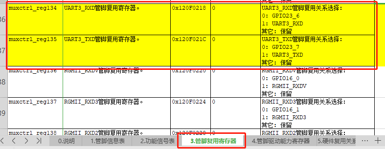
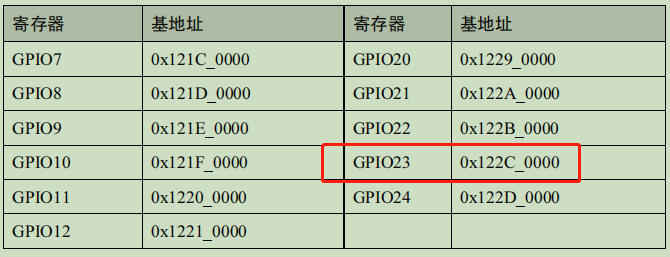
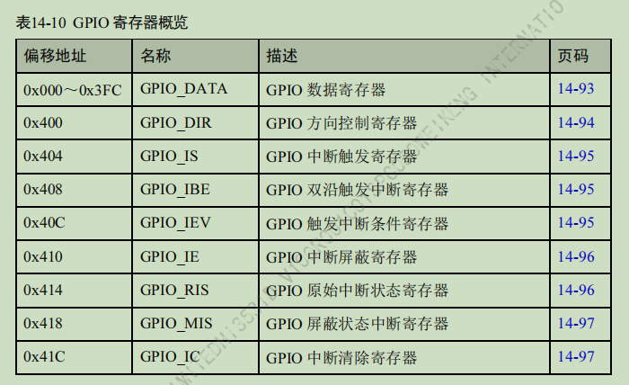
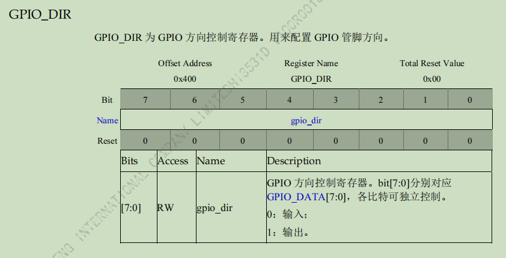

# 前言

海思提供的himm工具，能在linux命令行中，直接对gpio进行操作，对于调试来说非常方便

# himm的位置

如果已经按照要求完整地编译了海思的sdk，那么这个目录下，将生成许多工具

> osdrv/pub/bin/board_uclibc

主要关注这两个，可以发现本质上himm就是btools

```shell
-rwxrwxrwx 1 root root   45564  7月 13 10:41 btools
lrwxrwxrwx 1 root root       6  7月 13 10:41 himm -> btools
```

因此将btools放到板子上，并且建立链接，做好之后，如下

```shell
~ # ls /usr/sbin/btools -l
-rwx------    1 root     root         45564 Jan  1 08:11 /usr/sbin/btools
~ # ls /usr/sbin/himm -l
lrwxrwxrwx    1 root     root             6 Jan  1 08:11 /usr/sbin/himm -> btools
```

# 引脚的设置

本次实验的目的，是自由地设置uart3的rx和tx引脚输出高电平和低电平，因此先找引脚相关的地址、寄存器说明信息

## 取消复用功能

首先看这个文档的引脚复用章节，目的是要将复用功能改为普通GPIO功能

因为一般的引脚，都默认是复用功能，而不是作为普通的GPIO使用的

> ReleaseDoc\zh\00.hardware\chip\Hi3531DV100_PINOUT_CN.xlsx



在第三个表：管脚复用寄存器中，搜索UART3，即可找到这两个引脚，根据它的说明，这个地址0x120F0218、0x120F021C设置为1，将作为串口功能使用，设置为0，就是普通的GPIO功能

因此，在Linux命令行中执行以下命令，第一条设置UART3_RXD为GPIO23_6，第二条设置UART3_TXD为GPIO23_7

```shell
himm 0x120F0218 0
himm 0x120F021C 0
```

此处可以看到它的打印信息，告诉我们从默认的1变为0了

```shell
~ # himm 0x120F0218 0
*** Board tools : ver0.0.1_20121120 *** 
[debug]: {source/utils/cmdshell.c:167}cmdstr:himm
0x120F0218: 0x00000001 --> 0x00000000 
[END]
~ # himm 0x120F021C 0
*** Board tools : ver0.0.1_20121120 *** 
[debug]: {source/utils/cmdshell.c:167}cmdstr:himm
0x120F021C: 0x00000001 --> 0x00000000 
[END]
```


## 设置引脚的方向为输出

根据经验，第一步先设置引脚的方向寄存器为输出，第二步设置数据寄存器，找到如下文档，其它的芯片也类似，这个目录下文档不多

> ReleaseDoc\zh\00.hardware\chip\Hi3531DV100 H.265编解码处理器用户指南.pdf

找到 **外围设备** 章节，找到 **GPIO**  ，首先它告诉我们GPIO分很多组，每组都有自己的基地址，因此要找这个基地址，在 **14.5.4 GPIO 寄存器概览** 中，找到GPIO23的基地址为0x122C_0000 



然后要找方向寄存器和数据寄存器的偏移地址，及每一位的说明



首先找到**GPIO方向控制寄存器**，它的偏移地址为0x400，它的地址也就是 0x122C0000 + 0x400 =  0x122C0400 

接下来，看这个寄存器怎么设置，根据它的描述，0为输入，1为输出，一共有8个比特位，分别对应GPIO23_0到GPIO_7，低位与低位相对应



我们想让GPIO23_6和GPIO23_7作为输出引脚，因此要将此寄存器的最高2位设为1，也就是0xC0

在linux命令行中，输入

> himm 0x122C0400 0xC0

打印信息如下

```shell
~ # himm 0x122C0400 0xC0
*** Board tools : ver0.0.1_20121120 *** 
[debug]: {source/utils/cmdshell.c:167}cmdstr:himm
0x122C0400: 0x00000000 --> 0x000000C0 
[END]
```


## 设置数据寄存器

海思的数据寄存器跟一般的有点不一样，它设置了一个类似写保护的功能，也就是说，想写寄存器，先得打开写保护

先看一下海思的原文，个人感觉第一次看可能有点难懂，不知道到底说的是什么，那我再分析一下

> GPIO_DATA 寄存器利用 PADDR[9:2]实现了读写寄存器比特的屏蔽操作。该寄存器对应 256 个地址空间。PADDR[9:2]分别对应 GPIO_DATA[7:0]，当相应的 bit 为高时，则可以对相应的位进行读写操作；反之，若对应 bit 为低则不能进行操作。例如： 
>
> * 若地址为 0x3FC（0b11_1111_1100），则对 GPIO_DATA[7:0]这 8bit 操作全部有效。
>
> * 若地址为 0x200（0b10_0000_0000），则仅对 GPIO_DATA[7]的操作有效。

往上翻一下，找到GPIO的偏移地址，发现数据寄存器GPIO_DATA的偏移地址并不是一个固定值，而是0x000～0x3FC

二进制为 **0000 0000 00** 到 **11 1111 1100**，发现低2位[0-1]都是0，然后[2-9]位，可以是0或1

这就是它的保护机制，要想设置某一个位，必须将此处的偏移地址对应位设为1

以GPIO23_6和GPIO23_7举例

* 想要设置GPIO23_6，它是第7位，因此偏移地址为**0100 0000 00**

* 想要设置GPIO23_7，它是第8位，因此偏移地址为**1000 0000 00**

* 想要两位一起设置，7和8都选中，因此偏移地址为**1100 0000 00**

现在两个口一起设置，偏移地址换算成16进制就是0x300，因此在Linux命令行中，输入

> himm 0x122C0300 0xFF

为什么设置0xFF，因为省事，其它位是被屏蔽的，因此只会将我们需要的位设为1

虽然打印信息告诉我们从0x00变为0xff，但是我们再设为0，看一下打印信息

```shell
~ # himm 0x122C0300 0xFF
*** Board tools : ver0.0.1_20121120 *** 
[debug]: {source/utils/cmdshell.c:167}cmdstr:himm
0x122C0300: 0x00000000 --> 0x000000FF 
[END]
~ # himm 0x122C0300 0x0
*** Board tools : ver0.0.1_20121120 *** 
[debug]: {source/utils/cmdshell.c:167}cmdstr:himm
0x122C0300: 0x000000C0 --> 0x00000000 
[END]
```

发现是从0xc0变为0x00，我们之前要设数据寄存器为1100 0000，不就是0xc0吗，说明这样是没用问题的

