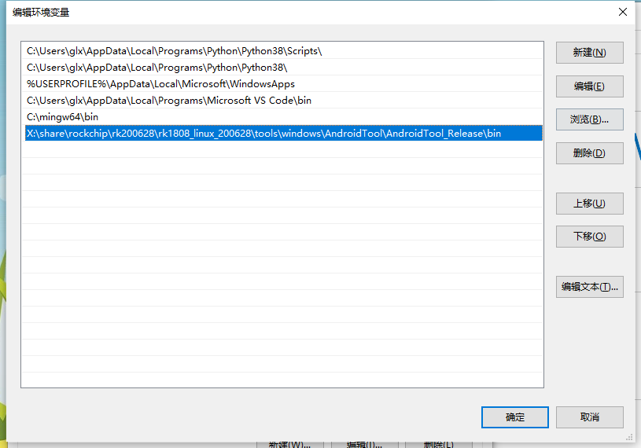

# NFS

在rockchip的sdk中，一般默认情况下是不打开NFS功能的，这给习惯使用NFS挂载的人带来了一定的麻烦，不过稍微修改一下内核，就能支持NFS

* 进入kernel目录
* sudo make menuconfig

进行如下的修改

```sh
[*] Networking support  ---> 
    Networking options  --->
        [*]   IP: kernel level autoconfiguration
        [*]     IP: DHCP support
        [*]     IP: BOOTP support
        [ ]     IP: RARP support
        
        
File systems  --->
    [*] Network File Systems  ---> 
        <*>   NFS client support  
        <*>     NFS client support for NFS version 2
        <*>     NFS client support for NFS version 3
        [*]       NFS client support for the NFSv3 ACL protocol extension
        <*>     NFS client support for NFS version 4
        [*]     Provide swap over NFS support 
        [*]   NFS client support for NFSv4.1
        [*]     NFS client support for NFSv4.2
        (kernel.org) NFSv4.1 Implementation ID Domain
        [*]     NFSv4.1 client support for migration
        [*]   Root file system on NFS
        [ ]   Use the legacy NFS DNS resolver
        < >   NFS server support
        [ ]   RPC: Enable dprintk debugging
        < >   Ceph distributed file system
        < >   CIFS support (advanced network filesystem, SMBFS successor)
        < >   NCP file system support (to mount NetWare volumes)
        < >   Coda file system support (advanced network fs)
        < >   Andrew File System support (AFS)
```

保存退出，保存默认配置文件

```cpp
sudo make savedefconfig
sudo cp defconfig ./arch/arm64/configs/rk1808_linux_defconfig 
```

修改设备树

```shell
vi kernel/arch/arm64/boot/dts/rockchip/rk1808-evb-v10.dts

# 使能gmac
&gmac {
	status = "okay";
};
```

编译烧录

```cpp
sudo ./build.sh kernel
```

# ADB

ADB一般用于安卓的调试，在linux版本的sdk下，主要使用文件的传输功能

ADB连接方式有两种：USB和网络。USB连接比较方便，而网络需要设置IP和端口，比较麻烦

ADB工具个人感觉不是很好用，而且有乱码情况，因此不是很推荐使用

使用USB ADB时，首先添加Windows环境变量



将adb.exe的所在目录添加进PATH，并且要重启cmd的窗口

这时输入adb shell，即可进入板子的shell界面

```sh
C:\Users\glx>adb shell
/ # ls
bin             init        media  proc           sdcard     udisk
busybox.config  lib         misc   rockchip_test  sys        userdata
data            lib64       mnt    root           system     usr
dev             linuxrc     oem    run            timestamp  var
etc             lost+found  opt    sbin           tmp
/ #
```

* 文件复制到板子

在Windows端执行`adb push 本地文件 板子路径`即可

下面是示例，传了一个ok.log 到/userdata目录下

```sh
C:\Users\glx\Desktop>dir
 驱动器 C 中的卷没有标签。
 卷的序列号是 6E79-CC9D

 C:\Users\glx\Desktop 的目录

2020/08/24  18:32    <DIR>          .
2020/08/24  18:32    <DIR>          ..
2020/08/12  16:14             2,107 bad.log
2020/08/25  11:23             3,515 note.c
2020/08/11  09:00               269 ok.log
2020/08/24  18:01    <DIR>          工具
               3 个文件          5,891 字节
               3 个目录 371,567,992,832 可用字节

C:\Users\glx\Desktop>adb push ok.log /userdata
ok.log: 1 file pushed. 0.0 MB/s (269 bytes in 0.050s)

C:\Users\glx\Desktop>

C:\Users\glx\Desktop>adb shell
/ # cd /userdata/
/userdata # ls -l
total 16
drwxr-xr-x 2 root root  1024 Aug  5  2017 bin
drwxr-xr-x 2 root root  1024 Aug  5  2017 cfg
drwx------ 2 root root 12288 Aug  5  2017 lost+found
-rw-rw-rw- 1 root root   269 Aug 11 01:00 ok.log
drwxr-xr-x 2 root root  1024 Aug  5  2017 recovery
/userdata #
```

* 文件传回电脑

在Windows端执行`adb pull 板子路径 本地文件 `即可

下面是示例，传了一个ok.log 到电脑下

```sh
/userdata # ls
123.test  bin  cfg  lost+found  recovery
/userdata # exit

C:\Users\glx\Desktop>adb pull /userdata/123.test .
/userdata/123.test: 1 file pulled.

C:\Users\glx\Desktop>dir
 驱动器 C 中的卷没有标签。
 卷的序列号是 6E79-CC9D

 C:\Users\glx\Desktop 的目录

2020/08/25  12:27    <DIR>          .
2020/08/25  12:27    <DIR>          ..
2020/08/25  12:27                 0 123.test
2020/08/12  16:14             2,107 bad.log
2020/08/25  11:23             3,515 note.c
2020/08/11  09:00               269 ok.log
2020/08/24  18:01    <DIR>          工具
               4 个文件          5,891 字节
               3 个目录 371,568,476,160 可用字节
```

# Lrzsz 

lrzsz 是一款 Linux 下面的文件传输工具。实现原理是通过 Xmodem / Ymodem / Zmodem 协议传输文件。lrzsz 可以在支持这三种协议的 Shell 界面的工具下工作，比如SecureCRT，puTTY 等

根据SDK编译好的rootfs中已经集成了lrz和lsz这两款工具，因此通过SecureCRT或puTTY 连接到板子上后，直接使用该工具即可

* sz 命令发送文件到本地：sz filename

* rz 命令本地上传文件到服务器：rz

执行该命令后，在弹出框中选择要上传的文件即可。

说明：打开 SecureCRT 软件 -> Options -> session options -> X/Y/Zmodem 下可以设置上传和下载的目录

# TFTP

arm端的tftp，相比于pc端，精简了不少，只留下了几个重要选项

```sh
[root@rk1808:/userdata]# tftp
BusyBox v1.27.2 (2020-08-24 13:36:03 CST) multi-call binary.

Usage: tftp [OPTIONS] HOST [PORT]

Transfer a file from/to tftp server

        -l FILE Local FILE
        -r FILE Remote FILE
        -g      Get file
        -p      Put file
        -b SIZE Transfer blocks of SIZE octets
```

* 从tftp服务器下载文件：tftp -r 服务器端文件名 -g 服务器IP

```sh
[root@rk1808:/userdata]# tftp -r pc.test -g 192.168.10.101
[root@rk1808:/userdata]# ls -l
total 17
-rw-r--r-- 1 root root     9 Aug 25 05:16 arm.test
drwxr-xr-x 2 root root  1024 Aug  5  2017 bin
drwxr-xr-x 2 root root  1024 Aug  5  2017 cfg
drwx------ 2 root root 12288 Aug  5  2017 lost+found
-rw-r--r-- 1 root root    26 Aug 25 05:17 pc.test
drwxr-xr-x 2 root root  1024 Aug  5  2017 recovery
[root@rk1808:/userdata]# 
```

* 从本地上传文件到服务器：tftp -l 本地文件名 -p 服务器IP

**注意，一定要先在服务器端创建一个同名空文件，并给777权限，否则上传会失败**

```sh
# 上传前先创建同名文件
glx@zigsunHI:/tftpboot$ touch arm.test
glx@zigsunHI:/tftpboot$ ls -l
-rw-r--r-- 1 glx  root         0  8月 25 13:15 arm.test

# 给读写权限
glx@zigsunHI:/tftpboot$ chmod 777 arm.test 
glx@zigsunHI:/tftpboot$ ls -l
-rwxrwxrwx 1 glx  root         0  8月 25 13:15 arm.test


# 上传文件
[root@rk1808:/userdata]# tftp -l arm.test -p 192.168.10.101

# 上传后查看该文件
glx@zigsunHI:/tftpboot$ ls -l
-rwxrwxrwx 1 glx  root         9  8月 25 13:16 arm.test

glx@zigsunHI:/tftpboot$ cat arm.test 
123
test
```


# Procrank 

Procrank 用来输出进程的内存快照，便于有效的观察进程的内存占用情况。

包括如下内存信息：

* VSS：Virtual Set Size 虚拟耗用内存大小（包含共享库占用的内存）

* RSS：Resident Set Size 实际使用物理内存大小（包含共享库占用的内存）

* PSS：Proportional Set Size 实际使用的物理内存大小（比例分配共享库占用的内存）

* USS：Unique Set Size 进程独自占用的物理内存大小（不包含共享库占用的内存）

注意：

* USS 大小代表只属于本进程正在使用的内存大小，进程被杀死后会被完整回收；

* VSS/RSS 包含了共享库使用的内存，对查看单一进程内存状态没有参考价值；

* PSS 是按照比例将共享内存分割后，某单一进程对共享内存区的占用情况。

命令格式：

```sh
procrank [ -W ] [ -v | -r | -p | -u | -h ] 
```

常用指令说明 : 

*  -v：按照 VSS 排序

* -r：按照 RSS 排序

* -p：按照 PSS 排序

* -u：按照 USS 排序

* -R：转换为递增[递减]方式排序

* -w：只显示 working set 的统计计数

* -W：重置 working set 的统计计数

* -h：帮助

示例：

* 输出内存快照：procrank

默认 procrank 输出是通过 PSS 排序。

*  按照 VSS 降序排列输出内存快照：procrank –v 

**一般情况下，可以写一个脚本，每1s钟打印一次某进程的procrank输出，并保存到某个文件，将单个进程的信息筛选出来很简单，利用grep按照cmdline筛选即可，这样根据生成的信息判断是否发生内存泄露**

# FIQ

FIQ debugger 是集成到内核中的一种系统调试手段

一般情况下串口是普通的 console 模式，SecureCRT 或 puTTY 下输入切换命令"fiq"，串口会切换到 FIQ debugger 模式

因为 FIQ 是不可屏蔽中断，所以这种调试手段适合调试 cpu 被 hang 住的情况，可以在 hang住的时候用 FIQ debugger 打印出 cpu 的故障现场，常用命令是 sysrq

Fiq debugger 相关使用命令：

```sh
debug> help
FIQ Debugger commands:
pc 					PC status
regs 				Register dump
allregs 			Extended Register dump
bt 					Stack trace
reboot [<c>] 		Reboot with command <c>
reset [<c>] 		Hard reset with command <c>
irqs 				Interupt status
sleep 				Allow sleep while in FIQ
nosleep 			Disable sleep while in FIQ
console	 			Switch terminal to console
cpu					Current CPU
cpu <number> 		Switch to CPU<number>
ps 					Process list
sysrq 				sysrq options
sysrq <param> 		Execute sysrq with <param>
```

# Last_log

```sh
cat /sys/fs/pstore/console-ramoops-0
```

打印出上次系统复位前的设备信息。若出现拷机异常或者异常掉电的情况，可通过该命令打印出上一次系统运行状态的日志

# i2c-tools

Buildroot 配置 i2c-tools 后，rootfs 会集成以下四个工具：

* i2cdetect

* i2cdump

* i2cget

* i2cset


## i2cdetect 列举 I2C bus

``` sh
# i2cdetect -l
i2c-0 i2c imx-i2c I2C adapter
i2c-1 i2c imx-i2c I2C adapter
i2c-2 i2c imx-i2c I2C adapter
```

## 列举 I2C bus i2c-1 上面连接的所有设备

```sh
\# i2cdetect -y 1 

	0  1  2  3  4  5  6  7  8  9  a  b  c  d  e  f
00:          -- -- -- -- -- UU -- -- -- -- -- -- --
10: -- UU -- -- -- -- -- -- -- -- -- -- -- -- -- --
20: -- -- -- -- -- -- -- -- -- -- -- -- -- -- -- --
30: -- -- -- -- -- -- -- -- -- -- 3a -- -- -- -- --
40: -- -- -- -- -- -- -- -- UU -- -- -- -- -- -- --
50: UU -- -- -- -- -- -- -- -- -- -- -- -- -- -- --
60: -- -- -- -- -- -- -- -- -- -- -- -- -- -- -- --
70: -- -- -- -- -- -- -- --
```

发现 I2C 设备的位置显示为 UU 或者表示设备地址的数值，UU 表示该设备在 driver 中被使用。


## i2cdumpdump I2C 设备大批量 register 的值

```sh
# i2cdump -y -f 1 0x3a

No size specified (using byte-data access)

	0  1  2  3  4  5  6  7  8  9  a  b  c  d  e  f 0123456789abcdef
00: eb 00 7f 05 3d 00 00 00 08 06 00 00 00 00 00 00 ?.??=...??......
10: 00 00 00 00 00 00 00 00 00 00 00 00 00 00 00 00 ................
20: 01 23 45 67 89 ab cd ef fe dc ba 98 76 54 32 10 ?#Eg????????vT2?
30: f0 e1 d2 c3 00 00 00 00 00 00 00 00 00 00 00 00 ????............
40: 80 00 10 00 00 00 00 00 00 00 00 00 00 00 00 00 ?.?.............
50: 00 00 00 00 00 00 00 00 00 00 00 00 00 00 00 00 ................
60: 00 00 00 00 00 00 00 00 00 00 00 00 00 00 00 00 ................
70: 00 00 00 00 00 00 00 00 00 00 00 00 00 00 00 00 ................
80: 00 00 00 00 00 00 00 00 00 00 00 00 00 00 00 00 ................
90: 00 00 00 00 00 00 00 00 00 00 00 00 00 00 00 00 ................
a0: 00 00 00 00 00 00 00 00 00 00 00 00 00 00 00 00 ................
b0: 00 00 00 00 00 00 00 00 00 00 00 00 00 00 00 00 ................
c0: 00 00 00 00 00 00 00 00 00 00 00 00 00 00 00 00 ................
d0: 00 00 00 00 00 00 00 00 00 00 00 00 00 00 00 00 ................
e0: 00 00 00 00 00 00 00 00 00 00 00 00 00 00 00 00 ................
f0: 00 00 00 00 00 00 00 00 00 00 00 30 00 00 00 00 ...........0....
```


## i2cget 读取 I2C 设备某个 register 的值

```sh
# i2cget -y -f 1 0x3a 0x02

0x7f
```

## i2cset 设置 I2C 设备某个 register 的值

```sh
# i2cset -y -f 1 0x3a 0x02 0x05
```

# IO

Buildroot 配置 io 后，rootfs 会集成 io 工具。io 命令可以动态的读取或是配置寄存器的值，使用说明如下：

```sh
io 0x1000 					#Reads one byte from 0x1000
io 0x1000 0x12 				#Writes 0x12 to location 0x1000
io -2 -l 8 0x1000 			#Reads 8 words from 0x1000
io -r -f dmp -l 100 200 	#Reads 100 bytes from addr 200 to file
io -w -f img 0x10000 		#Writes the whole of file to memory
```