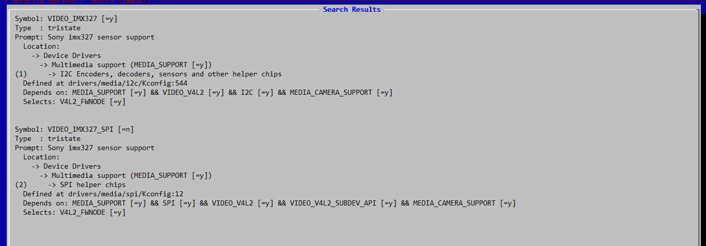

# 前言

为了更深入了解rk1808 sdk，对其中关于kernel部分的脚本和makefile等做一个分析

主要参考文件：**Rockchip_Developer_Guide_Linux_Software_CN.pdf**

# build.sh

在顶层目录的编译脚本中，关于kernel特别简单，主要做了三件事

* cd到内核目录下
* 拷贝默认的配置文件为当前的.config
* make编译，并指定设备树

```shell
function build_kernel(){
    echo "============Start build kernel============"
    echo "TARGET_ARCH          =$RK_ARCH"
    echo "TARGET_KERNEL_CONFIG =$RK_KERNEL_DEFCONFIG"
    echo "TARGET_KERNEL_DTS    =$RK_KERNEL_DTS"
    echo "=========================================="
    cd $TOP_DIR/kernel && make ARCH=$RK_ARCH $RK_KERNEL_DEFCONFIG && make ARCH=$RK_ARCH $RK_KERNEL_DTS.img -j$RK_JOBS && cd -
    if [ $? -eq 0 ]; then
        echo "====Build kernel ok!===="
    else
        echo "====Build kernel failed!===="
        exit 1  
    fi  
}
```

上面的打印信息，会很清楚得告诉你，传递给make的参数是多少

```shell
============Start build kernel============
TARGET_ARCH          =arm64
TARGET_KERNEL_CONFIG =rk1808_linux_defconfig
TARGET_KERNEL_DTS    =rk1808-evb-v10
==========================================
```

arm64这个参数传进去，主要是跟编译链的选择有关系

rk1808_linux_defconfig这个参数，就是为了从congfis目录下拷贝默认配置文件到本地.config

rk1808-evb-v10是指定设备树文件，这个内核是把设备树直接编进去了


# 记录

这些都不能去掉， 内核起不来

由于我们没用触摸屏，因此，可以在内核的选择中去掉它

```cpp
sudo make CROSS_COMPILE=/home/glx/share/rockchip/RK1808SDK200225/rk1808_linux_200225/prebuilts/gcc/linux-x86/aarch64/gcc-linaro-6.3.1-2017.05-x86_64_aarch64-linux-gnu/bin/aarch64-linux-gnu- menuconfig
    

```


```
Device Drivers  --->
    Input device support  --->
         [*]   Touchscreens  --->
```

```shell
cp .config arch/arm64/configs/rk1808_linux_defconfig     
```


没用显示屏，可以去掉

-> Device Drivers

 -> Graphics support

 -> Rockchip Misc Video driver

-> LCD Panel Select (<choice> [=y]) 

[ ] Backlight & LCD device support  ----    


摄像头没用也可以去掉

```shell
Device Drivers  --->  
	<*> Multimedia support  --->  
		I2C Encoders, decoders, sensors and other helper chips  --->  
			< > Sony imx327 sensor support
			< > GalaxyCore GC2355 sensor support
			< > SmartSens SC031GS sensor support
			< > NEXTCHIP nvp6324 driver support
		SPI helper chips  --->
			< > Gennum Serializers video
			< > Sony imx327 sensor support
			< > Rockchip Image Signal Pre-processing driver
		
```


