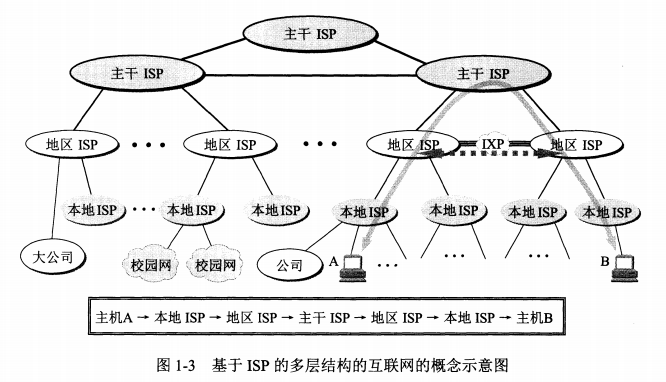
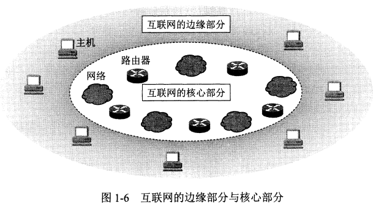
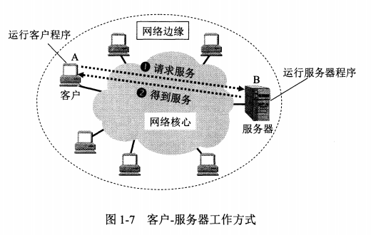
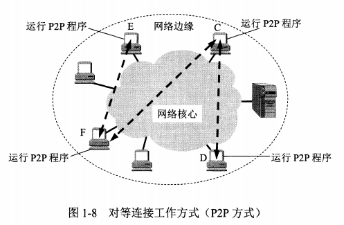
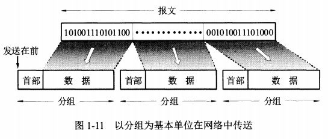
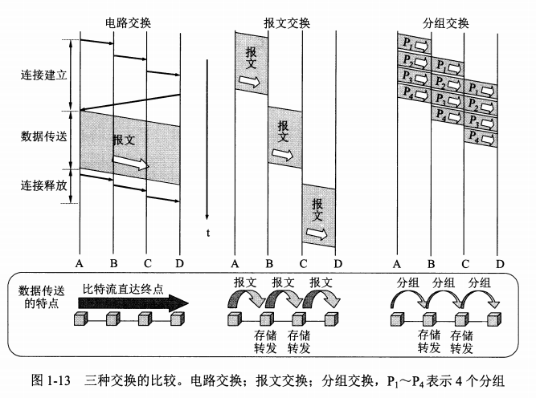
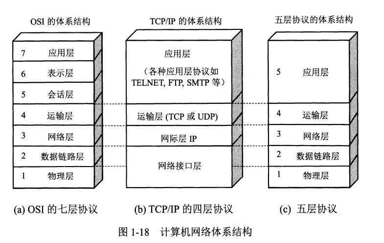

# 计算机网络在信息时代的作用

* 信息时代以网络为核心，重要特征是数字化、网络化、信息化

* 网络是信息社会的命脉，是发展知识经济的重要基础
* 互联网的两个特点：
  * 连通：任何互联网用户都可以相互交换数据，没有地域限制
  * 共享：资源共享
* 互联网的作用：
  * 给人们工作、生活、娱乐、学习提供便利
  * 计算机病毒等带来的负面影响
* 互联网+：互联网+各个传统行业，利用信息技术和互联网平台创造新的发展生态

# 互联网概述

起源于美国的互联网现在已经发展称为全世界最大的、覆盖全球的计算机网络

## 网络的定义

* 计算机网络：简称网络，是由若干结点（node）和连接这些结点的链路（link）组成
  * 结点：可以是计算机、集线器、交换机、路由器等
  * 链路：连接结点之间的线路
* 互联网：网络之间通过路由器互联起来，构成覆盖范围更大的网络，称为互联网

* 主机：与互联网相连的终端（计算机），常称为主机（host）

## 互联网基础结构发展的三个阶段

互联网的基础结构大体上经历了三个阶段的演进

### 第一阶段

**从单个网络ARPANET向互联网发展的过程**

* 1969年创建的ARPANET只是一个单个的分组交换网，所有要连接在ARPANET上的主机都直接与就近的结点交换机相连。
* 70年代中期，ARPA开始研究多种网络互联的技术，成为互联网的雏形
* 1983年TCP/IP协议成为ARPANET的标准协议，所有遵循该协议的计算机都能相互通信
* 1990年ARPANET关闭

## 第二阶段

**建成了三级结构的互联网**

* 1985年起，美国国家科学基金会（NSF）围绕六个大型计算机中心建设计算机网络，它是三级计算机网络，分为**主干网**、**地区网**、**校园网**，覆盖了主要的大学和研究所
* 1991年，许多公司开始接入互联网，通信量急剧增大，美国政府将**主干网**交给私人公司来经营，并对接入互联网的单位收费
* 1992年互联网上的主机超过100万台
* 1993年主干网速率达到45Mbits（T3速率）

## 第三阶段

**逐渐形成了多层次ISP结构的互联网**

* 1993年开始，由美国政府资助的NSFNET逐渐被若干个商用互联网主干网替代，政府机构不再负责互联网的运营，提供互联网服务的称为互联网服务提供商ISP（Internet Service Provider），例如中国移动、中国电信
* ISP可以从互联网管理机构中申请很多IP地址，同时自己架设或租用通信线路、路由器等联网设备
* 根据提供服务的覆盖范围，及拥有的IP数量，ISP分为主干ISP、地区ISP、本地ISP
  * 主干ISP：由专门的公司创建和维持，服务面加大，拥有高速主干网
  * 地区ISP：通过一个或多个主干ISP连接起来，通常服务一个地区
  * 本地ISP：给用户提供直接的服务，可以是一个仅仅提供互联网服务的公司，也可以是一个拥有网络并向自己雇员提供服务的企业，或者非盈利机构，如大学等
* 随着互联网数据流量急剧增长，互联网交换点IXP应运而生
  * IXP的主要作用是允许两个网络直接相连并交换分组，不再需要通过上一层的网络转发分组
  * IXP结构复杂，典型的IXP常采用工作在数据链路层的网络交换机，这些网络交换机都用局域网互连起来
* 互联网已经成为世界上规模最大、增长速率最快的计算机网络

## 互联网的标准化工作

* 标准化工作的好坏对一种技术的发展有很大的影响

* 缺乏国际标准，将使得技术的发展处于混乱状态，盲目的自由竞争可能形成多种技术体制并存且互不兼容的状态
* 国际标准的制定，又涉及到很多技术和非技术问题
* 互联网标准的制定面向公众，所有RFC文档均可下载，所有人均可提建议
* 制定互联网的正式标准经过三个阶段：
  * 互联网草案：有效期6个月，这期间还不能算RFC
  * 建议标准：从这个阶段开始称为RFC文档
  * 互联网标准：达到正式标准后，每个标准分配一个编号，一个标准可以和多个RFC文档关联

# 互联网的组成

从工作方式看，可以划分为两大块：

* 边缘部分：由所有连接在互联网上的主机组成，这部分是用户直接使用的，用来进行通信和资源共享
* 核心部分：由大量网络和连接这些网络的路由器组成，这部分是为边缘部分提供服务的（连通和交换）

## 互联网的边缘部分

* 边缘部分就是连接在互联网上的所有主机，这些主机也称为端系统（end system）
* 边缘部分利用核心部分所提供的服务，使众多主机之间能相互通信
* 端系统之间通信的方式可以划分为两大类：客户端服务器C/S，对等方式P2P

### 客户端-服务器方式

* 这种方式是最传统、最常用的方式
* 客户（client）和服务器（server）指的是通信中所涉及的两个应用进程
* 客户是服务请求方，服务器是服务提供方，双方都使用网络核心部分所提供的服务

客户程序的特点：

* 被用户调用后运行。在通信时主动向远程的服务器发起通信请求，因此必须知道服务器程序的地址
* 不需要复杂的软硬件系统

服务器程序的特点：

* 是一种专门用来提供某种服务的程序，可以同时处理多个客户程序的请求
* 系统启动后便一直运行，被动等待接收客户的请求，因此不需要知道客户程序的地址
* 一般需要强大的硬件和高级操作系统的支持

### 对等连接方式

* 对等连接（peer to peer），两台主机在通信时并不区分哪一个是服务请求方，哪一个是服务提供方，只要两台主机都运行了对等连接软件，即可对等连接通信。

* 实际上仍然是客户端-服务器方式，只不过每台主机，既是客户端，又是服务器
* 对等连接方式可以支持大量对等用户同时工作

## 互联网的核心部分

* 核心部分是互联网中最复杂的部分，由许多网络和路由器组成，它要向网络边缘的主机提供连通性
* 主机是为用户进行信息处理的，路由器是用来转发分组（分组交换）的
* 网络核心部分起特殊作用的是**路由器（router）**，它是一种专用计算机
* 路由器是实现分组交换（packet switching）的关键构件，其任务是**转发**收到的分组

### 电路交换

* 电话问世后，人们发现将所有电话两两相连需要的电线数量太大，应该使用电话交换机
* 每一部电话都连接到交换机上，而交换机使用交换的方法，其交换方式是电路交换（circuit switching），让电话用户彼此间通信
* 交换，就是按照某种方式动态分配传输线路的资源，电话通话时，建立了专用的物理通路，通话完毕后，释放这条物理通路
* 这种建立连接、通话、释放连接的交换方式，称为电路交换
* 电路交换的一个重要特点是在通话的全部时间内，通话的两个用户始终占用到端到端的通信资源
* 电路交换的传输效率很低

### 分组交换

* 分组交换采用**存储转发**技术 ，路由器收到分组后，先暂时存储，再检查其首部，查找路由表转发出去
* 路由器暂存的是一个短分组，而不是整个长报文，短分组暂存在路由器的内存中，保证了较高的交换速率
* 要发送的整块数据，称为一个报文（message）
* 发送前，报文被划分成更小的等长数据段（例如1024bit），在数据段前加**首部header**（必要的控制信息），就构成了一个**分组**（packet）
* 分组又称为包，分组的首部也称为包头，分组是互联网中传输的数据单元
* 互联网可以容许非常多的主机同时进行通信，而一台主机的多个进程也可以各自和不同主机的不同进程通信
* 分组交换在传送数据之前不必先占用一条端到端链路的通信资源，数据的传输效率更高
* 分组交换实质上采用了在数据通信过程中断续分配传输带宽的策略，使得通信线路的利用率大大提高了
* 为了提高分组交换网的可靠性，核心部分常采用网状拓扑结构，当发生网络拥塞或少数结点链路故障时，路由器可以选择其它线路转发分组
* 分组交换的缺点：
  * 时延：存储转发时的排队、处理等操作会造成一定的时延，而且无法保证端到端的带宽
  * 额外开销：各分组的首部携带的必要控制信息也造成了额外的开销（overhead）

### 三种交换的对比

* 电路交换：整个报文的比特流连续地从源点直达终点，好像在一个管道中传输
* 报文交换：整个报文先到达相邻结点，全部存储后转发到下一个结点
* 分组交换：单个分组传送到响铃结点，存储后查找转发表，转发到下一个结点

* 总结：
  * 若要连续传送大量的数据，且传送时间远大于连接建立时间，则电路交换的传输速率块
  * 若要传输突发数据，报文交换和分组交换不需要预先分配传输带宽，提高了整个网络的信道利用率
  * 分组交换时，分组长度小于整个报文长度，因此分组交换比报文交换时延小，同时也具有更好的灵活性

# 计算机网络在我国的发展

* 1980年，铁道部开始进行计算机联网实验
* 1989年11月，我国第一个共用分组交换网CNPAC建成运行
* 80年代后期，公安、银行、军队等部分相继建立了各自的专用计算机广域网
* 80年代起，许多单位相继安装了大量的局域网
* 1994年4月20日，我国用64Kbit/s专线正式接入互联网
* 1994年5月，中科院高能物理研究所设立了我国的第一个万维网服务器
* 1994年9月，中国共用计算机互联网CHINANET正式启动
* 目前最大的共用计算机网络：
  * 中国电信互联网：CHINANET
  * 中国联通互联网：UNINET
  * 中国移动互联网：CMNET
  * 中国教育和科研计算机网：CERNET
  * 中国科学技术网：CSTNET

# 计算机网络的类别

## 计算机网络的定义

计算机网络，主要是由一些**通用**的、**可编程**的硬件互联而成的，这些硬件并非专门用来实现某一个特定目的（如视频传输），而是能用来传输多种不同类型的数据，并能支持广泛的和日益增长的应用

## 几种不同类别的计算机网络

### 按照网络作用范围分类

* 广域网WAN（Wide Area Network）：
  * 作用范围通常为几十到几千公里，是互联网的核心部分
  * 任务是通过长距离传输数据，一般使用高速链路，具有较大的通信容量
* 城域网MAN（Metropolitan Area Network）：
  * 作用范围一般是一个城市，作用距离5-50km
* 局域网LAN（Local  Area Network）：
  * 一般用微型计算机或工作站通过高速通信线路连接（10Mbit/s以上）
  * 地理位置局限在较小的范围
* 个人区域网PAN（Personal Area Network）：
  * 在个人工作的地方把个人使用的电子设备，用无线技术连接起来
  * 范围很小，10米左右

## 按照网络使用者分类

* 公用网（Public Network）：电信公司出资建造的大型网络
* 专用网（Private Network）：某个部门为满足本单位的特殊业务需求而建造的网络，不向外人提供服务

## 用来把用户接入到互联网的网络

接入网AN（Access Network），又称为本地接入网或居民接入网，是一种特殊的计算机网络

* 既不属于互联网核心部分，也不属于边缘部分
* 接入网是从某个用户端到互联网中的一个路由器之间的一种网络
* 接入网只是起到让用户能够与互联网连接的桥梁作用

# 计算机网络的性能

## 计算机网络的性能指标

性能指标从不同的方面来度量计算机网络的性能

### 速率

网络中速率指的是数据的**传输速率**，也称为数据率或比特率，单位是bit/s

当提到网络速率时，往往说的是额定速率或标称速率，而不是实际速率

### 带宽

带宽（bandwidth）：

* 原本含义：某个信号具有的频带宽度，指该信号所包含的各种不同频率成分所占的频率范围，单位是HZ
* 计算机网络中：表示某个**通道**传输数据的能力，网络带宽表示在单位时间内网络中某个信道所能传输的数据量，单位是bit/s

### 吞吐量

吞吐量（throughput）：表示在**单位时间**内，通过某个网络（或信道、接口）的实际数据量

* 通常用于对网络速率的实际测量
* 吞吐量受网络带宽或者额定速率的限制
* 单位bit/s或Mbit/s

### 时延

时延是指数据从网络的一端，传送至另一端所需的时间

时延有以下部分组成：

* 发送时延（transmission deley）：是主机或路由器发送数据帧所需要的时间
  * 计算公式：发送时延 = 数据长度(bit) / 发送速率(bit/s)
  * 发送时延与数据帧长度有关
* 传播时延（propagation delay）：是电磁波在信道中传播一定距离需要的时间
  * 计算公式：传播时延 = 信道长度(m) / 传播速率(m/s)
  * 传播时间与传输介质的材料、长度有关
* 处理时延：主机或路由器在收到分组时需要花费一定的时间进行处理，例如分析头部、提取数据、差分校验、查找路由等
* 排队时延：分组在经过网络传输时，要经过多个路由器，排队等待处理产生的时延
  * 分组进入路由器后要在输入队列中排队等待处理，路由器确定转发接口后，还要在输出队列排队
  * 排灯时延取决于网络当前通信量，当通信量特别大时，会出现分组丢失，导致排队时延无限大

### 时延带宽积

传播时延 * 带宽

### 往返时间RTT

往返时间RTT（Round-Trip Time）：表示从发送端发送数据开始，到发送端收到来自接收端的确认（接收端收到数据后便立即发送确认），总共经历的时延

### 利用率

* 信道利用率：某个信道在一段时间内，有数据通过的时间占比，完全空闲的信道利用率为0
* 网络利用率：全网络信道利用率的加权平均值

**信道或网络的利用率过高会产生非常大时延**

## 计算机网络的非性能特征

* 费用：网速越高，价格越贵
* 质量：网络的质量影响到很多方面，如网络的可靠性、管理的简易性等
* 标准化：网络的软硬件设计最好遵循国际标准
* 可靠性：可靠性与网络的质量和性能有密切关系
* 可拓展性和可升级性：在构造网络时就应当考虑到今后可能会扩展和升级，网络的性能越高，拓展费用和难度越大
* 易于管理和维护：网络如果没有良好的管理和维护，就很难达到和保持所设计的性能

# 计算机网络体系结构

## 计算机网络体系结构的形成

相互通信的两个计算机系统必须高度协调工作才行，而这种“协调”是相当复杂的，为了设计这样复杂的计算机网络，ARPANET提出了分层思想，将庞大复杂的问题，转化为若干较小的局部问题。

* 1983年形成了开放系统互连基本参考模型OSI/RM（Open System Interconnection Refence Model）的正式标准
* 90年代初期，TCP/IP的互联网已经在全球相当大的范围成功运行了，而很少有符合OSI标准的商业产品，因此OSI失败了
* TCP/IP成为事实上的国际标准

## 协议的划分层次

为网络中的数据交换而建立的规则、标准、约定称为网络协议（Network Protocol），主要有三个要素组成

* 语法：数据和控制信息的结构或格式
* 语义：需要发出何种控制信息，完成何种动作以及做出何种响应
* 同步：事件实现顺序的详细说明

分层的好处：

* 各层之间是独立的：某一层并不知道下一层如何实现，只知道如何调用接口
* 灵活性好：当任何一层发生变化时，只要接口不变，其它层不受影响
* 结构上可分割：各层都可以采用最合适的技术来实现
* 易于实现和维护：整个系统被分为若干个相对独立的子系统，方便处理
* 能促进标准化工作：因为每一层的功能及其提供的服务已经有了明确的定义

通常各层要完成的功能主要有：

* 差错控制：使相应层次对等方的通信更加可靠
* 流量控制：发送速率必须使接收端来得及接收
* 分段和重装：发送时分段，接收时重装
* 复用和分用：发送端的高层会话会复用一条底层的连接，在接收端进行分用
* 连接建立和释放：交换数据前先建立一条逻辑连接，数据传送结束后释放

**计算为网络的各层协议及其协议的集合，就是网络的体系结构**，体系结构是抽象的，而实现是具体的，是真正运行的计算机软硬件

## 具有五层协议的体系结构

* OSI有七层协议体系结构，TCP/IP只有四层

* 学习计算机网络时，综合了OSI和TCP/IP的优点，采用五层协议的体系结构

### 应用层 application layer

* 任务是通过应用进程间的交互来完成特定的网络应用，应用层协议定义的是**应用进程间通信和交互的规则**
* 对于不同的网络应用需要使用不同的协议，如域名系统DNS、万维网HTTP、电子邮件SMTP
* 应用层交互的数据单元称为报文

### 运输层 transport layer

* 任务是负责向两台主机中的进程之间的通信**提供通用的数据传输服务**，运输层不准对特定应用
* 不同的应用均可利用运输层的服务传送报文
* 由于一台主机有多个进程，因此运输层有复用和分用的功能
* 运输层主要使用两种协议：
  * 传输控制协议TCP（Transmission Control Protocol）：提供面向连接的、可靠的数据传输服务，其数据传输的单位是报文段（segment）
  * 用户数据报协议UDP（User Datagram Protocol）：提供无连接的、尽最大努力的数据传输服务（不保证数据传输的可靠性），其数据传输的单位是用户数据报

### 网络层 network layer

* 任务一：负责为分组交换网上的不同主机提供通信服务
* 任务二：选择合适的路由，使运输层传下来的分组，能够通过路由器找到目的主机
* 在发送数据时，网络层把运输层产生的报文段或用户数据段封装成**分组**或**包**进行传送，由于网络层使用IP协议，因此分组也成为IP数据报
* 互联网是由大量的异构（heterogeneous）网络通过路由器（router）相互连接起来的，互联网使用的网络层协议是无连接的网际协议IP（Internet Procotol）和许多路由选择协议，因此网络层也叫网际层或IP层

### 数据链路层 data link layer

* 在两个相邻结点之间传送数据时，数据链路层将网络层交下来的IP数据报**组装成帧**，在两个相邻结点的链路上传送帧，每一帧包含数据和必要的控制信息（同步、地址、差错控制等）
* 数据链路层在收到一个帧后，提取出数据部分，上交给网络层
* 如果接收端检测到有差错，则直接丢弃这个帧

### 物理层 physical layer

* 物理层上所传输的数据单位是比特
* 物理层要考虑0和1如何用电压表示，接收方如何识别
* 物理层还要考虑插头的引脚数，各引脚如何连接

## 实体、协议、服务和服务访问点

* 实体（entity）：表示任何可发送或接收信息的硬件或软件进程， 在许多情况下，实体就是一个特定的软件模块
* 协议：是控制两个对等实体（或多个实体）进行通信的规则的集合
* 服务访问点SAP（service access point）：服务访问点SAP实际上就是一个逻辑接口

