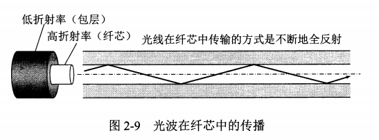
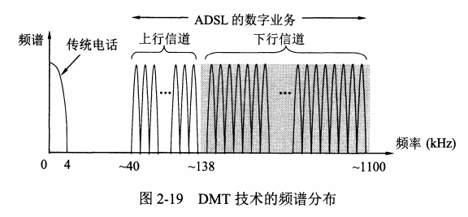

# 物理层的基本概念

* 物理层考虑的是怎样在不同的传输媒体上传输数据比特流，而不是传输媒体本身
* 物理层的作用是屏蔽掉传输媒体和通信手段的差异，让数据链路层不比考虑这些差异，专注于本层协议和服务的实现
* 物理层的主要任务：
  * 确定与传输媒体接口相关的一些特性
    * 机械特性：接线器的形状、尺寸、引脚、排列、固定方式等
    * 电气特性：不同电平的范围
    * 功能特性：不同电平的意义
    * 过程特性：不同事件出现的顺序
  * 完成传输方式的转换：并行与串行传输的转换

# 数据通信的基本知识

## 通信系统的基本概念

* 数据通信系统的组成：源系统、传输系统、目的系统
* 源系统：
  * 源点：产生要传输的数据，又称信源
  * 发送器：源点产生的数据要经过发送器编码后，才能在传输系统中传输，常用的是调制器
* 传输系统：
  * 可以是简单的传输线
  * 也可以是复杂的网络系统
* 目的系统：
  * 接收器：接收传输系统的信号，并转化为目的设备需要的信息，常用的是解调器
  * 终点：从接收器获取数字比特流，然后把信息输出，又称为信宿
* 通信的目的：传送**消息（message）**，如语音、文字等
* **数据（data）**：是运送消息的实体，是使用特定方式表示的信息，通常是有意义的符号序列
* **信号（signal）**：数据的电气或电磁的表现
* 信号的分类：
  * 模拟信号：信号是连续的
  * 数字信号：信号是离散的

* **码元**：使用时域表示数字信号时，代表不同离散数值的基本波形就是码元，二进制下，码元只有0和1

## 信道的基本概念

* 信道（channel）：信道一般用来表示向某一个方向传送信息的媒体，信道和电路并不等同，一条通信线路上，往往包含一条发送信道和一条接收信道

* 通信方式的分类：

  * 单向通信：也称单工通信，只有一条信道，一个方向，例如无线电广播
  * 双向交替通信：也称半双工，通信双方不能同时收发信息，只能一方发，一方收
  * 双向同时通信：也称全双工通信，通信的双方可以同时收发信息

* 为什么要进行调制（modulation）：来自信源的信号称为**基带信号**（基本频带信号），这种信号往往包含较多的低频成分，甚至直流成分，而许多信道并不能传输这种低频或直流分量，因此必须先进行调制

* 调制的分类：

  * 基带调制：仅仅对基带信号波形进行变换（一种数字信号转换为另一种数字信号），使它能与信道特性相适应，变换后仍然是基带信号，基带调制也称为**编码（coding）**
  * 带通调制：需要使用**载波（carrier）**进行调制，把基带信号的频率范围搬移到较高的频段，并转换为模拟信号，经过载波调制后的信号称为带通信号（在一定频率范围内能通过信道）

* 常用的编码方式

  

  * 不归零制：正电平为1，负电平为0
  * 归零制：正脉冲为1，负脉冲为0
  * 曼彻斯特编码：位周期中心上跳代表0，下跳代表1
  * 差分曼彻斯特编码：在每一位的中心始终都有跳变，位开始边界有跳变代表0，没有则代表1

* 基本的带通调制方法

  

  * 调幅AM：载波的振幅随基带数字信号而变化
  * 调频FM：载波的频率随着基带数字信号而变化
  * 调相PM：载波的初始相位随着基带数字信号而变化

* 为了达到更高的信息传输速率，必须采用技术上更为复杂的多元制的振幅相位混合调制方法，如**正交调幅调制QAM**（Quadrature Amplitude Modulation）

## 信道的极限容量

从概念上讲，限制码元在信道上传输速率的因素主要有两个

* 信道能够通过的频率范围
* 信噪比

## 信道能通过的频率范围

* 具体信道所能通过的频率范围是有限的，高频成分往往不能通过信道
* 高频成分丢失后，接收端信号波形失去了码元间的清晰界限，这种现象叫**码间串扰**
* 在任何信道中，码元传输的速率是有上限的，超过上限会出现严重的码间串扰问题

### 信噪比

* 信噪比就是信号的平均功率和噪声的平均功率之比，单位是分贝dB
* 噪声是随机产生的，但是影响是相对的，如果信号相对较强，则噪声的影响就很小
* 计算公式：
  $$
  S/N（dB） =  10  *  \lg (S/N) (dB)
  $$
* 香农公式：信道的极限信息传输速率C
$$
C = W * \log_2 (1+S/N) (bit/s)
$$
​	W：信道的宽度（Hz）

​	S：信道内所传信号的平均功率

​	N：信道内高斯噪声功率

* 结论：**信道的带宽或信道中的信噪比越大，信息的极限传输速率越高**
* 频道带宽确定、信噪比确定、速率无法提高，如何提高信息的传输速率：
  * 让每一个码元携带更多比特的信息量
  * 例如原来一个码元，只携带0或1，现在一个码元，携带000-111三个位

# 物理层下面的传输媒体

传输媒体，是数据传输的发送器和接收器之间的物理通路，可以分为两大类：

* 导引型传输媒体：电磁波被导引着固体媒体（铜线、光纤）传播
* 非导引型传输媒体：电磁波在自由空间传播

## 导引型传输媒体

### 双绞线

* 把两根互相绝缘的铜导线并排放在一起，然后后规则的方法**绞合（twist）**起来就构成了双绞线，绞合可以减少对相邻线的电磁干扰，通常将一定数量的双绞线捆成电缆，在外部包上保护套
* 模拟和数字信号都可以使用双绞线传输，距离一般为几到几十公里，长距离传输时，需要用到
  * 放大器：对衰减的模拟信号进行放大
  * 中继器：对失真的数字信号进行整形

* 双绞线价格便宜，性能不错，因此使用十分广泛
* 屏蔽双绞线（STP，shielded twister pair）：在双绞线的外面再加上一层金属丝编织成的屏蔽层，形成屏蔽双绞线，可以提高双绞线的抗电磁干扰能力

* EIA/TIA-568-A标准规定了5种UTP标准

### 同轴电缆

* 同轴电缆由内导体铜质芯线（单股实心线或多股绞合线）、绝缘层、网状编织的外导体屏蔽层、保护塑料外层所组成
* 由于外导体屏蔽层的作用，同轴电缆具有很好的抗干扰特性，被广泛用于传输较高速率的数据

### 光缆

* 光纤通信就是利用光导纤维传递光脉冲来进行通信，有脉冲则为1
* 光纤是光纤通信的传输媒体，光纤通常由非常透明的石英玻璃拉成细丝，主要由纤芯和包层构成双层通信圆柱体，光波在纤芯内全反射传播
* 在发送端有光源，可以采用发光二极管或但导体激光器，在电脉冲的作用下发出光脉冲
* 在接收端利用光电二极管做成光检测器，将光脉冲还原成电脉冲

* 多模光纤：多条不同入射角的光线在同一条光纤中传输，光脉冲在多模光纤中传输会逐渐展宽，造成失真，因此只适合近距离传输
* 单模光纤：光纤的直径减小到只有一个光的波长，则光可以一直向前传播，不会产生多次反射，损耗小，造价高
* 光缆：由于光纤很细，因此将一根或多根光纤，加上加强芯和填充物，做成光缆，可以提高机械强度

### 架空明线

* 在电线杆上架设相互绝缘的明线
* 特点：
  * 安装简单
  * 通信质量差、受环境影响大

## 非导引型传输媒体

* 利用无线电波在自由空间的传播，可以较快地实现多种通信，因此将自由空间称为**非导引型传输媒体**
* 短波通信（高频）：主要靠大气的电离层的反射，但是电离层不稳定产生的衰落现象和电离层反射所产生的多径效应，使得短波信道的通信质量较差
* 微波通信：主要使用的频率范围2~40GHz，微波在空间中主要是直线传播，而且会穿透大气的电离层进入宇宙空间，所以微波通信主要依靠**地面微波接力通信**和**卫星通信**

### 微波接力通信

由于微波是直线传播的，而地面是曲面，所以需要依靠中继站对信号放大，接力通信的特点是：

* 微波频率高，频段范围宽，因此通信信道的容量大
* 因为工业和天电干扰的频段比微波频率低得多，因此微波传输质量高
* 微波接力通信建设投资少，见效快，易于跨越山区河流

接力通信的缺点：

* 相邻中继站必须直视，不能有障碍物
* 微波的传播有时也会受恶劣天气的干扰
* 微波通信的隐蔽性和保密性差
* 大量中继站的维护需要消耗人力物力

### 卫星通信

卫星通信是利用同步卫星作为中继器的一种微波接力通信

* 通信距离远，通信费用与通信距离无关
* 频带很宽，通信容量大
* 具有较大的传播时延

# 信道复用技术

## 频分复用、时分复用和统计时分复用

* 频分复用（Frequency Division Multiplexing）：所有用户在同样的时间内，占用不同的带宽资源
* 时分复用（Time Division Multiplexing）：所有用户在不同时间占用同样的频带宽度

* 在时分复用中，当某个用户暂时无数据发送时，分配给该用户的时隙只能是空闲状态，导致信道利用率不高
* 统计时分复用STDM（Statistic TDM）：是一种改进的时分复用，能明显提高信道的利用率

* 统计时分复用使用STDM帧来传送复用的数据，STDM帧不是固定分配时隙，而是按需动态分配，因此线路利用率提高了
* 统计时分复用又称为异步十分复用，普通的时分复用称为同步时分复用

## 波分复用

* 波分复用WDM（Wavelength Division Multiplexing）就是光的频分复用
* 用一根光纤同时传输多个频率接近的光载波信号，因为频率高，因此用波长表示光载波，得到波分复用的概念
* 密集载波复用DWDM：在一根光纤上复用几十路或更多光载波

* 光信号传输一段距离后会衰减，因此要进行中继和放大，使用掺铒光纤放大器（Erbium-Doped Fiber Amplifiers）

## 码分复用

* 码分复用CDM（Code Division Multiplexing）
* 码分多址CDMA（Code Division Multiplexing Access）
* 每一个用户在同样的时间使用同样的频带进行通信，由于各用户使用经过特殊挑选的不同码型，因此各用户之间不会造成干扰，而且这种系统的信号有很强的抗干扰能力
* 其原理较复杂，此处不展开

# 宽带接入技术

## ADSL技术

* 非对称数字用户线ADSL（Asymmetric Digital Subscriber Line）技术是用数字技术对现有的模拟电话用户线进行改造，使它能够承载宽带数字业务

* ADSL把0-4KHz低频频留给电话使用，而把原来没有被利用的高频谱给用户上网使用
* 由于用户上网主要是进行下载，上传的需求不大，因此ADSL的下行带宽远高于上行带宽，这就是非对称
* ADSL的传输距离取决于数据传输速率和用户线的线径
* ADSL的用户线两端安装ADSL调制解调器，采用离散多音调DMT调制技术，采用频分复用的方法，把40KHz-1.1MHz划分为许多子信道，其中25个用于上行，249个用于下行，并使用不同的载波进行调制
* ADSL不能保证固定的数据率
* ADSL最大的好处就是可以利用现有电话网中的用户线，而不必重新布线

## 光纤同轴混合网（HFC）

光纤同轴混合网HFC（hubird Fiber Coax）是目前覆盖面很广的有线电视网的基础上开发的一种居民宽度接入网，除了可以传送电视节目外，还能提供电话、数据和其它宽带交互业务

* 将原先有线电视网中的同轴电缆主干部分该换为光纤
* 光纤从头端连接到光纤结点，然后光信号转化为电信号，通过同轴电缆传送到每个用户家庭
* 用户家庭还必须使用机顶盒和电缆调制解调器

## FTTx技术

* 光纤到户FTTH（fiber to the home）：把光纤一直铺设到用户家庭，是提升用户上网速率的很好选择

* 为了有效利用光纤资源，在光纤干线和广大用户之间，还需要铺设一段中间转换装置，光配线网ODN

* 光线路终端OLT是连接到光纤干线的终端设备，OLT把收到的下行数据发往无源的1:N光分路器，然后用广播方式向所有用户端的光网络单元ONU发送
* 当ONU发送上行数据时，先把电信号转化为光信号，光分路器把各ONU发送上来的数据汇总，以TDMA方式发往OLT

