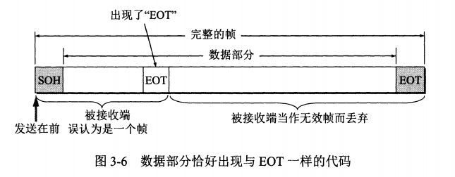

# 使用点对点信道的数据链路层

数据链路层属于计算机网络的低层，主要使用：

* 点对点信道：一对一的点对点通信方式，点对点协议PPP
* 广播信道：一对多的广播通信方式，CSMA/CD协议

## 数据链路和帧

* 链路（link）：从一个结点到相邻结点的一段**物理线路**（有线或无线），中间没有其它交换结点，链路只是一条完整通信路径的组成部分
* 数据链路（data link）：通信时，除了必要的物理线路，还必须有通信协议来控制数据传输，将这些协议的硬件和软件加到链路上，就构成了数据链路
  * 常用网络适配器来实现这些协议，一般的适配器包括了数据链路层和物理层的功能
* 帧（frame）：数据链路层把网络层交下来的数据构成帧发送到链路上，以及把接收到的帧中数据取出，并上交给网络层

* 点对点协议的数据链路层简化

* 点对点信道的数据链路层在进行通信时的主要步骤如下：
  * 结点A的数据链路层把网络层交下来的IP数据报**添加首部和尾部封装成帧**
  * 结点A把封装好的帧发送给结点B的数据链路层
  * 若结点B的数据链路层收到的帧无差错，则从收到的帧中提取出IP数据报上交给网络层，否则丢弃此帧

## 三个基本问题

数据链路层协议有很多，但三个基本问题是共同的：封装成帧、透明传输、差错检测

### 封装成帧

* 用户主机有从应用层到物理层的全部5层，而交换机只有网络层、链路层、物理层3层
* 在互联网上传输数据的基本单位是分组（即网络层的IP数据报）

* 网络层的IP数据报送到数据链路层，便是帧是数据部分，根据不同协议加上帧头帧尾，构成完整的帧，这样的帧是数据链路层的数据传送单元
* 封装成帧（framing）就是将网络层传下来的IP数据报加上首部和尾部，接收端从物理层获得的比特流后，根据首部和尾部的标识，就能识别帧的开始和结束
* 首部和尾部的重要作用是进行**帧定界**，即确定帧的界限，此外还包括许多必要的控制信息
* 每一种链路层协议都规定了所能传送的帧的数据部分长度上限-最大传送单元MTU

* 当数据是由可打印的ASCII码组成的文本文件时，帧定界可以使用特殊的帧定界符

* SOH（start of header）：放在帧的首部，表示帧的首部，十六进制编码为0x01
* EOT（end of transmission）：放在帧的尾部，表示帧的结束，十六进制编码为0x04
* 当出现差错时，例如连续收到两次SOH，则第一次的EOT丢失了，认为这次传输失败，直接丢弃

### 透明传输

* 透明：某一个实际存在的事物，看起来却好像不存在一样
* 透明传输：无论什么样的比特组合，都能按照原样没有差错地通过这个数据链路层，或者说，数据链路层对于这些数据来说是透明的
* 由于帧头帧尾使用专门的控制字符，因此数据中不能有帧定界符，否则出现帧定界错误

* 为了解决透明传输问题，就必须使数据中的SOH、EOT在接收端不被解释为控制字符
  * 在发送端，如果数据中出现SOH、EOT，则在前面插入转义字符ESC
  * 在接收端，删除数据中出现的转义字符ESC
  * 这种方式称为**字节填充（byte stuffing）**或**字符填充（character stuffing）**
  * 如果转义字符也出现在数据中，那么在前面再插入一个转义字符

### 差错检测

* 为了保证数据传输的可靠性，在计算机网络传输数据时，必须采取各种差错检测措施
* 目前数据链路层广泛使用的是循环冗余校验CRC（Cyclic Redundancy Check）
* 在数据链路层要进行差错校验，数据必须按帧传输，每一帧加上冗余码FCS
* 仅仅使用CRC仅能做到**无比特差错**传输，但是不能实现可靠传输（无传输差错）
  * 比特差错：传输过程出现1变0、0变1
  * 传输差错：帧丢失、帧重复、帧失序
* 在通信质量较差的无线传输链路中，数据链路层使用确认和重传机制，向上提供可靠传输服务
  * 在CRC基础上，增加帧编号、确认和重传机制
  * 收到正确的帧，需要向发送方发送确认，发送方超时没有收到确认，则进行重传
* 在通信质量良好的有线传输链路中，数据链路层不使用确认和重传机制，如果在数据链路层出现了差错，那么交给上层（如运输层的TCP协议）来改正差错

# 点对点协议PPP

过去通信线路质量教差时，能实现可靠传输的高级数据链路控制HDLC（high-level data link control）比较流行，目前HDLC已经很少使用，而是点对点协议PPP（point-to-point protocol）成为使用最广泛的数据链路层协议

## PPP协议的特点

互联网用户通常都要连接到某个ISP才能接入互联网，PPP协议就是用户计算机和ISP进行通信时所使用的数据链路层协议

#### PPP协议应满足的需求

IETF认为，在设计PPP协议时，必须考虑多方面的需求

* 简单
  * 互联网体系结构中，最复杂的部分在TCP协议中，网际协议IP相对来说比较简单，因此数据链路层的协议就更简单了，不需要纠错，不需要序号，也不需要流量控制
  * 数据链路层的协议，接收帧，进行CRC校验，成功则收下，失败则丢弃，其它的什么也不做
* 封装成帧
  * 必须规定帧界定符，以便接收端找出帧的开始和结束位置
* 透明传输
  * PPP协议必须保证数据传输的透明性，数据中出现SOH、EOT、ESC时需要插入转义字符ESC
* 多种网络层协议
  * PPP协议必须能够在同一条物理链路上同时支持多种网路层协议（如IP、IPX）的运行
  * 当点对点链路所连接的是局域网或路由器时，PPP协议必须同时支持在链路所连接的局域网或路由器上运行各种网络层协议
* 多种类型链路
  * PPP必须能在多种类型的链路上运行，例如串行的、并行的、同步的、异步的、低速的、高速的、电的、光的、交换的、非交换的点对点链路
* 差错检测
  * PPP协议必须对接收到的帧进行检测，并丢弃有差错的帧
* 检测连接状态
  * PPP协议必须具有一种机制能够及时检测链路是否处于正常工作状态
* 最大传送单元
  * PPP协议必须对每一种类型的点对点链路设置最大传送单元MTU的标准默认值
* 网络层地址协商
  * PPP协议必须提供一种机制，使通信的两个网络层的实体，能够通过协商知道或能够配置彼此的网络层地址
  * 协商的算法应该尽量简单，并且能得到协商结果
* 数据压缩协商
  * PPP协议必须提供一种方法来协商使用数据压缩算法，但PPP协议并不要求将数据压缩算法标准化

#### PPP协议的组成

PPP协议有三个组成部分

* 一个将IP数据报封装到串行链路的方法
  * PPP即支持异步链路，也支持面向比特的同步链路
  * IP数据报在PPP帧中就是信息部分，这个信息部分的长度受到MTU的限制
* 一个用来建立、配置、测试数据链路连接的链路控制协议LCP（link conrols protocol）
  * 通信的双方可以协商一些选项，在RFC1661中定义了11种类型的LCP分组
* 一套网络控制协议NCP（network control protocol）
  * 其中每一个协议支持不同的网络层协议，如IP、OSI的网络层、DECnet、AppleTalk等

## PPP协议的帧格式

#### 各字段的意义

* PPP帧的首部和尾部分别为4个和2个字段
* 首部和尾部都有标志字段F（flag），规定为0x7E，表示一帧的开始或结束，也就是帧定界符，连续两帧之间，只需要一个标志字段（帧定界符），如果连续出现两个标志字段，认为是空帧，直接丢弃
* 首部的地址字段A规定为0xFF，控制字段C规定为0x03，这两个字段目前就是固定的，不会有其它值
* 首部的协议字段是2字节
  * 0x0021：信息字段是IP数据报
  * 0xC021：信息字段是PPP链路控制协议LCP的数据
  * 0x8021：信息字段是网络层的控制数据
* 信息字段的长度可变，但是不超过1500字节，MTU规定了最大长度
* 尾部的第一个字段为2个字节，是使用CRC的帧检验序列FCS

#### 字节填充

* 当信息字段出现了和标志字段一样的值时，就需要采取措施，使接收端正确接收信息，而不是当错误帧丢弃

* 当PPP使用异步传输时，转义符定义为0x7D，并使用字节填充，RFC1662规定了如下填充方法
  * 把信息字段中的0x7E转换成2字节序列（0x7D，0x5E）
  * 把信息字段中的0x7D转换成2字节序列（0x7D，0x5D）
  * 若信息字段中出现ASCII码控制字符，则在该字符前加0x7D，同时改变该字符的编码，例如出现0x03，则转换成（0x7D，0x23），改变编码就是在本身基础上加0x20

#### 零比特填充

PPP协议用在SONET/SDH链路时，使用同步传输，这种情况下，采用零比特填充来实现透明传输，具体做法是

* 在发送端，先扫描整个信息字段，只要发现有5个连续1，则填入一个0
* 在接收端，先确定帧边界，在对信息字段进行扫描，当发现5个连续1时，就将其后的0删除

零比特填充可以传输任意组合的比特流，而不会引起帧边界的错误判断

## PPP协议的工作状态

* 链路静止（link dead），这时个人主机和ISP之间没有物理层的连接，个人主机通过调制解调器呼叫路由器，建立物理层连接
* 链路建立：
  * 个人主机发送LCP的配置请求帧，其协议字段置为LCP对应的代码，信息字段包含特殊的请求
  * ISP的响应分为
    * 配置确认帧：所有选项都接受
    * 配置否认帧：所有选项都理解，但是不接受
    * 配置拒绝帧：选项有的无法识别或不能接受，需要协商
  * LCP配置选项包括
    * 最大帧长MTU
    * 所使用的鉴别协议
    * 是否使用PPP帧中的地址和控制字段（这两个字段目前是固定的，没有任何意义）
* 鉴别：
  * 建立了LCP链路后，进入鉴别（Authenticate）状态
  * 若使用口令鉴别协议PAP（明文），则需要个人主机主动发送身份标识符
  * 为了安全性考虑，可以使用口令握手鉴别协议CHAP
  * 如果鉴别失败，则转入链路终止状态，成功，则进入网络层协议状态
* 网络层协议：
  * PPP链路的两端的网络控制协议NCP根据网络层的不同协议，互相交换网络层特定的网络控制分组
  * 如果运行IP协议，则对链路的每一端配置IP协议模块时，使用IPCP协议
  * 网络层配置完毕后，链路进入可以进行数据通信的链路打开状态
* 链路打开状态：
  * 链路的两个PPP端点可以批次向对方发送分组，还可以发送回送请求和回送回答
  * 数据传输结束后，可以由链路的一端发出终止请求，收到对方发来的终止确认后，转到链路终止
  * 如果链路出现故障，也会转到链路终止

# 使用广播信道的数据链路层

广播信道可以进行一对多的通信，接着讨论局域网中的广播信道

## 局域网的数据链路层

局域网为一个单位所拥有，地址范围和站点数目都有限，主要优点如下：

* 具有广播功能，从一个站点可以很方便地访问全网，局域网上的主机可以共享连接在局域网上的资源
* 便于系统的扩展和逐渐演变，各设备的位置可灵活调整
* 提高了系统的可靠性（reliability）、可用性（availabiliti）、生存性（survivability）

### 以太网的标准

* 最初的以太网标准有好几个，因此IEEE将数据链路层拆成了逻辑链路控制LLC和媒体接入控制MAC
  * 与接入到传输媒体有关的内容都放在MAC子层
  * LLC子层与传输媒体无关

* 90年代后，以太网取得垄断地位，因此很多适配器厂商仅装由MAC协议

### 适配器的作用

* 计算机与外界局域网的连接是通过适配器进行的
* 适配器上装有处理器和存储器，适配器的重要功能是进行数据的串并转换，由于数据率不同，还要进行缓存

* 适配器的CPU将自行判断是否收到有差错的帧，并丢弃，只有接收到正常帧时，才会以中断形式通知计算机CPU
* 适配器将收到的IP数据报上交给网络层，将从网络层获取的IP数据报组装成帧后发送到局域网

## CSMA/CD协议

为了通信的简便，以太网采取了以下两种措施：

* 采用较为灵活的无连接的工作方式
  * 不必建立连接就可以发送数据
  * 适配器对发送的数据帧不进行编号，也不要求发回确认
  * 差错帧是否重传由运输层决定，如果使用TCP协议，则需要重传，但是底层并不知道当前发送的是不是重传帧
  * 总线上同一时间只能允许一台计算机发送数据，以太网采用随机接入，使用CSMA/CD协议（载波监听多点接入/碰撞检测）来减少冲突概率
* 以太网发送的数据都采用曼彻斯特编码（上升沿和下降沿表示0或1）

* CSMA/CD协议的要点

  * 多点接入：说明是总线型网络，多个计算机以多点接入的方式连接在一根总线上
  * 载波监听：不管在发送前还是发送后，总是检测总线上有没有其它计算机也在发送数据
  * 碰撞检测：边发送边监听，检测是否有两个计算机在同时发送数据，也称为冲突检测
  * 使用该协议时，一个站不可能同时进行发送和接收，因此只能半双工通信
  * 每一个站在自己发送数据之后的一小段时间内，存在碰撞的可能性，这一小段时间，称为争用期（contention period），又称为碰撞窗口（collision window），经过争用期这段时间还没有检测到碰撞，那么这次发送肯定不会发送碰撞
  * 以太网使用截断二进制指数避退算法来确定碰撞后的重传时机，即每个站的重传时机不固定，由算法随机得出
  * 以太网规定一个最短帧长64字节，凡是长度小于64字节的帧，都是由于冲突而异常终止的无效帧
  * 强化碰撞：当发送数据时检测到碰撞后，继续发送32或48bit的人为干扰信号，以便让所有用户知道发生了碰撞
  * 以太网还规定了帧间最小间隔9.6μs，是为了使刚刚收到数据帧的站接收缓存来得及清理，为接收下一帧做准备

* CSMA/CD协议要点归纳

  * 准备发送：适配器从网络层获得一个分组，加上以太网的首部和尾部，组成以太网帧，放入适配器缓存中，发送前，先检测信道
  * 检测信道：不停的检测，直到空闲，就发送帧
  * 在发送过程中持续检测信道（边发送边监听）
    * 发送成功：争用期未发生碰撞
    * 发送失败：争用期发送碰撞，停止发送数据，并发送认为干扰信号，执行置属避退算法

## 使用集线器的星型拓扑

* 采用星型拓扑的以太网，在星形的中心增加了一个可靠性非常高的设备-集线器（hub）
* 每台设备通过两对无屏蔽双绞线（放在同一根电缆内，用于发送和接收）与集线器连接

  

* 集线器的一些特点如下：
    * 使用集线器的以太网在逻辑上仍然是一个总线网，各站共享逻辑上的总线，还是使用CSMA/CD协议
    * 一个集线器有多个接口，每个接口通过RJ-45插头，用两对双绞线与计算机的适配器相连，因此集线器类似于多借口的转发器
    * 集线器工作在物理层，它的每个接口仅仅做转发，不进行碰撞检测
    * 集线器采用了专门的芯片，进行自适应串音回波抵消，这样可以使接口转发出去的较强信号不至于对该接口收到的较弱信号产生干扰，每个比特在转发之前还要进行再生整形并重新定时

## 以太网的MAC层

### MAC层的硬件地址

**名字指出我们所要寻找的那个资源，地址指出那个资源在何处，路由告诉我们如何到达该处**

* 在局域网中，硬件地址又称为物理地址或MAC地址，地址就是识别某个系统的重要标识符

* IEEE802标准为局域网规定了一种48位的全球地址，是指局域网上的每一台计算机中固化在适配器ROM中的地址
* IEEE的注册管理机构RA是局域网全球地址的法定管理机构，它负责分配地址字段的前3字节，所有生产适配器的厂家都必须找IEEE购买前3各字节的号，这个号称为组织唯一标识符OUI；后3字节由厂家自行指派，称为扩展标识符，用这种方式得到的48位地址称为EUI-48（扩展的唯一标识符）
  * 第1字节的最低位为I/G位（Individual/Group），为0时表示单个站地址，为1时表示组地址，用来进行多播
  * 第1字节的最低第二位为G/L位（global/local），为0时是全球管理，全球唯一（厂家向IEEE购买OUI属于全球管理），为1时为本地管理，用户可以随意分配地址
* 适配器有过滤功能，收到MAC帧时，只接收与自己地址相同的，包括三种
  * 单播（unicast）：一对一，即收到的帧的MAC地址与本地的相同
  * 广播（broadcast）：一对多，即发送给本局域网上所有站点的帧（255.255.255.255）
  * 多播（multicast）：一对多，即发送给本局域网上一部分站点的帧
* 所有的适配器至少能识别单播和广播
* 以太网适配器还可以设置为**混杂方式**，悄悄接收所有的帧（窃听），不管是发送到哪个站

### MAC帧的格式

假定网络层使用的是IP协议，以太网V2的MAC帧格式如下

* 第一个字段（6字节）：目的地址
* 第二个字段（6字节）：源地址
* 第三个字段（2字节）：类型字段，用来标志上一层使用的是什么协议
  * 0x0800：IP数据报
  * 0x8137：表示该帧是由Novell IPX发过来的
* 第四个字段（多个字节）：数据字段，长度在46-1500个字节之间
* 最后一个字段（4字节）：帧检验序列FCS（CRC校验）

当数据字段长度小于46字节时，MAC子层会在数据字段后面加入整数字节的填充字段，以保证MAC帧长不小于64字节

当上层使用IP协议时，其首部有一个总长度字段，其值为没有加填充字段的长度，因此可以将填充字段丢弃

在传输媒体中实际传送的要比MAC帧还多8个字节，是因为刚开始接收MAC帧时，适配器的时钟尚未与到达的比特流达成同步，因此MAC帧前面若干位无法接收

插入的8个字节（硬件生成）

* 第一个字段为7个字节的前同步码：作用就是使得接收端的适配器在接手时能迅速调整时钟频率，保持和发送端时钟同步，实现位同步
* 第二个字段是帧开始定界符

MAC帧的FCS检验范围不包括这插入的8个字节

接收端只要找到帧开始定界符，其后面连续到达的比特流都属于同一个MAC帧，因此以太网不需要使用帧结束定界符，有不需要插入字节来保证透明传输

IEEE802.3规定的无效MAC帧

* 帧长度不为整数字节
* FCS校验出错
* 收到的帧数据长度不在46-1500之间

# 拓展的以太网

## 在物理层拓展以太网

以太网上的主机之间距离不能太原，否则信号衰减到使CSMA/CD协议无法正常工作

拓展主机与集线器之间距离的一种简单方法就是使用光纤和光纤调制解调器，由于光纤时延小带宽高，可以很容易使得主机和几公里外的集线器相连接

如果有多个集线器，则可以连接成覆盖更大范围的多级星型结构的以太网

有以下好处：

* 不同子以太网中的计算机可以相互通信
* 扩大了以太网覆盖的地理范围

有以下不足：

* 只有一个碰撞域，当两个不同子以太网的主机通信时，会占用所有的集线器进行转发，使得其他人都不能通信
* 如果不同子网使用不同的以太网技术，那么不可能用集线器将其互联起来

## 在数据链路层拓展以太网

扩展以太网更常用的方法是在数据链路层进行

最初是使用网桥，网桥对收到的帧根据目的MAC地址进行转发和过滤

1990年交换式集线器问世，很快淘汰了网桥，交换时集线器常称为以太网交换机或第二层交换机（L2 switch），强调其工作在数据链路层

### 以太网交换机的特点

以太网交换机实质上是一个**多接口的网桥**，和工作在物理层的转发器、集线器有很大的差别

以太网交换机每个接口连接一个主机或另一个交换机接口，全双工，并且能使多台主机同时通信，相互通信的主机独占传输媒体，无碰撞地传输数据

以太网交换机的接口有存储器，能够在接口繁忙时暂存数据帧，其内部的帧交换表是通过自学习算法建立的，由于使用了专用的交换结构芯片，使用硬件转发，速率远高于网桥的软件转发

以太网交换机具有各种速率的接口，适用于不同情况的用户

大多以太网交换机采用存储转发的形式转发数据帧

### 以太网交换机的自学习功能

交换机有多个接口，对于不知道应该发到哪个接口的帧，第一次是进行广播，并将源地址和源接口记录在交换表中

用这样的方法，可以将所有主机的地址和对应的接口记录在交换表，以后遇到任何数据帧，都可以直接找到目的接口进行转发

这种方式在两个交换机之间，可能出现兜圈子现象（反复重建交换表的某一项），为了避免这种现象，802.1D标准制定了生成树协议STP

### 从总线以太网到星形以太网

最初以太网是总线结构，但是随着站点数目增加，总线结构的以太网可靠性下降

随着大规模集成电路及专用芯片的发展，星型结构的以太网取代了总线结构的以太网

总线以太网使用CSMA/CD协议，半双工方式工作，而星形以太网使用以太网交换机，不使用共享总线，没有碰撞问题，因此也不使用CSMA/CD协议，而且全双工方式工作，但是帧结构未改变，所以仍然叫以太网

## 虚拟局域网

利用以太网交换机可以很方便地实现虚拟局域网VLAN，虚拟局域网是由一些局域网网段构成的与物理位置无关的逻辑组，这些网段具有某些共同的需求，每一个VLAN的帧都有一个明确的标识符，指明发送这个帧的计算机属于哪一个VLAN

虚拟局域网只是给用户提供一种服务，并不是一种新型局域网

由于虚拟局域网是用户和网络资源的逻辑组和，因此可以按照需要将有关设备和资源非常方便的重新组合，使用户从不同的服务区或数据库中存取所需的资源

1988年的802.3ac标准，定义了以太网帧格式的扩展，支持虚拟局域网

虚拟局域网协议允许在以太网的帧格式中插入4字节的标识符VLAN标记，用来指明发送该帧的计算机属于哪一个虚拟局域网

VLAN标记字段长度为4字节

前2个字节总是设为0x8100，称之为IEEE 802.1Q标记类型

后3位是用户优先级

后1位是规范格式指示符CFI

最后12位是虚拟局域网VLAN标识符VID，它唯一标识了这个以太网帧属于哪个VLAN

# 高速以太网

随着电子技术的发展，以太网的速率不断提升，从传统的10Mbit/s的以太网，目前已经发展到速率1Gbit/s的吉比特以太网

## 100BASE-T以太网

100BASE-T是在双绞线上传送100Mbit/s基带信号的星型拓扑以太网，仍然使用802.3的CSMA/CD协议，它又称为快速以太网

## 吉比特以太网

1997年通过了吉比特以太网的标准802.3z，并在1998年成为正式标准

工作在半双工方式时，必须进行碰撞检测

* 吉比特以太网保持一个网段的最大长度位100m，采用载波延伸的方法，使最短帧长仍为64字节，同时将争用期增大为512字节
* 还增加了一种功能，分组突发，当很多短帧要发送时，第一个采用载波延伸，随后的一个接一个发送，之间只留下必要的帧间最小间隔

工作在全双工方式时，不使用载波延伸和分组突发

## 使用以太网进行宽带接入

以太网接入的一个重要特点是它可以提供双向的宽带通信，并且可以根据用户对宽带的需求灵活地进行宽带升级

然而以太网的帧格式中没有用户名密码字段，因此人们将数据链路层的PPP协议封装到以太网帧中，这就是PPPoE（PPP over Ethernet）

