# 网络层提供的服务

网络层向上只提供简单灵活的、无连接的、尽最大努力交付的数据报（datagram）服务，数据报也就是常说的分组

网络在发送分组时不需要提前建立连接，每一个分组（IP数据报）独立发送，与前后分组无关（不进行编号），因此可能会有出错、丢失、失序、重复等问题

如果进程需要可靠通信，则由运输层负责处理（包括差错处理、流量控制等），采用这种思路，网络造价大大降低、运行方式灵活，适用多种应用

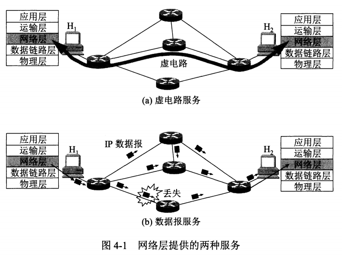

虚电路服务于数据报服务对比

| 对比项目           | 虚电路                                         | 数据报                                             |
| ------------------ | ---------------------------------------------- | -------------------------------------------------- |
| 思路               | 可靠通信应当由网络来保证                       | 可靠通信应当由用户主机来保证                       |
| 连接的建立         | 必须有                                         | 不需要                                             |
| 终点地址           | 仅在连接建立阶段使用，每个分组使用短的虚电路号 | 每个分组都有终点的完整地址                         |
| 分组的转发         | 属于同一条的分组均按照同一路由进行转发         | 每个分组独立选择路由器进行转发                     |
| 结点出现故障时     | 所有通过故障结点的虚电路不能工作               | 出故障的结点可能会丢失分组，一些路由可能会发生变化 |
| 分组的顺序         | 总是按发送顺序到达终点                         | 到达终点的时间不一定按照发送顺序                   |
| 差错处理和流量控制 | 可以由网络负责，也可以由用户主机负责           | 由用户主机负责                                     |

# 网际协议IP

网际协议IP是TCP/IP体系中两个最主要的协议之一，也是最重要的互联网标准协议之一

与IP协议配套使用的还有三个协议：

* 地址解析协议ARP（address resolution protocol）
* 网际控制报文协议ICMP（Internet control message protocol）
* 网际组管理协议IGMP（Internet group management protocol）

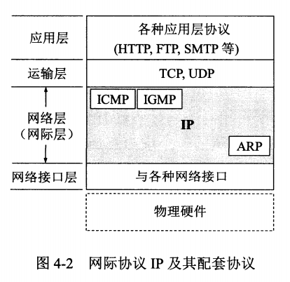

## 虚拟互连网络

因为用户的需求是多种多样的，所以没有一种单一的网络能够适应所有用户的需求

从一般概念来讲，讲网络互联起来要使用一些中间设备，根据中间设备所在的层次，可以有四种不同的中间设备

* 转发器repeater：物理层使用的中间设备
* 网桥/桥接器（bridge）：数据链路层使用的中间设备
* 路由器（router）：网络层使用的中间设备
* 网关（gateway）：网络层以上使用的中间设备，用网关连接两个不兼容的系统需要在高层进行协议转换

由许多计算机网络通过一些路由器进行互连，由于都使用网际协议IP，因此互连后的计算机网络可以看成一个虚拟互连网络，意思是利用IP协议，可以让这些性能各异的网络在网络层看起来好像是一个统一的网络

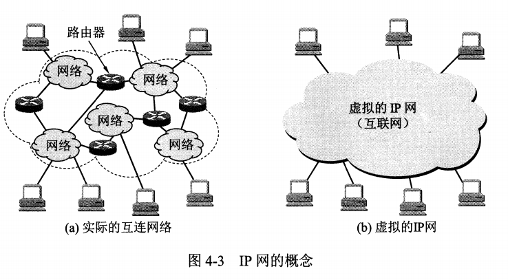

使用IP协议的虚拟互联网络简称为IP网，好处是当IP网上的主机进行通信时，就好像在一个单个网络上通信一样，它们看不见互连的各网络的具体异构细节，在这种覆盖全球的IP网的上层使用TCP协议，就是现在的互联网（Internet）

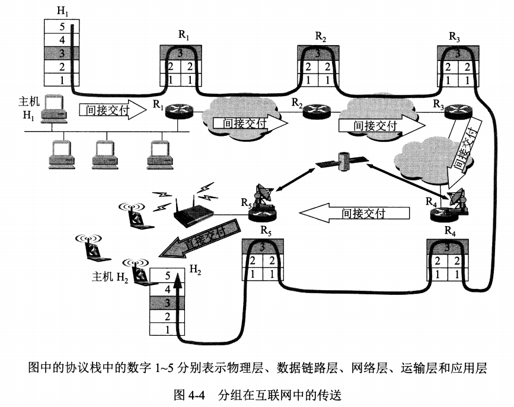

上图中，描述的是主机H1发送一个IP数据报到主机H2的数据流向

* 主机H1查找自己的路由表，发现目的主机并不在本网络中，因此将IP数据报发送给某个路由器R1
* R1查找自己的路由表后，将数据报转发给R2进行间接交付
* 经过多个路由器的转发，最后路由器R5判断到目的主机和自己在同一个网络，直接将数据报交付给目的主机

注意到其中：

* 主机的协议栈有5层，而路由器的协议栈只有3层，图中黑线表示数据在协议栈中流动的方向
* 在R4和R5之间，使用了卫星链路，而R5所连接的是一个无线局域网
* 在R1到R4之间的三个网络，可以是任意类型的

总之，**互联网可以由多种异构网络互连组成**

## 分类的IP地址

### IP地址及其表示方法

整个互联网就是一个单一的、抽象的网络，IP地址就是给互联网上的每一台主机或路由器的每一个接口分配一个全世界范围内唯一的32位标识符，IP地址现在由互联网名字和数字分配机构ICANN进行分配

分类的IP地址，就是将IP地址划分位若干个固定类，每一类地址都由两个固定长度字段组成

* 第一个字段位网络号，它标志主机或路由器所连接到的网络，网络号在互联网是唯一的
* 第二个字段是主机号，标志主机或路由器

IP地址在整个互联网范围内是唯一的，这种两级IP地址可以表示位
$$
IPaddress ::= \{<net-id>, <host-id>\}
$$
图中给出了各种IP地址的网络号字段和主机号字段，其中ABC类位单播地址，是最常用的

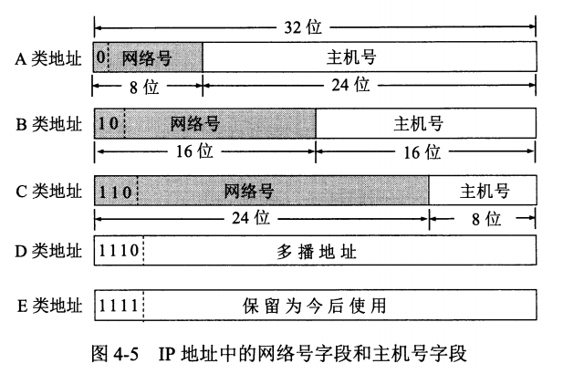

从图中可以看出：

* A、B、C类地址的网络号字段为1、2、3个字节，网络号字段的前面1~3位为类别位
* A、B、C类地址的主机号字段分别为3、2、1个字节* 

* D类地址用于多播
* E类地址保留

### 常用的三类IP地址

A类地址网络号1个字节，但实际只有7位可用，最高位固定为0，可以指配的网络为2^7-2个

* 第一网络号字段全0为保留地址，代表本网络，所以0000 0000 无法使用
* 第二0111 1111（127）也保留，作为本地软件的环回测试

A类地址的主机号占3个字节，其中主机号全0和全1是保留的，因此可以分配的主机号有2^24-2个

* 主机号全0表示该IP地址是本主机所连接到的单个网路，表示的是整个网络的地址
* 主机号全1表示该网络中所有的主机

B类地址的网络号有2个字节，前面10固定，但是128.0.0.0保留，因此可指派的网络数为2^14-1

B类地址的主机号数量为2^16-2，因为全0和全1同样是保留的

C类地址的网络号有3个字节，前面三位110固定，192.0.0.0保留，因此可指派的网络数为2^21-1

C类地址的主机号数量为2^8-2，全0和全1是保留的

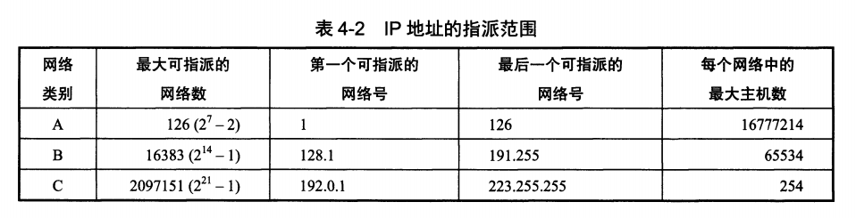

除了正常的IP地址，特殊的IP地址一般是不使用的

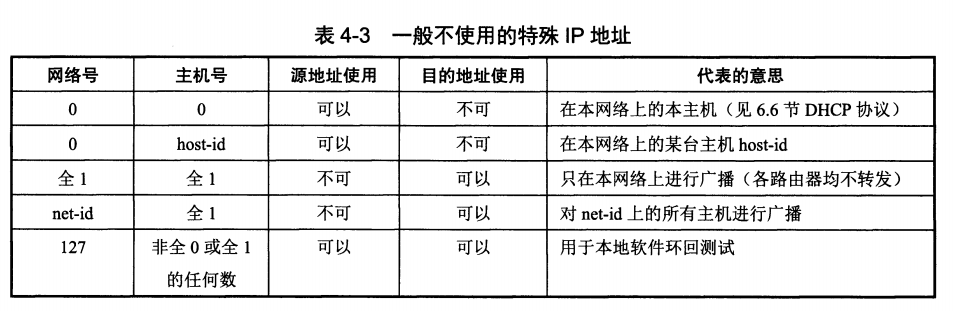

IP地址具有以下一些重要特点

* 每一个IP地址都由网络号和主机号组成，IP地址管理机构只需要分配网络号，而主机号由单位自行分配
* 路由器仅根据目的主机的网络号进行转发，减少了路由表所占的存储空间和查路由表的时间
* 一个网络是具有相同网络号的主机的集合，用转发器或网桥连接起来的若干局域网仍然是一个网路，这些局域网都具有相同的网络号

* 在同一个局域网的主机或路由器IP地址的网络号必须一样，可以用主机号全0表示该网络
* 用网桥（工作在数据链路层）互连的网段仍然是一个局域网，只能有一个网络号
* 路由器总是有2个或2个以上的IP地址，因为要连接多个接口，每个接口都连接到了不同的网络中

## IP地址与硬件地址

硬件地址就是数据链路层和物理层使用的地址，而IP地址是网络层及上层使用的地址，是一种逻辑地址

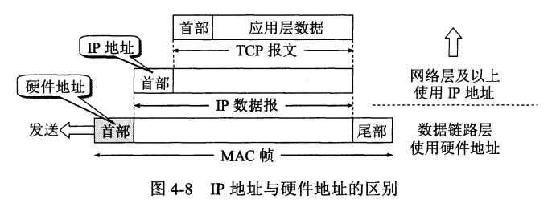

IP地址放在IP数据报的首部，使用IP地址的IP数据报，交给数据链路层，就被封装成MAC帧，MAC帧在传送中使用的源地址和目的地址都是硬件地址，硬件地址写在MAC帧的首部

目的主机收到MAC帧后，根据MAC帧中的目的地址，决定是否丢弃还是收下该帧，上交给网络层是，剥离MAC帧的首尾，只上交IP数据报部分，网络层在IP数据报中找到源地址和目的地址的IP地址

以下概念是计算机网络的精髓所在

* 在IP层抽象的互联网上只能看到IP数据报，虽然要经过路由器转发，但是IP数据报的源地址和目的地址始终是不变的
* 虽然在IP数据报首部有源IP地址，但是路由器只根据目的IP地址的网络号进行路由选择
* 在局域网的链路层，只能看到MAC帧，IP数据报被封装在MAC帧中，MAC帧在不同网络传输时，源地址和目的地址会一直发生变化，而MAC帧中硬件地址的变化，上面的IP层是看不见的
* 尽管互连在一起的网络的硬件地址体系各不相同，但是IP层抽象的互联网却屏蔽了下层这些很复杂的细节，使用统一的，抽象的IP地址研究主机之间的通信

## 地址解析协议ARP

ARP的应用：已知一个机器的IP地址，需要找到对应的硬件地址

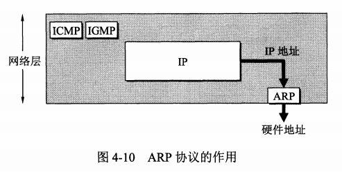

逆地址解析协议RARP：只知道硬件地址，通过RARP协议找到其IP，目前DHCP协议已经包含了RARP的功能

虽然网络层使用IP地址，但是在物理链路上传输时，还是要使用硬件地址，网路层和上层只知道目的地址的IP，并不知道物理地址，如何进行传输呢

地址解析协议ARP的方法是在主机ARP高速缓存中存放一个IP地址到硬件地址的动态更新的映射表

* 当主机A要向局域网内的主机B发送信息，先在自己的ARP高速缓存中查看是否有主机B的IP
* 如果有，就查找对应的硬件地址，并将该硬件地址写入MAC帧
* 如果没有，就在局域网内广播一个ARP请求分组，内容包括主机A的IP、物理地址、主机B的IP
* 局域网内所有主机均收到该ARP请求分组，判断是否是查询自己的IP，不是的话就不理睬
* 主机B发现这个ARP请求分组查询的是自己的IP，就收下该分组，并向主机A单播一个ARP响应分组，告诉主机A自己的物理地址，同时将主机A的IP和硬件地址写入自己的ARP高速缓存
* 主机A收到ARP响应分组后，在其ARP高速缓存中写入主机B的IP和硬件地址的映射关系

ARP对保存在高速缓存中的每一个映射都设置生存时间，超时则删除

注意，ARP解决的是**同一个局域网**上的主机/路由器的IP地址和硬件地址的映射关系

从IP地址到硬件地址的解析是自动进行的，主机用户并不知道底层做了这些操作

## IP数据报的格式

在TCP/IP的标准中，各种数据格式常以32位为单位来描述

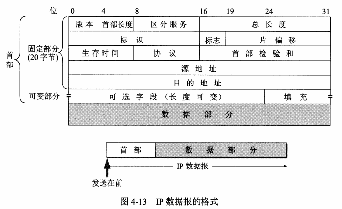

从图中可以看出，一个IP数据报由首部和数据两部分组成。首部由固定部分20字节和可变部分组成

### 首部的固定部分

* 版本：4位，指IP协议的版本，通信双方的IP协议必须一致
* 首部长度：4位，范围5~15，单位是4字节，例如可变部分长度为0，此时首部为20字节，此字段数值为0101
* 区分服务：8位，用来获得更好的服务，只有在使用区分服务时，此字段才起作用
* 总长度：16位，指首部和数据部分的总长度，单位是字节
  * 当数据报长度超过数据链路层的MTU值，就必须进行分片处理
  * 在进行分片时，总长度字段是指分片后每一个分片的实际总长度
* 标识：16位，IP软件在存储器中维持一个计数器，每产生一个数据报，计数器加1，并将其赋值给标识字段，但是标识并不是序号，因为IP是无连接的服务。当需要分片时，标识被赋值到所有的数据报片的标识字段中，这样在接收后，按照标志能够重新组装成原来的数据报
* 标志：3位，目前只有2位有意义
  * 最低位为MF，MF=1表示后面还有分片，MF=0表示这是分片的最后一个
  * 中间1位记为DF，以上是不能分片，只有DF=0时才允许分片
* 片偏移：13位，在较长的IP数据报分片后，用于表示某分片在原分组中的相对位置，单位是8个字节
* 生存时间：8位，TTL（time to live），表明数据报在网络中的寿命，由发出数据报的源点设置这个字段，防止无法交付的数据报无限制地在互联网中兜圈子
  * 随着技术的进步，TTL字段的功能改为**跳数限制**，路由器每次转发，都将TTL减一，若TTL值减小到0，则丢弃该数据报，不再转发
* 协议：8位，协议字段指出此数据报携带的数据是使用何种协议，以便使得目的主机的IP层知道应该将数据部分交给哪个协议进行处理

| 协议     | ICMP | IGMP | IP   | TCP  | EGP  | IGP  | UDP  | IPv6 | ESP  | OSPF |
| -------- | ---- | ---- | ---- | ---- | ---- | ---- | ---- | ---- | ---- | ---- |
| 协议字段 | 1    | 2    | 4    | 6    | 8    | 9    | 17   | 41   | 50   | 89   |

* 首部校验和：16位，这个字段只校验数据报的首部，不包括数据部分。每次经过路由器，都要重新计算首部校验和，为了较少校验时间，采用反码加法运算
* 源地址：32位
* 目的地址：32位

### 首部的可变部分

IP数据报首部的可变部分是一个选项字段，用来支持排错、测量以及安全等措施，但是会增加路由器的开销，因此实际上很少使用，很多路由器都不考虑IP首部的选项字段

## IP层转发分组的流程

* 特定主机路由：对特定的目的主机指明一个路由
* 默认路由：只要目的网络是其它网络，则一律转发到默认路由，这种转发方式在一个网络只有很少对外连接时很有用，可以减少路由表所占的空间和搜索路由表所用的时间

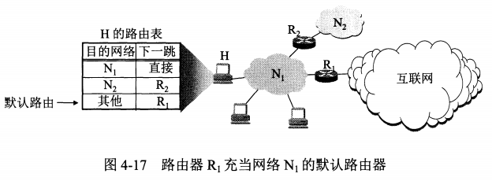

* 当路由器要转发一个分组时，先从路由表中得到下一跳的IP地址，再通过ARP获得下一跳的硬件地址，再将硬件地址放入MAC帧的首部

归纳分组转发算法

* 从数据报的首部提取出目的主机IP地址和目的网络地址
* 如果目的网络与该路由器直接相连，则进行直接交付
* 如果无法直接交付，则检查是否有包含目的IP的特定路由，有的话就转发给特定路由
* 如果路由表中有到达目的网络的路由，则将数据报交给指定的路由
* 如果有默认路由，则将数据报传送给默认路由
* 什么都没有就报错

