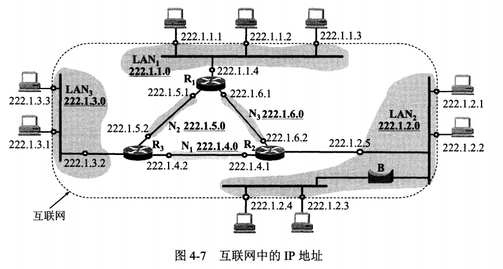
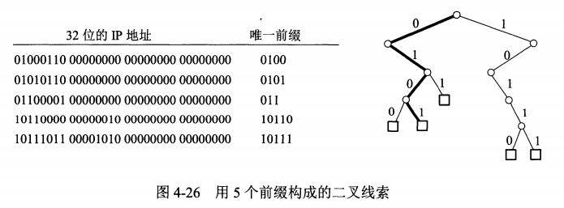
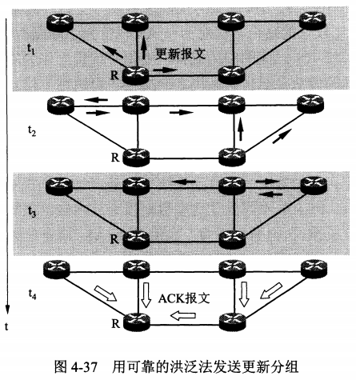
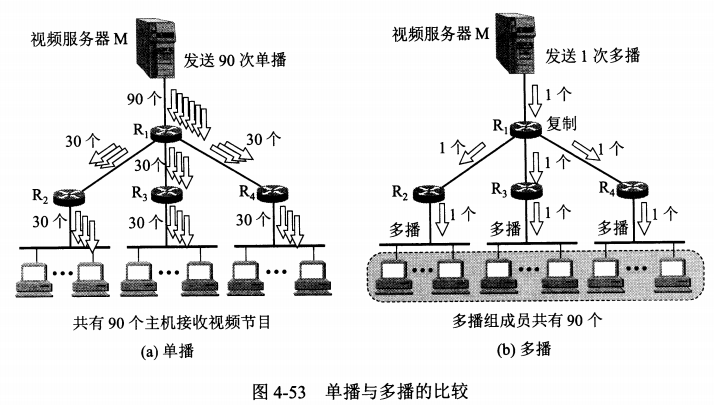
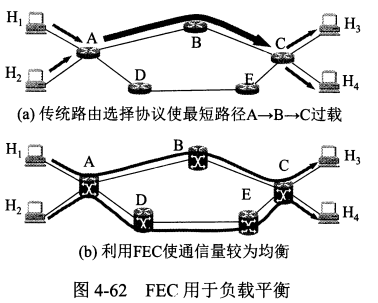

# 网络层提供的服务

网络层向上只提供简单灵活的、无连接的、尽最大努力交付的数据报（datagram）服务，数据报也就是常说的分组

网络在发送分组时不需要提前建立连接，每一个分组（IP数据报）独立发送，与前后分组无关（不进行编号），因此可能会有出错、丢失、失序、重复等问题

如果进程需要可靠通信，则由运输层负责处理（包括差错处理、流量控制等），采用这种思路，网络造价大大降低、运行方式灵活，适用多种应用

虚电路服务于数据报服务对比

| 对比项目           | 虚电路                                         | 数据报                                             |
| ------------------ | ---------------------------------------------- | -------------------------------------------------- |
| 思路               | 可靠通信应当由网络来保证                       | 可靠通信应当由用户主机来保证                       |
| 连接的建立         | 必须有                                         | 不需要                                             |
| 终点地址           | 仅在连接建立阶段使用，每个分组使用短的虚电路号 | 每个分组都有终点的完整地址                         |
| 分组的转发         | 属于同一条的分组均按照同一路由进行转发         | 每个分组独立选择路由器进行转发                     |
| 结点出现故障时     | 所有通过故障结点的虚电路不能工作               | 出故障的结点可能会丢失分组，一些路由可能会发生变化 |
| 分组的顺序         | 总是按发送顺序到达终点                         | 到达终点的时间不一定按照发送顺序                   |
| 差错处理和流量控制 | 可以由网络负责，也可以由用户主机负责           | 由用户主机负责                                     |

# 网际协议IP

网际协议IP是TCP/IP体系中两个最主要的协议之一，也是最重要的互联网标准协议之一

与IP协议配套使用的还有三个协议：

* 地址解析协议ARP（address resolution protocol）
* 网际控制报文协议ICMP（Internet control message protocol）
* 网际组管理协议IGMP（Internet group management protocol）

## 虚拟互连网络

因为用户的需求是多种多样的，所以没有一种单一的网络能够适应所有用户的需求

从一般概念来讲，讲网络互联起来要使用一些中间设备，根据中间设备所在的层次，可以有四种不同的中间设备

* 转发器repeater：物理层使用的中间设备
* 网桥/桥接器（bridge）：数据链路层使用的中间设备
* 路由器（router）：网络层使用的中间设备
* 网关（gateway）：网络层以上使用的中间设备，用网关连接两个不兼容的系统需要在高层进行协议转换

由许多计算机网络通过一些路由器进行互连，由于都使用网际协议IP，因此互连后的计算机网络可以看成一个虚拟互连网络，意思是利用IP协议，可以让这些性能各异的网络在网络层看起来好像是一个统一的网络

使用IP协议的虚拟互联网络简称为IP网，好处是当IP网上的主机进行通信时，就好像在一个单个网络上通信一样，它们看不见互连的各网络的具体异构细节，在这种覆盖全球的IP网的上层使用TCP协议，就是现在的互联网（Internet）

上图中，描述的是主机H1发送一个IP数据报到主机H2的数据流向

* 主机H1查找自己的路由表，发现目的主机并不在本网络中，因此将IP数据报发送给某个路由器R1
* R1查找自己的路由表后，将数据报转发给R2进行间接交付
* 经过多个路由器的转发，最后路由器R5判断到目的主机和自己在同一个网络，直接将数据报交付给目的主机

注意到其中：

* 主机的协议栈有5层，而路由器的协议栈只有3层，图中黑线表示数据在协议栈中流动的方向
* 在R4和R5之间，使用了卫星链路，而R5所连接的是一个无线局域网
* 在R1到R4之间的三个网络，可以是任意类型的

总之，**互联网可以由多种异构网络互连组成**

## 分类的IP地址

### IP地址及其表示方法

整个互联网就是一个单一的、抽象的网络，IP地址就是给互联网上的每一台主机或路由器的每一个接口分配一个全世界范围内唯一的32位标识符，IP地址现在由互联网名字和数字分配机构ICANN进行分配

分类的IP地址，就是将IP地址划分位若干个固定类，每一类地址都由两个固定长度字段组成

* 第一个字段位网络号，它标志主机或路由器所连接到的网络，网络号在互联网是唯一的
* 第二个字段是主机号，标志主机或路由器

IP地址在整个互联网范围内是唯一的，这种两级IP地址可以表示位
$$
IPaddress ::= \{<net-id>, <host-id>\}
$$
图中给出了各种IP地址的网络号字段和主机号字段，其中ABC类位单播地址，是最常用的

从图中可以看出：

* A、B、C类地址的网络号字段为1、2、3个字节，网络号字段的前面1~3位为类别位
* A、B、C类地址的主机号字段分别为3、2、1个字节* 

* D类地址用于多播
* E类地址保留

### 常用的三类IP地址

A类地址网络号1个字节，但实际只有7位可用，最高位固定为0，可以指配的网络为2^7-2个

* 第一网络号字段全0为保留地址，代表本网络，所以0000 0000 无法使用
* 第二0111 1111（127）也保留，作为本地软件的环回测试

A类地址的主机号占3个字节，其中主机号全0和全1是保留的，因此可以分配的主机号有2^24-2个

* 主机号全0表示该IP地址是本主机所连接到的单个网路，表示的是整个网络的地址
* 主机号全1表示该网络中所有的主机

B类地址的网络号有2个字节，前面10固定，但是128.0.0.0保留，因此可指派的网络数为2^14-1

B类地址的主机号数量为2^16-2，因为全0和全1同样是保留的

C类地址的网络号有3个字节，前面三位110固定，192.0.0.0保留，因此可指派的网络数为2^21-1

C类地址的主机号数量为2^8-2，全0和全1是保留的

除了正常的IP地址，特殊的IP地址一般是不使用的

IP地址具有以下一些重要特点

* 每一个IP地址都由网络号和主机号组成，IP地址管理机构只需要分配网络号，而主机号由单位自行分配
* 路由器仅根据目的主机的网络号进行转发，减少了路由表所占的存储空间和查路由表的时间
* 一个网络是具有相同网络号的主机的集合，用转发器或网桥连接起来的若干局域网仍然是一个网路，这些局域网都具有相同的网络号

* 在同一个局域网的主机或路由器IP地址的网络号必须一样，可以用主机号全0表示该网络
* 用网桥（工作在数据链路层）互连的网段仍然是一个局域网，只能有一个网络号
* 路由器总是有2个或2个以上的IP地址，因为要连接多个接口，每个接口都连接到了不同的网络中

## IP地址与硬件地址

硬件地址就是数据链路层和物理层使用的地址，而IP地址是网络层及上层使用的地址，是一种逻辑地址

IP地址放在IP数据报的首部，使用IP地址的IP数据报，交给数据链路层，就被封装成MAC帧，MAC帧在传送中使用的源地址和目的地址都是硬件地址，硬件地址写在MAC帧的首部

目的主机收到MAC帧后，根据MAC帧中的目的地址，决定是否丢弃还是收下该帧，上交给网络层是，剥离MAC帧的首尾，只上交IP数据报部分，网络层在IP数据报中找到源地址和目的地址的IP地址

以下概念是计算机网络的精髓所在

* 在IP层抽象的互联网上只能看到IP数据报，虽然要经过路由器转发，但是IP数据报的源地址和目的地址始终是不变的
* 虽然在IP数据报首部有源IP地址，但是路由器只根据目的IP地址的网络号进行路由选择
* 在局域网的链路层，只能看到MAC帧，IP数据报被封装在MAC帧中，MAC帧在不同网络传输时，源地址和目的地址会一直发生变化，而MAC帧中硬件地址的变化，上面的IP层是看不见的
* 尽管互连在一起的网络的硬件地址体系各不相同，但是IP层抽象的互联网却屏蔽了下层这些很复杂的细节，使用统一的，抽象的IP地址研究主机之间的通信

## 地址解析协议ARP

ARP的应用：已知一个机器的IP地址，需要找到对应的硬件地址

逆地址解析协议RARP：只知道硬件地址，通过RARP协议找到其IP，目前DHCP协议已经包含了RARP的功能

虽然网络层使用IP地址，但是在物理链路上传输时，还是要使用硬件地址，网路层和上层只知道目的地址的IP，并不知道物理地址，如何进行传输呢

地址解析协议ARP的方法是在主机ARP高速缓存中存放一个IP地址到硬件地址的动态更新的映射表

* 当主机A要向局域网内的主机B发送信息，先在自己的ARP高速缓存中查看是否有主机B的IP
* 如果有，就查找对应的硬件地址，并将该硬件地址写入MAC帧
* 如果没有，就在局域网内广播一个ARP请求分组，内容包括主机A的IP、物理地址、主机B的IP
* 局域网内所有主机均收到该ARP请求分组，判断是否是查询自己的IP，不是的话就不理睬
* 主机B发现这个ARP请求分组查询的是自己的IP，就收下该分组，并向主机A单播一个ARP响应分组，告诉主机A自己的物理地址，同时将主机A的IP和硬件地址写入自己的ARP高速缓存
* 主机A收到ARP响应分组后，在其ARP高速缓存中写入主机B的IP和硬件地址的映射关系

ARP对保存在高速缓存中的每一个映射都设置生存时间，超时则删除

注意，ARP解决的是**同一个局域网**上的主机/路由器的IP地址和硬件地址的映射关系

从IP地址到硬件地址的解析是自动进行的，主机用户并不知道底层做了这些操作

## IP数据报的格式

在TCP/IP的标准中，各种数据格式常以32位为单位来描述

从图中可以看出，一个IP数据报由首部和数据两部分组成。首部由固定部分20字节和可变部分组成

### 首部的固定部分

* 版本：4位，指IP协议的版本，通信双方的IP协议必须一致
* 首部长度：4位，范围5~15，单位是4字节，例如可变部分长度为0，此时首部为20字节，此字段数值为0101
* 区分服务：8位，用来获得更好的服务，只有在使用区分服务时，此字段才起作用
* 总长度：16位，指首部和数据部分的总长度，单位是字节
  * 当数据报长度超过数据链路层的MTU值，就必须进行分片处理
  * 在进行分片时，总长度字段是指分片后每一个分片的实际总长度
* 标识：16位，IP软件在存储器中维持一个计数器，每产生一个数据报，计数器加1，并将其赋值给标识字段，但是标识并不是序号，因为IP是无连接的服务。当需要分片时，标识被赋值到所有的数据报片的标识字段中，这样在接收后，按照标志能够重新组装成原来的数据报
* 标志：3位，目前只有2位有意义
  * 最低位为MF，MF=1表示后面还有分片，MF=0表示这是分片的最后一个
  * 中间1位记为DF，以上是不能分片，只有DF=0时才允许分片
* 片偏移：13位，在较长的IP数据报分片后，用于表示某分片在原分组中的相对位置，单位是8个字节
* 生存时间：8位，TTL（time to live），表明数据报在网络中的寿命，由发出数据报的源点设置这个字段，防止无法交付的数据报无限制地在互联网中兜圈子
  * 随着技术的进步，TTL字段的功能改为**跳数限制**，路由器每次转发，都将TTL减一，若TTL值减小到0，则丢弃该数据报，不再转发
* 协议：8位，协议字段指出此数据报携带的数据是使用何种协议，以便使得目的主机的IP层知道应该将数据部分交给哪个协议进行处理

| 协议     | ICMP | IGMP | IP   | TCP  | EGP  | IGP  | UDP  | IPv6 | ESP  | OSPF |
| -------- | ---- | ---- | ---- | ---- | ---- | ---- | ---- | ---- | ---- | ---- |
| 协议字段 | 1    | 2    | 4    | 6    | 8    | 9    | 17   | 41   | 50   | 89   |

* 首部校验和：16位，这个字段只校验数据报的首部，不包括数据部分。每次经过路由器，都要重新计算首部校验和，为了较少校验时间，采用反码加法运算
* 源地址：32位
* 目的地址：32位

### 首部的可变部分

IP数据报首部的可变部分是一个选项字段，用来支持排错、测量以及安全等措施，但是会增加路由器的开销，因此实际上很少使用，很多路由器都不考虑IP首部的选项字段

## IP层转发分组的流程

* 特定主机路由：对特定的目的主机指明一个路由
* 默认路由：只要目的网络是其它网络，则一律转发到默认路由，这种转发方式在一个网络只有很少对外连接时很有用，可以减少路由表所占的空间和搜索路由表所用的时间

* 当路由器要转发一个分组时，先从路由表中得到下一跳的IP地址，再通过ARP获得下一跳的硬件地址，再将硬件地址放入MAC帧的首部

归纳分组转发算法

* 从数据报的首部提取出目的主机IP地址和目的网络地址
* 如果目的网络与该路由器直接相连，则进行直接交付
* 如果无法直接交付，则检查是否有包含目的IP的特定路由，有的话就转发给特定路由
* 如果路由表中有到达目的网络的路由，则将数据报交给指定的路由
* 如果有默认路由，则将数据报传送给默认路由
* 什么都没有就报错

# 划分子网和构造超网

## 划分子网

### 从两级IP地址到三级IP地址

早期的IP地址设计并不合理，第一是IP地址的利用率很低，导致IP地址空间资源过早被用完，第二是给每一个物理网络分配网络号，导致路由表变得很大，查询时消耗大量时间，第三是两级IP不够灵活，要入网必须先申请IP

为了解决上述问题，增加了**子网号字段**，这种做法叫做划分子网

划分子网的基本思路如下：

* 一个拥有许多物理网络的单位，可以将所属的物理网络划分为若干个子网（subnet），外部看不见这些子网，这个单位对外仍然表现为一个网络
* 从主机号中借用若干位作为子网号，于是变成了三级IP地址：网络号，子网号，主机号
* 凡是从其它网络发送给本单位某台主机的IP数据报，仍然是先根据网络号找到本单位的路由器，然后再找到目的子网，交付IP数据报

### 子网掩码

为了使路由器能够很方便地从数据报中的目的IP地址中提取所要找的子网的网络地址，路由器就要使用三级IP地址的子网掩码，子网掩码中，网络号和子网号的部分为全1， 主机号部分为全0

划分子网后，由于拿出固定位数作为子网号，所以子网掩码也就确定了

不管有没有划分子网，路由器将收到的数据报的目的IP地址子网掩码相与（AND），便能得到目的网络地址

如果一个网络不划分子网，那么该网络的子网掩码就是默认子网掩码，其中网络号为全1，主机号为全0，路由器将目的地址与子网掩码相与，就能立即得到该IP的网络地址

## 使用子网时分组的转发

在划分子网后，路由表中必须包含三项内容：

* 目的网络地址
* 子网掩码
* 下一跳的地址

因此分组转发的算法必须做相应的改动，路由器在收到分组时，用子网掩码和分组的目的IP进行与运算，判断是直接交付，还是找下一跳的地址转发出去

## 无分类编址CIDR（构造超网）

### 网络前缀

* CIDR（classless inter-domain routing）：无分类域间路由选择
* CIDR消除了传统的IP地址分类及划分子网的概念，因此可以更有效地分配地址空间
* CIDR把IP地址划分为两个部分，网络前缀和主机号
* CIDR使用斜线记法，即在IP地址后面加上斜线`\`，然后写上网络前缀所占的位数，例如128.14.35.7/20
* CIDR把网络前缀都相同的连续IP地址组成一个CIDR地址块
* 由于一个CIDR地址块中有很多地址，所以路由表中就利用CIDR地址块还查找目的网络，这种地址的聚合常称为路由聚合，它使得路由表中的一个项目可以表示原来传统分类的多个路由

### 最长前缀匹配

在采用CIDR时，路由表中每个项目由网络前缀和下一跳地址组成，但是在查找路由表时，可能得到多个匹配结果

**应该从匹配结果中，选择具有最长网络前缀的路由，这叫做最长前缀匹配（longest-prefix matching）**

### 使用二叉线索查找路由表

* 查找每一个路由所需的时间是非常短的，因此必须使用很好的数据结构和先进的快速查找算法
* 常用的是**二叉线索（binary trie）**，它是一种特殊结构的树，各个路径就代表路由表中存放的各个地址

* 将路由表中每个IP地址的**唯一前缀**，构造二叉线索
* 进行查找时，只要能够和唯一前缀匹配上，就认为查找成功

* 为了提高二叉线索的查找速度，广泛使用了各种压缩技术

# 网际控制报文协议ICMP

* 为了更有效地转发IP数据报和提高交付成功的机会，在网际层使用了ICMP（Internet Control Message Protocol）
* ICMP允许主机或路由器报告差错情况，和提供有关异常情况的报告
* ICMP报文是装在IP数据报中，作为其中的数据部分

## ICMP报文的种类

* ICMP报文有两种：ICMP差错报告报文、ICMP询问报文
  * 前4个字节：是统一的格式，有三个字段，类型、代码、校验和
  * 接着4字节：与ICMP类型有关
  * 最后的：数据字段，长度取决于ICMP的类型
* 类型字段如下表

* ICMP报文的代码字段是为了进一步区分某种类型中的几种不同情况
* 校验和字段用来校验整个ICMP报文，因为IP数据报首部的校验和，并不会去校验数据部分
* ICMP差错报告报文共有四种：
  * 终点不可达：当路由器或主机不能交付数据报时，向源点发送终点不可达报文
  * 超时：当路由器收到生存时间为0的数据报时，除了丢弃外，还要向源点发送超时报文。当终点在预先规定的时间内不能收到一个数据报的全部片段时，也将数据报丢弃，并向源点发送超时报文
  * 参数问题：当路由器或目的主机收到的数据报的首部中有字段的值不正确，就丢弃数据报，并向源点发送参数问题报文
  * 改变路由（重定向）：路由器把改变路由报文发送给主机，让主机知道下次应将数据报发送给另外的路由器
* 主机有自己的路由表，而且不和路由器交换路由信息，在向默认路由发送某个IP地址的信息时，默认路由检测到有更好的路由线路（最佳路由），就发送改变路由报文，让主机在其路由表中增加项目，将报文发送到最优路由器中
* ICMP差错报告报文构成：
  * ICMP固定的8个字节
  * IP数据报的首部
  * IP数据报数据部分的前8个字节：是为了得到运输层的端口号（UDP/TCP），以及运输层报文的发送顺序（TCP）
* 整个ICMP报文作为IP数据报的数据字段发送给源点

下面是不应该发送ICMP差错报文的几种情况：

* 对ICMP差错报告报文，不再发送ICMP差错报告报文
* 对第一个分片的数据报片的所有后续数据报片，都不发送ICMP差错报告报文
* 对具有多播地址的数据报，都不发送ICMP差错报告报文
* 对具有特殊地址的数据报，不发送ICMP差错报告报文

常用的ICMP询问报文有两种：

* 回送请求和回答：ICMP回送请求报文是由主机或路由器向一个特定的目的主机发出的询问，收到此报文的主机必须给源主机或路由器发送ICMP回送回答报文。这种询问报文用来**测试目的站是否可达以及了解其有关状态**
* 时间戳请求和回答：ICMP时间戳请求报文是请求某台主机或路由器回答当前日期和时间，**用于时钟同步和时间测量**

## ICMP的应用举例

* ICMP的一个重要应用就是分组网间探测PING（Packet InterNet Groper），用来测试两台主机的连通性

* PING是应用层直接使用网路层ICMP，没有通过运输层的TCP或UDP
* 通过tracert（windows）或者tranceroute（unix），可以跟踪一个分组从源点到终点的路径

# 互联网的路由选择协议

## 有关路由选择协议的几个基本概念

### 理想的路由算法

路由选择协议的核心就是路由算法，即需要何种算法来获得路由表中的各项目，一个理想的路由算法应具有如下的一些特点：

* 算法必须是正确和完整的：沿着路由表的指引，分组一定能够达到目的网络和主机
* 算法在计算上简单：路由选择的计算不应该使网路通信量增加太多的额外开销
* 算法应能适应通信量和网络拓扑的变化：当网络中的通信量发生变化时，算法能自适应地改变路由以均衡各链路的负载，当某些结点和链路故障时，算法也能及时改变路由
* 算法具有稳定性：在网络通信量和拓扑相对稳定的情况下，路由算法应该收敛于一个可以接受的解，而不应使得出路由不停变化
* 算法应是公平的：路由选择算法对所有用户都是平等的
* 算法应是最佳的：路由选择算法应当能找出最好的路由，使得分组平均时延最小，而网络吞吐量最大

### 分层次的路由选择协议

互联网采用的路由选择协议主要是自适应的、分布式路由选择协议，而且是分层次的，原因如下：

* 互联网规模非常大，如果所有路由器都知道所有网络怎么到达，路由表将非常大
* 单位内部不希望外界了解自己单位的布局细节和路由选择协议，但是同时希望连接到互联网上

因此，可以将互联网划分为许多自治系统（autonomous system），一般记为AS，一个AS对其它AS表现出的是一个单一和一致的路由选择策略

在目前互联网中，一个大的ISP就是一个自治系统，因此把路由选择协议分为两类：

* 内部网关协议IGP（Interior Gateway Protocol）：在一个自治系统内部使用的路由选择协议，如RIP/OSPF
* 外部网关协议EGP（External Gateway Protocol）：源主机和目的主机不在一个自治系统中，当数据报传递到边界时，需要使用外部网关协议EGP，如BGP
* 

自治系统之间的路由选择也叫做域间路由选择（inerdomain routing），自治系统内部的路由选择叫做域内路由选择（intradomain routing）

## 内部网关协议RIP

### 工作原理

RIP（Routing Information Protocol）路由信息协议，在内部网关协议IGP中使用广泛，是一种分布式的基于距离向量的路由选择协议，最大优点是简单

RIP协议要求网络中所有路由器都要维护从它自己到其它网络或路由器的距离记录

* 从一个路由器到直接相连的网络，距离为0或1
* 从一个路由器到非直接相连的距离，为所经过路由器的数量 加1，如3个路由器相连，首尾距离为2
* 距离也称为跳数（hop count），RIP允许一条路径中最多只能包含15个路由器，距离大于16等于不可达，因此RIP适用于小型互联网
* RIP不能在两个网络之间同时使用多条路由，而是选择距离最短的路线
* RIP协议路由器信息交换的特点：
  * 仅和相邻路由器交换信息：不相邻路由器不交换信息
  * 交换的信息：当前路由器所知道的全部信息（自己的路由表信息），包括到所有网络的距离，下一跳路由器地址等
  * 按固定时间间隔交换：每隔一段时间，路由器酒根据收到的路由信息更新路由表，当网络拓扑发生变化时，路由器也及时向相邻路由器通告拓扑变化后的路由信息
* 路由表更新的原则就是找到每个目的网络的最短距离，这种更新算法又称为距离向量算法

### 距离向量算法

对每一个相邻路由器发送过来的RIP报文，进行以下步骤

* 对于地址为X的路由器发送的RIP报文，先将下一跳字段改为X，再将距离字段加1
* 如果原路由表没有目的网络N，则添加到路由表
* 如果原路由表有目的网络N，且原先下一跳地址为X，则进行替换（动态更新）
* 若原先下一跳地址不为X，且收到的距离变短了，则进行更新，否则不更新
* 若3分钟还没有收到相邻路由器的更新路由表，则认为该路由器为不可达，距离设为16

### RIP协议的报文格式

RIP协议使用运输层的用户数据报UDP进行传输

* RIP报文由首部和路由部分组成
  * 首部4个字节：其中命令字段指出报文的意义：
    * 命令字段为1：表示请求路由信息
    * 命令字段为2：表示对请求路由信息的响应或未被请求而发出的路由更新报文
    * 必为0：是为了4字节的对齐
  * 路由部分，由若干个路由信息组成，每个路由信息20字节
    * 地址族标识符：用来标志所使用的地址协议（IP地址协议为2）
    * 路由标记：填入自治系统号ASN，考虑到RIP有可能收到自治系统以外的路由选择信息
    * 网络地址、子网掩码、下一跳路由地址、跳数
* 一个RIP报文最多可包括25个路由，超过则再用一个RIP报文发送
* RIP存在的问题是
  * 当网络出现故障时，要经过比较长的时间才能将此信息传送到所有的路由器
  * 仅适用于小规模网络

## 内部网关协议OSPF

### OSPF协议的基本特点

开放最短路径优先OSPF（Open Shortest Path First）：是为了克服RIP的缺点而开发出来的

OSPF最主要的特征是使用分布式的链路状态协议（link state protocol），而不是像RIP那样的距离向量协议

* 使用洪泛法向本自治系统中**所有的路由器**发送信息，路由器通过所有输出端口向所有相邻的路由器发送信息，而每一个相邻路由器又再将此信息发送给其它相邻路由器，最终所有的路由器都收到这个消息
* 发送的信息是本路由器相邻的所有路由器的**链路状态**，所谓链路状态，就是说明本路由器和哪些路由器相邻，以及该链路的**度量（metric）**，度量表示费用、距离、时延、带宽等，由网络管理人员来决定，有时也称为代价
* 只有当链路状态发生变化时，路由器才向所有路由器用洪泛法发送此信息
* 各路由器最终都能建立一个**链路状态数据库**，每一个路由器使用数据库中的数，构造自己的路由表，每一个路由器都知道全网的拓扑结构，但是RIP协议中的路由器只知道所有的网络距离和下一跳路由器的地址
* OSPF更新过程收敛的很快

为了使OSPF能够用于大规模的网络，将一个自治系统划分为若干更小的区域（Area），每一个区域都有一个32位的区域标识符

* 划分区域的好处是，交换链路状态信息时范围局限在每一个区域，减少了整个网络上的通信量
* 在一个区域内部的路由器只知道本区域的完整网络拓扑，但是不知道其它区域的拓扑情况

OSPF使用层次结构的区域划分：

* 上层的叫主干区域，用于连接其它区域，标识符规定位0.0.0.0
* 区域边界路由器：不同的区域要通信，一定要经过主干区域，主干区域和其它区域，用区域边界路由器连接，如R3、R4、R7
* 主干路由器：主干区域内的所有路由器叫主干路由器，如R3~R7，包括区域边界路由器
* 自治系统边界路由器：用于专门和其它自治系统交换路由信息，如R6

OSPF不用UDP而是直接用IP数据报发送信息，OSPF构成的数据报很短，不但可以减少通信量，而且不用分片

OSPF分组使用24字节的固定长度首部，分组的数据部分可以是五种类型分组中的一种

* 版本：当前版本号为2
* 类型：可以是五种类型分组中的一种
* 分组长度：包括OSPF首部在内的分组长度，以字节为单位
* 路由器标识符：标志发送该分组的路由器的接口IP地址
* 区域标识符：分组属于的区域的标识符
* 校验和：用来检验分组中的差错
* 鉴别类型：目前只有两种，0（不用），1（口令）
* 鉴别：鉴别类型为0时填入0，为1时填入8个字符的口令

除了以上的基本特点外，OSPF还具有下列一些特点：

* 允许管理员给每条路由指定不同的代价：可以是1-65535的任意值，一般根据链路带宽来计算其代价
* 如果同一个目的网络有多条代价相同的路径，那么可以将通信量同时分配给这些路径，实现**负载均衡**
* 所有在OSPF路由器交换的分组，都具有鉴别的功能，因而保证了仅在可信赖的路由器之间交换链路状态信息
* OSPF支持可变长子网划分和CIDR
* 由于链路状态可能经常发生变化，因此OSPF让每一个链路状态都带上一个32位的序号，序号越大就越新

### OSPF的五种分组类型

* 问候（hello）：用来发现和维持邻站的可达性
  * 每隔10S，就向邻站发送问候分组，只有可达邻站的链路状态信息才存入链路状态数据库
  * 若40S没有收到某个邻站的问候分组，则认为不可达，应该修改链路状态数据库，并计算新的路由表
* 数据库描述（database description）：向邻站给出自己的链路状态数据库中所有链路状态项目的摘要信息
* 链路状态请求（link state request）：向对方请求发送某些链路状态项目的详细信息
* 链路状态更新（link state update）：用洪泛法对全网更新链路状态，这种分组是最复杂的，也是OSPF协议的最核心部分，路由器使用这种分组将其链路状态通知给邻站，链路状态更新分组共有五种不同的链路状态
* 链路状态确认（link state acknowledgment）：对链路更新分组的确认、

路由器从刚开始工作到实现同步的过程：

* 路由器使用数据库描述分组，和相邻路由器交换本数据库中已有的链路状态摘要
* 路由器获得相邻路由器的摘要，然后发送链路状态请求分组，向对方请求自己所缺少的某些链路状态信息的详细信息
* 经过一系列的分组交换，建立全网同步的链路数据库

在网络运行的过程中，只要有一个路由器的链路状态发生变化，该路由器就要使用链路状态更新分组，用洪泛法向全网更新链路状态

OSPF使用的是可靠的洪泛法，路由器在收到更新分组后，要发送确认

为了确保链路状态数据库与全网保持一致，OSPF还规定每隔一段时间，如30分组，要刷新一次数据库中的链路状态

OSPF对于多点接入的局域网采用**指定的路由器**的方法，使广播量大大减少，指定的路由器代表该局域网所有的链路向连接到该网络上的各路由器发送状态信息

## 外部网关协议BGP

不同AS之间，为什么使用BGP，而不使用RIP或OSPF：

* 互联网规模太大，使得自治系统AS之间路由选择非常困难
* 自治系统之间的路由选择必须考虑有关策略

边界网关协议BGP只能是力求寻找一条能够达到目的网络且比较好的路由（不能兜圈子），而并非要寻找一条最佳路由

BGP采用了路径向量（path vector）路由选择协议，与RIP和OSPF有很大区别

在配置BGP时，每一个自治系统的管理员至少要指定一个路由器作为**BGP发言人**

* 一个BGP发言人与其它AS的BGP发言人交换信息，要先建立TCP连接，然后交换BGP报文，建立BGP会话
* 使用TCP连接交换路由信息的两个BGP发言人，称为邻站或对等站
* 每一个BGP发言人除了运行BGP协议外，还必须运行改AS内部网关协议

* 在BGP刚刚运行时，BGP的邻站是交换整个BGP路由表，但以后只需要更新有变化的部分

BGP-4规定了4种报文：

* OPEN：用来和邻站建立关系，使通信初始化
* UPDATE：用来通告某一路由的信息，以及列出要撤销的多条路由
* KEEPALIVE：用来周期性地验证邻站的连通性
* NOTIFICATION：用来发送检测到的差错

若两个邻站属于不同AS，则需要先发送OPEN报文，邻站回复KEEPALIVE进行响应，建立连接

一但关系建立，就要继续保持，每隔一段时间，就周期性交换KEEPALIVE报文

UPDATE报文用于撤销曾经通知过的多条路由，或者新增一条路由

BGP报文的格式：

* 四种类型的BGP报文具有同样的通用首部，长度19字节
* 通用首部分为三个字段：
  * 标记（market）：16字节，用来鉴别收到的BGP报文，不使用时设为全1
  * 长度：指出包括首部在内的**整个BGP报文的长度**，单位是字节，范围19-4096
  * 类型：对应于上述四种BGP报文的一种，范围1-4

* OPEN报文有6个字段：

  * 版本：1字节，值为4
  * 本自治系统号：2字节，全球唯一的16位自治系统号
  * 保持时间：2字节，以秒计算的保持为邻站关系的时间
  * BGP标识符：4字节，通常是路由器的IP
  * 可选参数长度：1字节
  * 可选参数

* UPDATE报文有5个字段：

  * 不可行路由长度：2字节，指明下一字段的长度
  * 撤销的路由：列出索要撤销的路由
  * 路径属性总长度：2字节，指明下一个字段的长度
  * 路径属性：定义在这个报文中增加的路径和属性
  * 网络层可达性星系NLRI：定义发出去此报文的网络，包括网路前缀位数，IP地址前缀

* KEEPALIVE报文，只有BGP的19字节的通用首部

* NOTIFICATION报文有3个字段

  * 差错代码：1字节
  * 差错子代码：1字节
  * 差错数据：给出有关差错的诊断信息

  ## 路由器的构成

  ### 路由器的结构

  路由器是一种专用计算机，有多个输入|输出接口，任务是转发分组
  
  

路由器分为两大部分：路由选择、分组转发

路由选择也叫控制部分，核心构件是路由选择处理机，任务是根据选定的路由选择协议构造出路由表，同时定期交换路由表信息，更新和维护路由表

分组转发由三部分组成：

* 交换结构（switching fabric）：又称为交换组织，作用就是根据转发表（forwarding table）对分组进行转发
* 输入端口/输出端口：

**转发**：路由器根据选择表把收到的IP数据报从路由器合适的端口转发出去，仅仅涉及到一个路由器

**路由选择**：为分组到源站到目的站选择合适的路径，涉及到很多路由器

**路由表**：路由器按照复杂的路由算法，得出网络的拓扑变化情况，并以此构造出路由表，路由表一般仅包含从目的网络到下一跳的映射

**转发表**：从路由器中得出，必须包含完成转发功能所必须的信息，转发表的每一行必须包含从要到达的目的网络到输出端口和某些MAC地址信息的映射

### 交换结构

交换机构将分组从一个输入端口转移到某个合适的输出端口，常用的有三种方式：

* 通过存储器交换：输入端口收到分组后，通知路由选择处理机，然后将分组复制到存储器，路由选择处理机查找路由表后，再从存储器复制到输出端口的缓存钟
* 通过总线交换：数据报从输入端口通过共享的总线直接传送到合适的输出端口，而不需要处理机的干预，但是总线上只能有一个分组在传输
* 通过互连网络交换：当输入端口收到一个分组时，就将它发送到与该输入端口相连的水平总线上，如果对应输出端口的垂直总线是空闲的，则该结点将垂直总线与水平总线接通

# IPv6

2011年2月，IPv4地址耗尽

解决IP地址耗尽的根本措施就是采用具有更大地址空间的IPv6

## IPv6的基本首部

IPv6锁引进的主要变化如下：

* 更大的地址空间：从IPv4的32位扩大到128位
* 扩展的地址层次结构：由于地址空间很大，因此可以划分为更多的层次
* 灵活的首部格式：IPv6和IPv4不兼容，IPv6定义了很多可选的扩展首部，不仅提供了更多的功能，而且提高路由器的处理效率
* 改进的选项：IPv6允许数据报包含有选项的控制信息，因而可以包含一些新的选项，但IPv6的首部长度是固定的，将选项放在有效载荷中
* 允许协议继续扩充：技术在不断发展，新的应用会不断出现
* 支持即插即用（自动配置）：因此IPv6不需要DHCP
* 支持资源的预分配：IPv6支持实时视像等要求保证一定的带宽和时延的应用
* IPv6首部8字节对齐，IPv4首部4字节对齐

IPv6数据报由两部分组成：基本首部（base header）和有效载荷（payload）

其中，有效载荷允许有0个或多个扩展首部（extension header），扩展首部并不属于IPv6数据报的首部

有效载荷包括可选的扩展首部和数据部分

由于把首部中不必要的功能取消了，使得IPv6首部的字段数减少到只有8个

* 版本：4位，指明了协议的版本，对IPv6该字段是6
* 通信量类：8位，这是为了区分不同的IPv6数据报的类别或优先级
* 流标号：20位，IPv6的一个新的机制是支持资源预分配，并且允许路由器把每一个数据报与一个给定的资源分配相联系，IPv6提出了**流（flow）**的概念，流就是互联网上从特定源点到特定终点的一系列数据报，而这个流所经过的路径上的路由器都保证指明的服务质量，所有属于同一个流的数据拥有相同的流标号
* 有效载荷长度：16位，指明了除基本首部以外的字节数，最大值是64KB
* 下一个首部：8位，相当于IPv4的协议字段或可选字段，当没有扩展首部时，下一个首部字段的作用和IPv4一样，指明应该交付给运输层的哪一个协议（TCP/UDP）；当出现扩展首部时，下一个首部字段的值就标识后面第一个扩展首部的类型
* 跳数限制：8位，防止数据报在网络中无限期存在，源点在每个数据报发出去时设定跳数限制，路由器转发时跳数减一
* 源地址：128位，发送端的IP地址
* 目的地址：128位，接收端的IP地址

IPv6的扩展首部：

* IPv4中设置了扩展首部，则路由器要逐个检查，而IPv6的扩展首部，路由器不会检查，而是交给目的主机检查
* 有六种拓展首部：逐跳选项、路由选择、分片、鉴别、封装安全有效载荷、目的站选项

## IPv6的地址

IPv6数据报的目的地址可以是三种类型：

* 单播：点对点通信
* 多播：点对多通信，数据报发送到一组计算机中的每一个
* 任播：IPv6新增的，任播的终点是一组计算机，但数据报只交付其中的一个，通常是距离最近的

实现IPv6的主机和路由器称为结点，一个结点可能有多个接口，每个接口都有一个IP地址

IPv6使用冒泡十六进制记法，每个16位的值用十六进制表示，之间用冒号分隔，允许把数字前面的0省略，还允许**零压缩**，如FF05:0:0:0:0:0:0:B3，可以压缩为FF05::B3

IPv6的地址分类：

| 地址类型         | 二进制前缀                        |
| ---------------- | --------------------------------- |
| 未指明地址       | 0...0(128位)，可记为::/128        |
| 环回地址         | 0...1(128位)，可记为::1/128       |
| 多播地址         | 11111111(8位)，可记为FF00::/8     |
| 本地链路单播地址 | 1111111010(10位)，可记为FF80::/10 |
| 全球单播地址     | 除上述4中外                       |

* 未指明地址：16字节的全0地址，该地址不能用作目的地址
* 环回地址：IPv6的环回地址是::1，作用和IPv4的环回地址一样
* 多播地址：功能和IPv4一样，这类地址占总数的1/256
* 本地链路单播地址：有的单位使用TCP/IP协议，但是并没有接入互联网，因此使用这种本地地址进行通信
* 全球单播地址：使用的最多的一类

## 从IPv4向IPv6过渡

由于互联网规模太大，因此只能采用逐步演进的方法，同时新安装的IPv6系统要能够向后兼容

### 双协议栈

双协议栈（dual statck）是指在完全过渡到IPv6之前，使一部分主机和路由器装双协议栈，既能和IPv4的系统通信，又能和IPv6的系统通信

### 隧道技术

隧道技术（tunneling），在IPv6数据报进入IPv4网络时，把IPv6数据报封装成IPv4数据报，现在整个IPv6数据报变成了IPv4的数据部分，而原来的IPv6数据报就像在隧道中传输一样，什么都没有变化，当IPv4离开IPv4网络时，再把数据部分交给主机的IPv6协议栈

****

## ICMPv6

和IPv4一样，IPv6也不保证数据报的可靠交付，因此需要ICMP来反馈一些差错信息

新版本叫ICMPv6，地址解析协议ARP和网际组管理协议IGMP的功能已经合并到ICMPv6中

ICMPv6是面向报文的协议，它利用报文来报告差错、获取信息、探测邻站、管理多播通信

# IP多播

## IP多播的概念

在互联网上进行多播就叫做IP多播，IP多播是需要在互联网上增加更多的智能才能提供的一种服务，由一个源点发送到许多终点，是一对多的通信

当多播组的主机数很大时，采用多播方式可以很明显减轻网络资源消耗

多播要靠路由器实现，路由器必须增加能识别多播数据报的软件，运行多播协议

IP多播所传送的分组需要使用多播IP地址

多播数据报和一般的IP数据报区别在于，它使用D类IP地址作为目的地址，并且首部的协议字段值是2，表示使用网际组管理协议IGMP

多播地址只能用于目的地址，不能用于源地址，对多播数据不产生ICMP差错报文

### 在局域网上进行硬件多播

* 互联网号码指派管理局IANA拥有的以太网地址块的高24位为00-00-5E，因此TCP/IP协议使用的以太网多播地址块的范围是从00-00-5E-00-00-00到00-00-5E-FF-FF-FF

* 之前已经说过，第1个字节最低位为1时即为多播地址，这种多播地址数占IANA分配到的地址数的一半。因此IANA拥有的以太网多播地址范围是从01-00-5E-00-00-00到01-00-5E-7F-FF-FF
* 不难看出，每一个地址中，只有23位可用作多播，这只能和D类IP地址中的23位一一对应，而D类IP可分配的有28位。由于多播IP地址与以太网硬件地址的映射关系不唯一，因此收到多播数据报的数据，要在IP层进行过滤。

以上的描述中有一些原文没有说清楚：

* 问题：为什么IANA拥有的以太网多播地址范围是从01-00-5E-00-00-00到01-00-5E-7F-FF-FF，也就是说为什么这种多播地址数只占分配到的一半，换句话说，为什么多播的MAC地址只有23位可以自由分配

网上有很多人问这个，还记得最早在其博士论文中提出IP多播的哥们Steve Deering吗，他在做多播研究的时候，原本是想让MAC地址和IP地址的28位一一对应，但是一个OUI只有24位是有效的，于是便想申请16个连续的OUI，例如（01-00-50）到（01-00-5F），加上末尾的3个字节，范围就是（01-00-50-00-00-00）到（01-00-5F-FF-FF-FF）就能凑成28位有效，实现和D类IP的28位一一对应，但是IEEE卖一个OUI，要1000美元，要买16个，就得花16000美元，Steve Deering的经理Jon Postel比较节约，只愿意买一个OUI，而且一个OUI的24位，只愿意把低23位给Steve Deering用，也就是说这哥们想要28位，结果因为穷，只得到了23位，这就是23位的由来

* 问题：多播工作的流程

可以把多播想象成无线电广播，电台一直在发射信号，而听众随时可以加入，随时可以离开。在多播中，源站要发送信息，得有个目的IP，但是目的主机有多个，这个IP没法确定，于是要使用D类IP，例如230.10.10.1，上面提到了IP多播的MAC地址，在发送的时候是用不上的，因为MAC地址在传输过程中，是会一直变化的，链路层会不断给数据加上新的首部和尾部。当数据到达一个局域网后，需要路由器支持多播，路由器检测到这是一个多播数据报，它的数据链路层就将IP数据报重新包装成MAC帧，其中首部就要加入之前提到的MAC地址，例如MAC地址设为01-00-5E-3F-80-40，局域网中的主机，如果没有加入多播组，则网卡适配器不会接收这个MAC地址的数据，如果加入了多播组，则会监听MAC地址01-00-5E-3F-80-40的数据，然后再将IP数据报发到IP层去处理，因为23位MAC地址和28位IP地址不是一一对应，因此会有多个多播组使用同一个MAC地址，只有IP层才能判断收到的IP数据报是不是发给自己的。当一个主机加入多播组时，其实是要监听一个D类IP地址，也就是源站发送数据时的目的IP地址，所以目的主机判断收到的和自己加入时设置的多播组IP是否相同，就知道是不是发给自己的数据

## 网际组管理协议IGMP和多播路由选择协议

### IP多播需要两种协议

下图是互联网上传播多播数据报的例子

当局域网内没有成员参加多播组，路由器就不应该将多播数据报转发给内部主机，路由器怎样知道多播组成员音系，就要利用网际组管理协议IGMP（Internet Group Management Protocol）

IGMP协议是让连接在**本地局域网**的多播路由器知道本地是否有主机加入了或退出了某个多播组，并不知道互联上多播组成员的信息

连接在局域网上的多播路由器还必须和互联网上其它多播路由器协同工作，以便把多播数据用最小代价传送给所有的组成员，因此还要使用到多播路由选择协议

多播路由选择协议比较复杂

* 多播转发必须动态的适应多播组成员的变化
* 多播路由器在转发多播分组数据报时，不能仅仅根据多播数据报中的目的地址
* 多播数据报可以由没有加入多播组的主机发出，也可以通过没有组成员接入的网络

### 网际组管理协议IGMP

和网际控制报文协议ICMP类似，IGMP使用IP数据报传递报文（IGMP报文+IP首部），但它也向IP提供服务，因此是属于IP协议的一部分

IGMP的工作可以分为两个阶段：

* 第一阶段：当某台主机加入新的多播组，该主机向多播地址发送一个IGMP报文，声明自己要加入。本地的多播路由器收到IGMP报文后，利用多播路由选择协议，转发到互联网上其它的多播路由器
* 第二阶段：组成员的关系是动态的，本地多播路由器要周期性检测本地是否有多播组成员，如果没有成员回应，则认为本地所有主机已经离开了这个组

为了避免多播控制信息给网络增加大量的开销，IGMP采取了一些措施：

* 主机和多播路由器之间使用IP多播
* 多播路由器在探询组成员关系时，对所有的组，只发送一次请求信息，而不是每个组都发送一次
* 同一个网络中有多个多播路由器时，会选择其中一个来探询组成员关系
* 主机在收到询问后，不同的多播组，会随机经过一定的时延后，发送响应，最大时延由多播路由器询问指定
* 同一个组内每一台主机都要监听响应，如果有人发送了响应，则自己不需要再发送

### 多播路由选择协议

在多播过程中一个多播组的成员是动态变化的，多播路由选择协议实际上就是要找出以源主机位根节点的多播转发树，转发多播数据报时使用了以下三种方法

* 洪泛与剪除：这种方法适合于较小的多播组，一开始路由器转发多播数据报用洪泛法，同时为了避免兜圈子，采用反向路径广播RPB的策略，每一个路由器在收到一个多播数据报时，先检查数据报是否是从源点经最短路径传送来的，若是，则向其它方向转发，否则就丢弃

如果在多播转发树上的某个路由器发现它的下游树枝（叶节点方向）已经没有该多播组的成员，就应该把它和下游的树枝一起剪除，当某个树枝有新增加的组成员时，可以再接入到多播转发树上

* 隧道技术：隧道技术适用于多播组的位置在地理上很分散的情况，如果路径上有的路由器不支持多播，就将多播数据报进行再次封装，即加上普通数据报的首部，使之称为单播数据报，通过隧道后再还原位多播数据报，这种使用隧道技术传送数据报又叫做IP中的IP（IP-in-IP）

* 基于核心的发现技术：这种方法对于多播组的大小在较大范围内变化时都适合，对每一个多播组G指定一个核心路由器，给出它的IP单播地址，核心路由器创建多播转发树。如果有一个路由器R1向这个核心路由器发送数据报，那么它在途中经过的每一个路由器都要检查其内容。当数据报到达参加了多播组G的路由器R2时，R2就处理这个数据报。

# 虚拟专用网VPN和网络地址转换NAT

## 虚拟专用网VPN

* 一些计算机不需要直接和互联网相连，主要用作和本机构内其它主机通信，可以自行分配IP地址，而不需要申请全球唯一IP
* RFC1917指明了一些**专用地址**，这些地址只能用于一个机构的内部通信，互联网上的路由器对专用地址的数据报直接丢弃
  * 10.0.0.0 - 10.255.255.255：此IP原先属于ARPANET，后来停止运行，用作专用网IP
  * 172.16.0.0 - 172.31.255.255
  * 192.168.0.0 - 192.168.255.255
* 这样的专用IP地址的互联网络称为专用互联网或本地互联网，专用的IP地址叫做可重用地址
* 利用公用的互联网作为本机构各专用网之间的通信载体，称为虚拟专用网**VPN**

* 还有一种类型的VPN，就是远程接入VPN（remote access VPN）

## 网络地址转换NAT

网络地址转换NAT（network address translation）：这种方法需要在专用网连接到互联网的路由器上安装NAT软件，装有NAT软件的路由器叫做NAT路由器，它至少有一个有效的外部全球IP地址，这样所有使用本地地址的主机在和外接通信时，都要在NAT路由器上将本地地址转换为全球IP地址，才能和互联网连接

* 为了更加有效利用NAT路由器上的全球IP地址，现在常用的NAT转换表把运输层的端口号也用上了，这样可以使多个拥有本地地址的主机，共用一个NAT路由器上的全球IP地址，因而可以和互联网上不同主机进行通信
* 使用端口号的NAT也叫做网络地址与端口号转换NAPT
* NAPT把专用网内不同的源IP地址都转换为同样的全球IP地址，但是对源主机所采用的TCP端口号，则转换为不同的新的端口号，因此当NAPT路由器收到从互联网发过来的应答时，就可以从IP数据报的数据部分找出运输层的端口号，然后根据不同的目的端口号，从NAPT转换表种找到正确的目的主机

# 多协议标记交换MPLS

MPLS（MultiProtocol Label Switching）：多协议表示在上层可以采用多种协议

MPLS利用面向连接技术，使每个分组携带一个叫做标记的小整数，当分组到达交换机时，交换机读取分组的标记，并用标记值来检索分组转发表，这样就比查找路由表来转发分组快得多

MPLS具有以下三个方面的特点：

* 支持面向连接的服务质量
* 支持流量工程，平衡网络负载
* 有效地支持虚拟专用网VPN

## MPLS的工作原理

### 基本工作过程

MPLS的一个重要特点就是在MPLS域的入口处，给每一个IP数据报打上固定长度的**标记**，然后对打上标记的IP数据报用硬件进行转发，这就使得IP数据报转发过程大大加快。

采用硬件技术对打上标记的IP数据报进行转发就称为**标记交换**，交换也表示在转发时不再上升到第三层查找转发表，而是根据标记在第二层（链路层）用硬件进行转发

MPLS可用多种链路层协议，如PPP、以太网、ATM以及帧中继等

MPLS域（domain）是指该域中有许多彼此相邻的路由器，并且所有的路由器都是支持MPLS技术的标记交换路由器LSR（label switching router），LSR同时具有标记交换和路由选择功能

MPLS的基本工作过程如下：

* MPLS域中的各LSR使用专门的标记分配协议LDP交换报文，并找出和特定标记相对应的路径，即标记交换路径LSP，各LSR根据这些路径构造出转发表
* 当一个IP数据报进入到MPLS域时，MPLS入口结点就打上标记，并按照转发表把它转发给下一个LSR
* 一个标记仅仅在两个标记路由器LSR之间才有意义，分组每经过一个LSR，一是转发，二是更新标记，即把入标记更新为出标记，这叫做标记对换

* 当IP数据报离开MPLS域时，MPLS出口结点就把MPLS的标记去除，按照普通方式转发

### 转发等价类FEC

MPLS有个很重要的概念就是**转发等价类**FEC（forwarding equivalence class），FEC就是路由器按照同样方式对待的IP数据报的集合

按照同样方式对待表示从同样接口转发到同样的下一跳地址，并且具有同样服务类别和同样丢弃优先级

划分FEC的方法不受限制，由网络管理员来控制，入口结点并不是给每一个IP数据报指派一个不同的标记，而是将同样FRC的IP数据报都指派同样的标记，FEC和标记是一一对应关系

在MPLS的情况下，入口结点A设置两种FEC，可用使得网络的负载平衡，这种均衡网络的做法也称为流量工程

## MPLS首部的位置和格式

* MPLS并不要求下层的网络都使用面向连接的技术

* 需要使用一种封装技术，在IP数据报封装成以太网帧之前，先要插入一个MPLS首部

MPLS首部共包括以下4各字段：

* 标记值：占20位
* 试验：3位，保留
* 栈S：1位，在有**标记栈**时使用
* 生存时间TTL：8位，防止MPLS分组兜圈子

